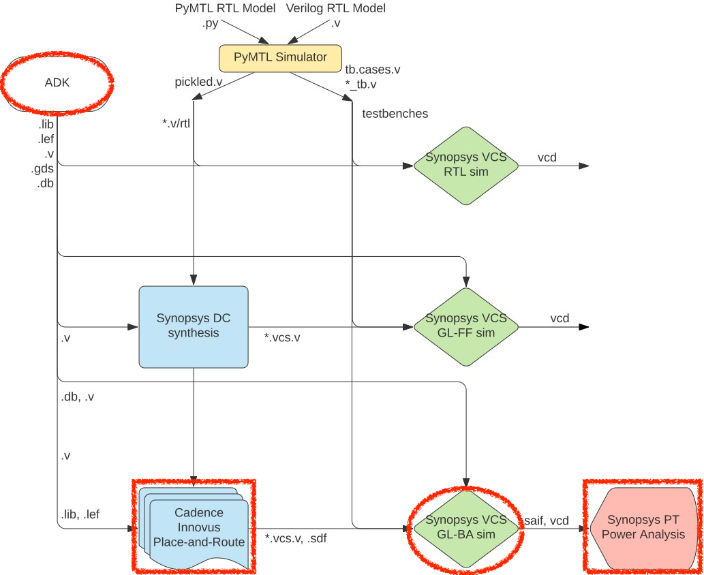

ECE 6745 Section 2: ASIC Back-End Flow
==========================================================================

In this section, we will be discussing the back-end of the ASIC toolflow.
More detailed tutorials will be posted on the public course website, but
this section will at least give you a chance to take a gate-level netlist
through place-and-route, simulate the final gate-level netlist, and
energy analysis. The following diagram illustrates the tool flow we will
be using in ECE 6745. Notice that the Synopsys and Cadence ASIC tools all
require various views from the standard-cell library which part of the
ASIC design kit (ADK).



The "back-end" of the flow is highlighted in red and refers to the PyMTL
simulator, Synopsys DC, and Synopsys VCS:

 - We use **Cadence Innovus** to place-and-route our design, which means
   to place all of the gates in the gate-level netlist into rows on the
   chip and then to generate the metal wires that connect all of the
   gates together. We need to provide Cadence Innovus with similar
   abstract logical and timing views used in Synopsys DC. Cadence Innovus
   takes as input the `.lib` file which is the ASCII text version of a
   `.db` file. In addition, we need to provide Cadence Innovus with
   technology information in `.lef` and `.captable` format and abstract
   physical views of the standard-cell library in `.lef` format. Cadence
   Innovus will generate an updated Verilog gate-level netlist, a `.spef`
   file which contains parasitic resistance/capacitance information about
   all nets in the design, and a `.gds` file which contains the final
   layout. The `.gds` file can be inspected using the open-source Klayout
   GDS viewer. Cadence Innovus also generates reports which can be used
   to accurately characterize area and timing.

 - We use **Synopsys VCS** for back-annotated gate-level simulation.
   Gate-level simulation involves simulating every standard-cell gate and
   helps verify that the Verilog gate-level netlist is functionally
   correct. Fast-functional gate-level simulation does not include any
   timing information, while back-annotated gate-levle simulation does
   include the estimated delay of every gate and every wire.

 - We use **Synopsys PrimeTime (PT)** to perform power-analysis of our
   design. This requires switching activity information for every net in
   the design (which comes from the back-annotated gate-level simulation)
   and parasitic capacitance information for every net in the design
   (which comes from Cadence Innovus). Synopsys PT puts the switching
   activity, capacitance, clock frequency, and voltage together to
   estimate the power consumption of every net and thus every module in
   the design.

Extensive documentation is provided by Synopsys and Cadence. We have
organized this documentation and made it available to you on the Canvas
course page:

 - <https://www.csl.cornell.edu/courses/ece6745/asicdocs>

The first step is to access `ecelinux`. You should use VS Code for
working at the command line, but you will also need to use Microsoft
Remote Desktop for using Linux GUI applications. Once you are at the
`ecelinux` prompt, source the setup script, clone this repository from
GitHub, and define an environment variable to keep track of the top
directory for the project.

```bash
% source setup-ece6745.sh
% mkdir -p $HOME/ece6745
% cd $HOME/ece6745
% git clone https://github.com/cornell-ece6745/ece6745-sec02-asic-back-end sec02
% cd sec02
% TOPDIR=$PWD
```

1. NanGate 45nm Standard-Cell Libraries
--------------------------------------------------------------------------

Recall that a standard-cell library is a collection of combinational and
sequential logic gates that adhere to a standardized set of logical,
electrical, and physical policies. For example, all standard cells are
usually the same height, include pins that align to a predetermined
vertical and horizontal grid, include power/ground rails and nwells in
predetermined locations, and support a predetermined number of drive
strengths. In this course, we will be using the a NanGate 45nm
standard-cell library. It is based on a "fake" 45nm technology. This
means you cannot actually tapeout a design using this standard cell
library, but the technology is representative enough to provide
reasonable area, energy, and timing estimates for teaching purposes. All
of the files associated with this standard cell library are located in
the `$ECE6745_STDCELLS` directory.

Let's look at some layout for the standard cell library just like we did
in the last section.

```bash
% klayout -l ${ECE6745_STDCELLS}/klayout.lyp ${ECE6745_STDCELLS}/stdcells.gds
```

Let's look at a 3-input NAND cell, find the NAND3_X1 cell in the
left-hand cell list, and then choose _Display > Show as New Top_ from the
menu. We will learn more about layout and how this layout corresponds to
a static CMOS circuit later in the course. The key point is that the
layout for the standard cells are the basic building blocks that we will
be using to create our ASIC chips.

The Synopsys and Cadence tools do not actually use this layout directly;
it is actually _too_ detailed. Instead these tools use abstract views of
the standard cells, which capture logical functionality, timing,
geometry, and power usage at a much higher level. In the last section, we
looked at Verilog and `.lib` views. The back-end flow takes as input the
`.lib` view for logical timing information, but it also takes as input a
`.lef` view which contains _physical_ information about the standard
cell. Let's look at the LEF for the 3-input NAND cell.

```bash
% less -p NAND3_X1 ${ECE6745_STDCELLS}/stdcells.lef
```

The `.lef` view includes information about the size of the standard cell,
but also includes information about where every pin is physically
located. You can use Klayout to view `.lef` files as well. Start Klayout
like this:

```bash
% klayout ${ECE6745_STDCELLS}/stdcells.lef
```

Let's look at a 3-input NAND cell, find the NAND3_X1 cell in the
left-hand cell list, and then choose _Display > Show as New Top_ from the
menu. The `.lef` file does not contain any transistor-level information.
It only contains information relevant to placement and routing.

In addition to physical information about each standard cell, the
back-end flow also needs to take as input general information about the
technology. This information is contained in two files:

```bash
% less ${ECE6745_STDCELLS}/rtk-tech.lef
% less ${ECE6745_STDCELLS}/rtk-typical.captable
```

The first provides information about the geometry and orientation of
wires for each metal layer. The second provides information about the
resistance and capacitance of each metal layer.

Now that we have looked at the physical views of the standard cell
library, we can now try using these views and the ASIC flow back-end to
place and route a gate-level netlist.

2. Revisiting the ASIC Flow Front-End
--------------------------------------------------------------------------

As in the last section, we will be using the following four-stage
registered incrementer as our example design:


Before we can place and route a gate-level netlist, we need to synthesize
that netlist. This is what we learned about in the last section. Here are
the steps to test and then synthesize the design using Synopsys DC.

### 2.1. Test, Simulate, Translate

Always run the tests before pushing anything through the ASIC flow. There
is no sense in running the flow if the design is incorrect!

```bash
% mkdir -p $TOPDIR/sim/build
% cd $TOPDIR/sim/build
% pytest ../tut3_verilog/regincr
```

You can run the simulator for our four-stage registered incrementer like
this:

```bash
% cd $TOPDIR/sim/build
% ../tut3_verilog/regincr/regincr-sim 0xff 0x20 0x30 0x04 0x00
% less RegIncr4stage__pickled.v
```

You should now have the Verilog that we want to push through the ASIC
flow.

### 2.2. Simulate, Synthesize, Simulate

We have provided you run scripts that will reproduce the three key steps
we learned about in the previous discussion sections:

 - Use Synopsys VCS for four-state RTL simulation
 - Use Synopsys DC to synthesize RTL to gate-level netlist
 - Use Synopsys VCS for fast-functional gate-level simulation

You can run these steps as follows:

```bash
% cd $TOPDIR/asic
% ./01-synopsys-vcs-rtlsim/run
% ./02-synopsys-dc-synth/run
% ./03-synopsys-vcs-ffglsim/run
```

Verify that your design passes four-state RTL simulation and
fast-functional gate-level simulation. Then take a look at the synthesis
reports

```bash
% less ./02-synopsys-dc-synth/area.rpt
% less ./02-synopsys-dc-synth/timing.rpt
```

Finally, take a few minutes to examine the resulting Verilog gate-level
netlist. Notice that the module hierarchy is preserved.

```bash
% less ./02-synopsys-dc-synth/post-synth.v
```

This is the gate-level netlist that we now want to push through the ASIC
back-end flow.

3. Using Cadence Innovus for Place-and-Route
--------------------------------------------------------------------------

We will be running Cadence Innovus in a separate directory to keep the
input and output files separate.

```bash
% mkdir -p $TOPDIR/asic/04-cadence-innovus-pnr
% cd $TOPDIR/asic/04-cadence-innovus-pnr
```

### 3.1. Constraint and Timing Input Files

Before starting Cadence Innovus, we need to create two files which will
be loaded into the tool. The first file is a `.sdc` file which contains
timing constraint information about our design. This file is where we
specify our target clock period, but it is also where we could specify
input or output delay constraints (e.g., the output signals must be
stable 200ps before the rising edge). Use VS Code to create a file named
`constraints.sdc`.

```bash
% cd $TOPDIR/asic/04-cadence-innovus-pnr
% code constraints.sdc
```

The file should have the following constraint:

```
create_clock clk -name ideal_clock -period 1
```

The `create_clock` command is similar to the command we used in
synthesis, and usually, we use the same target clock period that we used
for synthesis. In this case, we are targeting a 1GHz clock frequency
(i.e., a 1ns clock period).

The second file is a "multi-mode multi-corner" (MMMC) analysis file. This
file specifies what "corner" to use for our timing analysis. A corner is
a characterization of the standard cell library and technology with
specific assumptions about the process temperature, and voltage (PVT). So
we might have a "fast" corner which assumes best-case process
variability, low temperature, and high voltage, or we might have a "slow"
corner which assumes worst-case variability, high temperature, and low
voltage. To ensure our design worked across a range of operating
conditions, we need to evaluate our design across a range of corners. In
this course, we will keep things simple by only considering a "typical"
corner (i.e., average PVT). Use VS Code to create a file named
`setup-timing.tcl`.

```bash
% cd $TOPDIR/asic/04-cadence-innovus-pnr
% code setup-timing.tcl
```

The file should have the following content:

```
create_rc_corner -name typical \
   -cap_table "$env(ECE6745_STDCELLS)/rtk-typical.captable" \
   -T 25

create_library_set -name libs_typical \
   -timing [list "$env(ECE6745_STDCELLS)/stdcells.lib"]

create_delay_corner -name delay_default \
   -library_set libs_typical \
   -rc_corner typical

create_constraint_mode -name constraints_default \
   -sdc_files [list constraints.sdc]

create_analysis_view -name analysis_default \
   -constraint_mode constraints_default \
   -delay_corner delay_default

set_analysis_view -setup analysis_default -hold  analysis_default
```

The `create_rc_corner` command loads in the `.captable` file that we
examined earlier. This file includes information about the resistance and
capacitance of every metal layer. Notice that we are loading in the
"typical" captable and we are specifying an "average" operating
temperature of 25 degC. The `create_library_set` command loads in the
`.lib` file that we examined in the last section. This file includes
information about the input/output capacitance of each pin in each
standard cell along with the delay from every input to every output in
the standard cell. The `create_delay_corner` specifies a specific corner
that we would like to use for our timing analysis by putting together a
`.captable` and a `.lib` file. In this specific example, we are creating
a typical corner by putting together the typical `.captable` and typical
`.lib` we just loaded. The `create_constraint_mode` command loads in the
`.sdc` file we mentioned earlier in this section. The
`create_analysis_view` command puts together constraints with a specific
corner, and the `set_analysis_view` command tells Cadence Innovus that we
would like to use this specific analysis view for both setup and hold
time analysis.

### 3.2. Initial Setup and Floorplanning

Now that we have created our `constraints.sdc` and `setup-timing.tcl`
files we can start Cadence Innovus. Note that we are using the Cadence
Innovus GUI so you will need to use Microsoft Remote Desktop.

```bash
% innovus
```

We can enter commands in the terminal and watch the effect of these
commands on our design in the GUI. We need to set various variables
before starting to work in Cadence Innovus. These variables tell Cadence
Innovus the location of the MMMC file, the location of the Verilog
gate-level netlist, the name of the top-level module in our design, the
location of the `.lef` files, and finally the names of the power and
ground nets.

```
innovus> set init_mmmc_file "setup-timing.tcl"
innovus> set init_verilog   "../02-synopsys-dc-synth/post-synth.v"
innovus> set init_top_cell  "RegIncr4stage"
innovus> set init_lef_file  "$env(ECE6745_STDCELLS)/rtk-tech.lef $env(ECE6745_STDCELLS)/stdcells.lef"
innovus> set init_gnd_net   "VSS"
innovus> set init_pwr_net   "VDD"
```

We can now use the `init_design` command to read in the verilog, set the
design name, setup the timing analysis views, read the technology `.lef`
for layer information, and read the standard cell `.lef` for physical
information about each cell used in the design.

```
innovus> init_design
```

We start by working on power planning which is the process of routing the
power and ground signals across the chip. First, we use the `floorPlan`
command to set the dimensions for our chip.

```
innovus> floorPlan -su 1.0 0.70 4.0 4.0 4.0 4.0
```

In this example, we have chosen the aspect ration to be 1.0, the target
cell utilization to be 0.7, and we have added 4.0um of margin around the
top, bottom, left, and right of the chip. This margin gives us room for
the power ring which will go around the entire chip.

### 2.3. Power Routing

Often when working with the ASIC flow back-end, we need to explicitly
tell the tools how the logical design connects to the physical aspects of
the chip. For example, the next step is to tell Cadence Innovus that
`VDD` and `VSS` in the gate-level netlist correspond to the physical pins
labeled `VDD` and `VSS` in the `.lef` files.

```
innovus> globalNetConnect VDD -type pgpin -pin VDD -inst * -verbose
innovus> globalNetConnect VSS -type pgpin -pin VSS -inst * -verbose
```

The next step in power planning is to draw M1 wires for the power and
ground rails that go along each row of standard cells.

```
innovus> sroute -nets {VDD VSS}
```

### 2.4. Placement

Now that we have finished our basic power planning we can do the initial
placement and routing of the standard cells using the `place_design`
command:

```
innovus> place_design
```

You should be able to see the standard cells placed in the rows along
with preliminary routing to connect all of the standard cells together.
You can toggle the visibility of metal layers by pressing the number keys
on the keyboard. So try toggling the visibility of M1, M2, M3, etc. You
can visualize how the modules in the original Verilog mapped to the
place-and-routed design by using the Design Browser. Choose the
_Windows > Workspaces > Design Browser + Physical_ menu option.
Then use the _Design Browser_ to click on specific modules or nets to
highlight them in the physical view.

### 2.5. Routing

The `place_design` command will perform a very preliminary route to help
ensure a good placement, but we will now use the `routeDesign` command to
do a more detailed routing pass.

```
innovus> routeDesign
```

Watch the physical view to see the result before and after running this
command. You should be able to appreciate that the final result requires
fewer and shorter wires.

### 2.6. Final Output and Reports

The final step is to insert "filler" cells. Filler cells are essentially
empty standard cells whose sole purpose is to connect the wells across
each standard cell row.

```
innovus> setFillerMode -core "FILLCELL_X1 FILLCELL_X2 FILLCELL_X4"
innovus> addFiller
```

Now we are basically done! Obviously there are many more steps required
before you can really tape out a chip. We would need to add a real power
grid and an I/O ring to connect the chip to the package. We would need to
do further verification and additional optimization.

We can generate various artifacts. We might want to save the final
gate-level netlist for the chip since Cadence Innovus will often insert
new cells or change cells during its optimization passes.

```
innovus> saveNetlist post-pnr.v
```

We can also extract resistance and capacitance for the metal interconnect
and write this to a special `.spef` file and `.sdf` file. These files can
be used for later back-annotated gate-level simulation and/or power
analysis.

```
innovus> extractRC
innovus> rcOut -rc_corner typical -spef post-pnr.spef
innovus> write_sdf post-pnr
```

And of course the step is to generate the real layout as a `.gds` file.
This is what we will send to the foundry when we are ready to tapeout the
chip.

```
innovus> streamOut post-pnr.gds \
           -merge "$env(ECE6745_STDCELLS)/stdcells.gds" \
           -mapFile "$env(ECE6745_STDCELLS)/rtk-stream-out.map"
```

We can also use Cadence Innovus to do timing and area analysis similar to
what we did with Synopsys DC. These post-place-and-route results will be
_much_ more accurate than the preliminary post-synthesis results.

```
innovus> report_area
innovus> report_timing -late  -path_type full_clock -net
innovus> report_timing -early -path_type full_clock -net
```

Finally, we go ahead and exit Cadence Innovus.

```
innovus> exit
```

Open the final layout using Klayout.

```bash
% klayout -l ${ECE6745_STDCELLS}/klayout.lyp post-pnr.gds
```

Choose _Display > Full Hierarchy_ from the menu to display the entire
design. Zoom in and out to see the individual transistors as well as the
entire block.

4. Using Synopsys VCS for Back-Annotated Gate-Level Simulation
--------------------------------------------------------------------------

As we learned in the last discussion section, good ASIC designers are
always paranoid and _never_ trust their tools. How do we know that the
final post-place-and-route gate-level netlist is correct? Once again, we
can rerun our test suite on the gate-level model. We can do this using
Synopsys VCS for back-annotated gatel-level simulation. _Back-annotated_
refers to the fact that this simulation will take into account all of the
gate and interconnect delays. So this also helps build our confidence not
just that the final gate-level netlist is functionally correct, but also
that it meets all setup and hold time constraints. Here is how to run VCS
for RTL simulation:

```bash
% mkdir -p $TOPDIR/asic/05-synopsys-vcs-baglsim
% cd $TOPDIR/asic/05-synopsys-vcs-baglsim
% vcs -sverilog -xprop=tmerge -override_timescale=1ns/1ps \
    +neg_tchk +sdfverbose \
    -sdf max:RegIncr4stage_tb.DUT:../04-cadence-innovus-pnr/post-pnr.sdf \
    +define+CYCLE_TIME=1.000 \
    +define+VTB_INPUT_DELAY=0.025 \
    +define+VTB_OUTPUT_DELAY=0.025 \
    +vcs+dumpvars+RegIncr4stage_basic.vcd \
    +incdir+$TOPDIR/sim/build \
    -top RegIncr4stage_tb \
    ${ECE6745_STDCELLS}/stdcells.v \
    ${TOPDIR}/sim/build/RegIncr4stage_basic_tb.v \
    ../04-cadence-innovus-pnr/post-pnr.v
```

You should see a `simv` binary which is the compiled RTL simulator which
you can run like this:

```bash
% cd $TOPDIR/asic/05-synopsys-vcs-baglsim
% ./simv
```

It should pass the test. Now let's look at the resulting waveforms using
Surfer.

```bash
% cd $TOPDIR/asic/05-synopsys-vcs-baglsim
% code RegIncr4stage_basic.vcd
```

Browse the signal hierarchy and display all the waveforms for the DUT
using these steps:

 - Expand out the Scopes until you find the _DUT_ module
 - Select the _clk, in, out_ signals
 - Expand out the Scopes until you find the `gen[0].reg_incr.add` module
 - Select all of the signals in this adder

Zoom in and notice how the signals now change throughout the cycle. This
is because the delay of every gate and wire is now modeled. Let's rerun
the simulation, but this time let's use a very fast clock frequency (much
faster than the 1ns clock constraint we used during synthesis and
place-and-route).

```bash
% cd $TOPDIR/asic/05-synopsys-vcs-baglsim
% vcs -sverilog -xprop=tmerge -override_timescale=1ns/1ps \
    +neg_tchk +sdfverbose \
    -sdf max:RegIncr4stage_tb.DUT:../04-cadence-innovus-pnr/post-pnr.sdf \
    +define+CYCLE_TIME=0.300 \
    +define+VTB_INPUT_DELAY=0.025 \
    +define+VTB_OUTPUT_DELAY=0.025 \
    +vcs+dumpvars+RegIncr4stage_basic-300ps.vcd \
    +incdir+$TOPDIR/sim/build \
    -top RegIncr4stage_tb \
    ${ECE6745_STDCELLS}/stdcells.v \
    ${TOPDIR}/sim/build/RegIncr4stage_basic_tb.v \
    ../04-cadence-innovus-pnr/post-pnr.v
```

You should see timing violations and the test will fail. If you look at
the resulting waveforms you can see that the adder does not have time to
finish its calculation and cannot meet the setup time contraint.

```bash
% cd $TOPDIR/asic/05-synopsys-vcs-baglsim
% open RegIncr4stage_basic-300ps.vcd
```

For power analysis we need to convert our VCD file into an SAIF file. The
SAIF file has just the activity factors for every net in the design.

```bash
% cd $TOPDIR/asic/05-synopsys-vcs-baglsim
% vcd2saif -input RegIncr4stage_basic.vcd \
           -output RegIncr4stage_basic.saif
```

5. Using Synopsys PrimeTime for Power Analysis
--------------------------------------------------------------------------

Synopsys PrimeTime (PT) is primarily used for very accurate "sign-off"
static timing analysis (more accurate than the analysis performed by
Synopsys DC and Cadence Innovus), but in this course, we will only use
Synopsys PT for power analysis. There are many ways to perform power
analysis. Synthesis and place-and-route power reports use statistical
power analysis where we simply assume some toggle probability on each
net. For more accurate power analysis, we need to find out the actual
activity for every net for a given experiment; this is exactly what we
figured out during back-annotated gate-level simulation.

We start by creating a subdirectory for our work and then launching
Synopsys PT.

```bash
% mkdir -p $TOPDIR/asic/06-synopsys-pt-pwr
% cd $TOPDIR/asic/06-synopsys-pt-pwr
% pt_shell
```

We begin by setting the `target_library` and `link_library` variables as
before.

```
pt_shell> set_app_var target_library "$env(ECE6745_STDCELLS)/stdcells.db"
pt_shell> set_app_var link_library   "* $env(ECE6745_STDCELLS)/stdcells.db"
```

Since Synopsys PT is primarily used for static timing analysis, we need
to explicitly tell Synopsys PT that we want to use it for power analysis.

```
pt_shell> set_app_var power_enable_analysis true
```

We now read in the gate-level netlist, tell Synopsys PT we want to do
power analysis for the top-level module, and link the design (i.e.,
recursively resolve all of the module references starting from the
top-level module).

```
pt_shell> read_verilog   "../04-cadence-innovus-pnr/post-pnr.v"
pt_shell> current_design RegIncr4stage
pt_shell> link_design
```

In order to do power analysis, Synopsys PT needs to know the clock
period. Here we will set the clock frequency to be the same as the
initial clock constraint.

```
pt_shell> create_clock clk -name ideal_clock1 -period 1
```

We now read in the SAIF file with the activity factors and the SPEF file
with the parasitic cpacitances for every net in our design.

```
pt_shell> read_saif "../05-synopsys-vcs-baglsim/RegIncr4stage_basic.saif" \
                    -strip_path "RegIncr4stage_tb/DUT"
pt_shell> read_parasitics -format spef "../04-cadence-innovus-pnr/post-pnr.spef"
```

We now have everything we need to perform the power analysis: (1) the
activity factor of a subset set of the nets, (2) the capacitance of every
net/port, (3) the supply voltage, and (4) the clock frequency. We use the
`update_power` command to propagate activity factors to unannotated nest
and to estimate the power of our design.

```
pt_shell> update_power
```

We can use the `report_power` command to show a high-level overview of
how much power the sort unit consumes as well as how much each module in
our design consumes.

```
pt_shell> report_power -nosplit
pt_shell> report_power -nosplit -hierarchy
```

Finally, we go ahead and exit Synopsys PT.

```
pt_shell> exit
```

