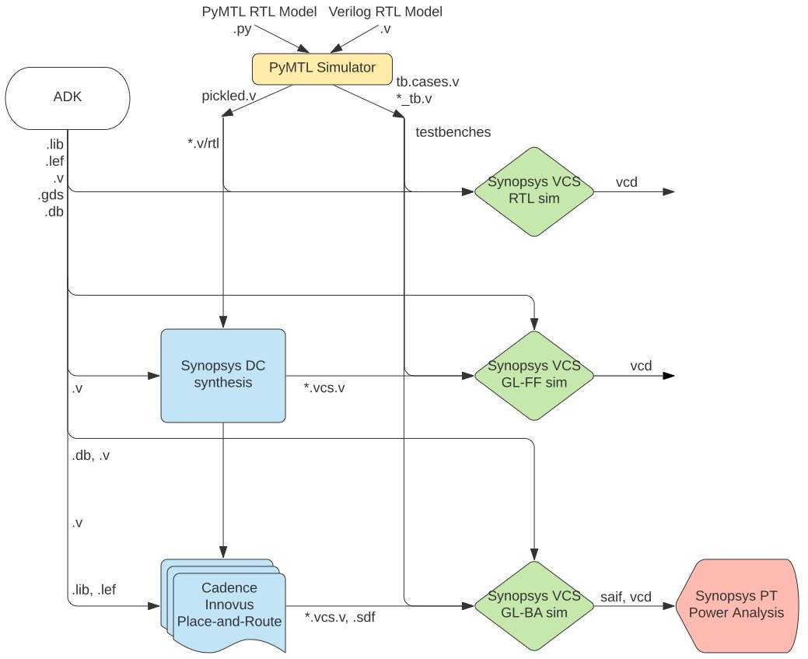

ECE 6745 Section 3: ASIC Automated Flow
==========================================================================

In the previous sections, we manually commands entering commands for each
tool to take a design from RTL to layout. Flow scripts can help automate
the process but copying and modifying these flow scripts for every design
is tedious and error prone. An agile hardware design flow demands
automation to simplify rapidly exploring the area, energy, timing design
space of one or more designs. In this section, we will introduce a simple
tool called pyhflow which takes as input a _step templates_ and a _design
YAML_ and generates appropriate flow scripts.

The following diagram illustrates the five primary tools we have already
seen in the previous discussion sections. Notice that the ASIC tools all
require various views from the standard-cell library.



Extensive documentation is provided by Synopsys and Cadence for these
ASIC tools. We have organized this documentation and made it available to
you on the public course webpage:

 - <https://www.csl.cornell.edu/courses/ece6745/asicdocs>

The first step is to access `ecelinux`. Use Microsoft Remote Desktop to
log into a specific `ecelinux` server. Then use VS Code to log into the
same specific `ecelinux` server. Once you are at the `ecelinux` prompt,
source the setup script, source the GUI setup script, clone this
repository from GitHub, and define an environment variable to keep track
of the top directory for the project.

```bash
% source setup-ece6745.sh
% source setup-gui.sh
% mkdir -p $HOME/ece6745
% cd $HOME/ece6745
% git clone git@github.com:cornell-ece6745/ece6745-sec04-asic-auto sec03
% cd sec03
% export TOPDIR=$PWD
```

1. Testing, Simulation, and Translation
--------------------------------------------------------------------------

As in the last section, we will be using the following four-stage
registered incrementer as our example design:


Before we can use the ASIC flow, we need to verify the design and
generate the corresponding Verilog files for each test which can be used
for RTL simulation, fast-functional gate-level simulation, and
back-annotated gate-level simulation. Always run the tests before pushing
anything through the ASIC flow. There is no sense in running the flow if
the design is incorrect!

```bash
% mkdir -p $TOPDIR/sim/build
% cd $TOPDIR/sim/build
% pytest ../tut3_verilog/regincr  --test-verilog --dump-vtb
```

You can run the interactive simulator for our four-stage registered
incrementer like this:

```bash
% cd $TOPDIR/sim/build
% ../tut3_verilog/regincr/regincr-sim 0xff 0x20 0x30 0x04 0x00
% less RegIncrNstage__p_nstages_4__pickled.v
```

You should now have the Verilog that we want to push through the ASIC
flow.

2. pyhflow For Generating Flows
--------------------------------------------------------------------------

pyflow is based on the idea of _step templates_ which are located in the
`asic/steps` directory.

```bash
% cd $TOPDIR/asic/steps
% tree
.
├── 01-synopsys-vcs-rtlsim
│   └── run
├── 02-synopsys-dc-synth
│   ├── run
│   └── run.tcl
├── 03-synopsys-vcs-ffglsim
│   └── run
├── 04-cadence-innovus-pnr
│   ├── run
│   ├── run.tcl
│   └── setup-timing.tcl
├── 05-synopsys-vcs-baglsim
│   └── run
├── 06-synopsys-pt-pwr
│   ├── run
│   └── run.tcl
└── 07-summarize-results
    ├── run
    └── summarize-results
```

Each step is a directory with a run script and possibly other scripts.
The key difference from the scripts we used in the previous tutorials, is
that these scripts are templated using the Jinja2 templating system:

 - <https://jinja.palletsprojects.com>

Open the `run.tcl` script in the `02-synopsys-dc-synth` step template
which uses Synopsys DC for synthesis.

```
% cd $TOPDIR/asic/steps/02-synopsys-dc-synth
% code run.tcl
```

Notice how the `run.tcl` script is templated based on the design name and
the target clock period.

```
analyze -format sverilog $env(TOPDIR)/sim/build/{{design_name}}__pickled.v
elaborate {{design_name}}

create_clock clk -name ideal_clock1 -period {{clock_period}}
```

The `{{ }}` directive is the standard syntax for template variable
substitution using Jinja2.

The pyhflow program takes as input a design YAML file which specifies:

 - what steps make up the flow
 - key/value pairs for variables to substitute into scripts
 - list of tests
 - list of evals

Take a look at the provided design YAML file for the registered
incrementer.

```bash
% cd $TOPDIR/asic/designs
% cat sec03-regincr.yml

steps:
 - 01-synopsys-vcs-rtlsim
 - 02-synopsys-dc-synth
 - 03-synopsys-vcs-ffglsim
 - 04-cadence-innovus-pnr
 - 05-synopsys-vcs-baglsim
 - 06-synopsys-pt-pwr
 - 07-summarize-results

design_name  : RegIncrNstage__p_nstages_4
clock_period : 1.0

tests:
 - RegIncrNstage__p_nstages_4_test_4stage_large
 - RegIncrNstage__p_nstages_4_test_4stage_overflow
 - RegIncrNstage__p_nstages_4_test_4stage_random
 - RegIncrNstage__p_nstages_4_test_4stage_small

evals:
 - RegIncrNstage__p_nstages_4_regincr-sim-basic
```

This design YAML file specifies the generated flow should use all seven
steps. Currently the only parameters are the design name and the clock
period. We run RTL sim, FFGL sim, and BAGL sim on all tests and evals,
but we only do energy analysis on the evals. The evals usually come from
running an interactive simulator like `regincr-sim`. All pyhflow does is
use the YAML file to figure out what to substitute into the templated
steps and then copy the run scripts into the current working directory.
You can also override parameters on pyhflow command line.

### 1.1. Running ASIC Flow with One Test

Let's go ahead and use pyhflow to generate the flow scripts for the
registered incrementer.

```bash
% mkdir -p $TOPDIR/asic/build-sec03-regincr
% cd $TOPDIR/asic/build-sec03-regincr
% pyhflow --one-test ../designs/sec03-regincr.yml
```

The `--one-test` command line option tells pyhflow to only include the
first test and no evals in the flow scripts. This is a useful way to get
started with a single test and reduces the overall runtime of the flow.
Once we know that everything works with one test we can circle back and
regenerate the flow scripts with all of the tests and evals.

Let's see how the step template has been filled in for the Synopsys DC
synthesis step.

```bash
% cd $TOPDIR/asic/build-sec03-regincr
% cat 02-synopsys-dc-synth/run.tcl
...
analyze -format sverilog $env(TOPDIR)/sim/build/RegIncrNstage__p_nstages_4__pickled.v
elaborate RegIncrNstage__p_nstages_4
create_clock clk -name ideal_clock1 -period 1.0
```

Notice how the name of the source Verilog RTL File, the top-level
modulename, and the clock period have all been filled in.

After generating a flow, we always recommend explicitly running at least
the first two steps to ensure there are no errors. You can run the
four-state RTL simulation as follows.

```bash
% cd $TOPDIR/asic/build-sec03-regincr
% ./01-synopsys-vcs-rtlsim/run
```

Make sure the step can find the source files and passes the test. Then
run synthesis as follows.

```bash
% cd $TOPDIR/asic/build-sec03-regincr
% ./02-synopsys-dc-synth/run
```

Carefully look at the output from the synthesis step (also stored in the
`run.log` file). Look for the output after `Running PRESTO HDLC` for any
warnings to ensure that all of your Verilog RTL is indeed synthesizable.
Scan through the rest of the logs to ensure there are no worrying
warnings or errors.

Once you have explicitly run the first two steps to ensure there are no
errors, you can run the remaning steps.

```bash
% cd $TOPDIR/asic/build-sec03-regincr
% 03-synopsys-vcs-ffglsim
% 04-cadence-innovus-pnr
% 05-synopsys-vcs-baglsim
% 06-synopsys-pt-pwr
% 07-summarize-results
```

### 1.2. Running ASIC Flow with All Tests and Evals

If all looks good, then you can regenerate the with all of the tests and
evals. **pyhflow will also create a `run-flow` script which will run all
of the steps in sequence for you, but only use this if you are confident
there are no errors!**

```bash
% cd $TOPDIR/asic/build-sec03-regincr
% pyhflow ../designs/sec03-regincr.yml
% ./run-flow
```

For the results to be valid, the following must be true:

 - all four-state RTL simulations pass
 - all fast-functional gate-level simulations pass
 - all back-annotated gate-level simulations pass
 - place-and-route setup slack is positive
 - place-and-route hold slack is positive

If your design does not meet timing after synthesis but _does_ meet
timing after place-and-route then these are still valid results. It just
means Synopsys DC was conservative and/or Cadence Innovus did a good job
further optimizing the design.

### 1.3. Interactive Debugging

Let's start Cadence Innovus in interactive mode and then load the design.

```bash
% cd $TOPDIR/asic/build-sec03-regincr
% innovus
innovus> source 04-cadence-innovus-pnr/post-pnr.enc
```

You can use Cadence Innovus to analyze the static timing of any path in
the design. For example, let's look at the static timing for a path in
the first stage:

```bash
innovus> report_timing -path_type full_clock -net \
  -from v/gen[0].reg_incr/reg_out_reg[0] \
  -to v/gen[1].reg_incr/reg_out_reg[0]
```

You can use the Amobea workspace to help visualize how modules are mapped
across the chip. Choose _Windows > Workspaces > Amoeba_ from the menu.
However, we recommend using the design browser to help visualize how
modules are mapped across the chip. Here are the steps:

 - Choose _Windows > Workspaces > Design Browser + Physical_ from the menu
 - Hide all of the metal layers by pressing the number keys
 - Browse the design hierarchy using the panel on the left
 - Right click on a module, click _Highlight_, select a color

Go ahead and highlight each stage in a different color.

You can use the following steps in Cadence Innovus to display where the
critical path is on the actual chip.

 - Choose _Timing > Debug Timing_ from the menu
 - Click _OK_ in the pop-up window
 - Right click on first path in the _Path List_
 - Choose _Highlight > Only This Path > Color_

Finally, you can use Klayout to capture a screen shot demonstrating that
you have successfully taken a design from RTL to layout.

```bash
% cd $TOPDIR/asic/build-sec03-regincr
% klayout -l $ECE6745_STDCELLS/klayout.lyp 04-cadence-innovus-pnr/post-pnr.gds
```

You can use _Display > Full Hierarchy_ to show all of the layout
including the layout inside the standard cells. You can use _Display >
Decrement Hierarchy_ and _Display > Decrement Hierarchy_ to show/hide the
layout inside the standard cells to focus on the routing. Consider hiding
M7, VIA7, M8, VIA8, and M9 to just show the clock and signal routing. Try
toggling _View > Show Cell Frames_ to show/hide the standard cell
bounding boxes.

### 1.5. Key Reports

Let's look at some reports. Let's start by looking at the synthesis
resources report.

```bash
% cd $TOPDIR/asic/build-sec03-regincr
% cat 02-synopsys-dc-synth/resources.rpt
...
===============================================================================
|                    |                  | Current            | Set            |
| Cell               | Module           | Implementation     | Implementation |
===============================================================================
| add_x_1            | DW01_inc         | apparch (area)     |                |
===============================================================================
```

This means that Synopsys DC is using a DesignWare module named
`DW01_inc`. You can read the datasheet here:

 - <https://web.csl.cornell.edu/courses/ece6745/asicdocs/dwbb_datasheets>

Notice that DesignWare provides four different microarchitectures: a
ripple-carry adder, a carry-look-ahead adder, a delay optimized
parallel-prefix adder, and an area-optimized parallel-prefix adder.
Synopsys DC has chosen to use the area-optimized parallel-prefix adder in
this case.

Now let's look at the place-and-route setup and hold time reports.

```bash
% cd $TOPDIR/asic/build-sec03-regincr
% cat 04-cadence-innovus-pnr/timing-setup.rpt
% cat 04-cadence-innovus-pnr/timing-hold.rpt
```

We can also look at the detailed area report and the detailed power
report to understand the overall area/power as well as the area/power of
each individual module.

```bash
% cd $TOPDIR/asic/build-sec03-regincr
% cat 04-cadence-innovus-pnr/area.rpt
% cat 06-synopsys-pt-pwr/*-detailed.rpt
```

3. Case Studies
--------------------------------------------------------------------------

Now that we know how to push a design through the automated flow, let's
consider two different case studies: (1) decreasing the clock period
constraint; and (2) flattening the design.

### 3.1. Decreasing the Clock Period Constraint

We can use pyhflow to regenerate the flow with a different clock period
by either: (1) changing the design YAML file (i.e., `sec03-regincr.yml`);
or (2) specifying the clock period on the pyflow command line. Let's use
the second approach. If you look at the setup timing report you will see
with a 1ns clock period you have maybe 550ps of positive slack. So a good
starting point would be to maybe try a clock period of 1ns - 550ps =
450ps. Let's try 500ps.

```
% mkdir -p $TOPDIR/asic/build-sec03-regincr-decrease-clk
% cd $TOPDIR/asic/build-sec03-regincr-decrease-clk
% pyhflow --one-test --clock_period=0.5 ../designs/sec03-regincr.yml
% ./run-flow
```

Notice how we are working in a new build directory. You can use multiple
build directories to build different blocks through the flow and/or for
design-space exploration. Also notice how we are using `--one-test` so we
can quickly experiment with pushing the design through the flow with a
single test and no evals.

Continue to decrease the clock period in 100ps increments until the
design no longer meets timing. Then rerun the flow at (roughly) the
shortest clock period which still meets timing. **Do not be too zealous
and push the tools to try and meet a clock period constraint that is way
too small! This can cause the tools to freak out and run forever.**

Once you find a shorter clock period, be sure to rerun with all tests and
evaluations by removing the "--one-test" command line option.

```
% mkdir -p $TOPDIR/asic/build-sec03-regincr-decrease-clk
% cd $TOPDIR/asic/build-sec03-regincr-decrease-clk
% pyhflow --clock_period=XX ../designs/sec03-regincr.yml
% ./run-flow
```

Where `XX` is the shortest clock period which meets timing. Now compare
the results from the longer and shorter clock periods. Start by looking
at the summary statistics. How does the number of standard cells and area
compare? We can also look at what kind of adder implementation Synopsys
DC chose to meet the shorter clock period constraint.

```bash
% cd $TOPDIR/asic
% cat build-sec03-regincr/02-synopsys-dc-synth/resources.rpt
% cat build-sec03-regincr-decrease-clk/02-synopsys-dc-synth/resources.rpt
```

Here we can see Synopsys DC has chosen to use a different version of the
parallel-prefix adder which is now optimized for both area _and_ speed.

We can also look compare the critical path; you should be able to see
that the design with the shorter clock period has many fewer levels of
logic on the critical path.

```bash
% cd $TOPDIR/asic
% cat build-sec03-regincr/04-cadence-innovus-pnr/timing-setup.rpt
% cat build-sec03-regincr-decrease-clk/04-cadence-innovus-pnr/timing-setup.rpt
```

### 3.1. Flattening the Design

Let's modify our scripts to flatten our design and see how this impacts
various metrics. We can run pyhflow to instantiate the flow scripts and
then modify these flow scripts in the build directory. Use the shortest
clock period that still meets timing from the previous case study.

```
% mkdir -p $TOPDIR/asic/build-sec03-regincr-flatten
% cd $TOPDIR/asic/build-sec03-regincr-flatten
% pyhflow --clock_period=XX ../designs/sec03-regincr.yml
% code 02-synopsys-dc-synth/run.tcl
```

Where `XX` is the shortest clock period which meets timing. We are
currently using the following command in `02-synopsys-dc-synth/run.tcl`
to synthesize our design.

```
compile_ultra -no_autoungroup -gate_clock
```

Change this by removing `-no_autoungroup`.

```
compile_ultra -no_autoungroup -gate_clock
```

Now run the flow.

```
% cd $TOPDIR/asic/build-sec03-regincr-flatten
% ./run-flow
```

Revisit the post-synthesis gate-level netlist without flattening.

```bash
% cd $TOPDIR/asic
% less build-sec03-regincr-decrease-clk/02-synopsys-dc-synth/post-synth.v
```

Notice how the original gate-level netlist preserves the logical
hierarchy. Now look at the post-synthesis gate-level netlist with
flattening.

```bash
% cd $TOPDIR/asic
% less build-sec03-regincr-flatten/02-synopsys-dc-synth/post-synth.v
```

Now notice who all of the logical hierarchy is gone and all of the gates
are in a single "flat" module. Compare the area without and with
flattening.

```bash
% cd $TOPDIR/asic
% cat build-sec03-regincr-decrease-clk/04-cadence-innovus-pnr/area.rpt
% cat build-sec03-regincr-flatten/04-cadence-innovus-pnr/area.rpt
```

Because the flattened module lacks logical hierarchy we cannot see the
hierarchical breakdown. The advantage of flattening is that it can
improve the area and also potentially enable a shorter clock period, but
the disadvantage is that it significantly complicates our ability to
deeply understand the area, energy, and timing of our designs and thus
effectively explore an entire design space. So we will primarily turn off
flattening in this course.

Note that if we wanted to make it easier to experiment with flattening,
we could modify the synthesis step template like this:

```

compile_ultra -gate_clock

compile_ultra -no_autoungroup -gate_clock

```

Then in your design YAML file you can add this to control whether
flattening is turned on or off; or we can specify the value of the
flatten parameter as a pyhflow command line option (i.e., with
`--flatten=true`).

```
flatten : true
```

Students should feel free to modify the step templates and/or the design
YAML files for their labs and/or projects to experiment with the ASIC
flow.

