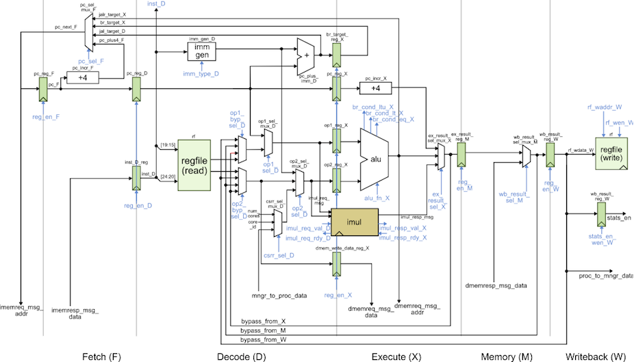

ECE 6745 Section 4: TinyRV2 Accelerator RTL Design
==========================================================================

In this section, we will be discussing how to implement a simple
medium-grain accelerator. Fine-grain accelerators are tightly integrated
within the processor pipeline (e.g., a specialized functional unit for
bit-reversed addressing useful in implementing an FFT), while
coarse-grain accelerators are loosely integrated with a processor through
the memory hierarchy (e.g., a graphics rendering accelerator sharing the
last-level cache with a general-purpose processor). Medium-grain
accelerators are often integrated as co-processors: the processor can
directly send/receive messages to/from the accelerator with special
instructions, but the co-processor is relatively decoupled from the main
processor pipeline and can also independently interact with memory. To
illustrate how to implement a medium-grain accelerator, we will be
working on a simple "accumulation" accelerator that adds all of the
values in an array stored in memory. More detailed tutorials for a
vector-vector-add accelerator including how to push a complete processor,
memory, and accelerator system will be posted on the public course
website shortly.

The first step is to access `ecelinux`. Use Microsoft Remote Desktop to
log into a specific `ecelinux` server. Then use VS Code to log into the
same specific `ecelinux` server. Once you are at the `ecelinux` prompt,
source the setup script, source the GUI setup script, clone this
repository from GitHub, and define an environment variable to keep track
of the top directory for the project.

```bash
% source setup-ece6745.sh
% source setup-gui.sh
% mkdir -p $HOME/ece6745
% cd $HOME/ece6745
% git clone git@github.com:cornell-ece6745/ece6745-sec04-xcel-rtl sec04
% cd sec04
% export TOPDIR=$PWD
```

1. Baseline TinyRV2 Processor FL and RTL Models
--------------------------------------------------------------------------

The following figure illustrates the overall system we will be using with
our TinyRV2 processors. The processor includes eight latency insensitive
val/rdy interfaces. The mngr2proc/proc2mngr interfaces are used for the
test harness to send data to the processor and for the processor to send
data back to the test harness. The imem master/minion interface is used
for instruction fetch, and the dmem master/minion interface is used for
implementing load/store instructions. The system includes both
instruction and data caches. The xcel master/minion interface is used for
the processor to send messages to the accelerator. **The cache is not
ported to work with the ASIC flow so it is not currently included!**


We provide two implementations of the TinyRV2 processor. The FL model in
`sim/proc/ProcFL.py` is essentially an instruction-set-architecture (ISA)
simulator; it simulates only the instruction semantics and makes no
attempt to model any timing behavior. The RTL model in
`sim/proc/ProcVRTL.v` is similar to the alternative design for lab 2 in
ECE 4750. It is a five-stage pipelined processor that implements the
TinyRV2 instruction set and includes full bypassing/forwarding to resolve
data hazards. There are two important differences from the alternative
design for lab 2 of ECE 4750. First, the new processor design uses a
single-cycle integer multiplier. Second, the new processor design
includes the ability to handle new CSRs for interacting with medium-grain
accelerators. The datapath diagram for the processor is shown below.



We should run all of the unit tests on both the FL and RTL processor
models to verify that we are starting with a working processor.

```bash
% mkdir -p $TOPDIR/sim/build
% cd $TOPDIR/sim/build
% pytest ../proc
```

2. Cross-Compiling and Executing TinyRV2 Microbenchmarks
--------------------------------------------------------------------------

We will write our microbenchmarks in C. Let's start by writing a simple
accumulation microbenchmark. Take a look at the code provided in
`app/ubmark/ubmark-accum.c`:

```c
__attribute__ ((noinline))
int accum_scalar( int* src, int size )
{
  // ''' SECTION TASK ''''''''''''''''''''''''''''''''''''''''''''''''
  // Implement a simple C function to add all of the elements in the
  // source array and then return this result.
  // '''''''''''''''''''''''''''''''''''''''''''''''''''''''''''''''''
}
```

Go ahead and implement the `accum_scalar` function. We will a use
microbenchmark test to verify the functionality of our microbenchmark and
a microbenchmark eval to evaluate the performance of our microbenchmark.
We will run both the microbenchmark test and eval on both FL and RTL
TinyRV2 processor models.

### 2.1. TinyRV2 Microbenchmark Test

Let's go ahead and take a look at the microbenchmark test provided for
the accumulation microbenchmark.

```bash
% cd $TOPDIR/app/ubmark
% less ubmark-accum-test.c
```

Notice how we have various test case functions and then we call these
test case functions in `main`. We have a build system that can compile
microbenchmarks tests and evalutions natively for x86 and can also
cross-compile these microbenchmarks for TinyRV2 so they can be executed
on our simulators. Here is how we compile and execute the tests for the
pure-software accumulation microbenchmark natively:

```bash
% cd $TOPDIR/app
% mkdir build-native
% cd build-native
% ../configure
% make ubmark-accum-test
% ./ubmark-accum-test
```

You can run a single test case like this:

```bash
% cd $TOPDIR/app/build-native
% ./ubmark-accum-test 1
```

Once we are confident the microbenchmark test passes on natively, we can
cross-compile the microbenchmark test and run it on both FL and RTL
TinyRV2 processor models. Let's start by cross-compiling the
microbenchmark test.

```bash
% mkdir -p $TOPDIR/app/build
% cd $TOPDIR/app/build
% ../configure --host=riscv32-unknown-elf
% make ubmark-accum-test
```

This will create a `ubmark-accum-test` binaries which contains TinyRV2
instructions and data. You can disassemble a TinyRV2 binary (i.e., turn a
compiled binary back into an assembly text representation) with the
`riscv32-objdump` command like this:

```bash
% cd $TOPDIR/app/build
% riscv32-objdump ubmark-accum-test | less -p"<ubmark_accum>:"
```

Take a look at the `ubmark_accum` function in the disassembly and see if
you can understand how this assembly implements the C function you wrote.

We have provided you with a simulator that composes a processor, memory,
and accelerator and is capable of executing TinyRV2 binaries. The
simulator enables flexibly choosing the processor implementation (FL vs.
RTL) and the type and implementation of the accelerator. By default, the
simulator uses the processor FL model and a "null" accelerator. So let’s
execute both TinyRV2 binaries on the instruction-set
simulator:

```bash
% cd $TOPDIR/app/build
% ../../sim/pmx/pmx-sim ./ubmark-accum-test
```

The `--trace` command line option will display each instruction as it is
executed on the ISA simulator.

```bash
% cd $TOPDIR/app/build
% ../../sim/pmx/pmx-sim --trace ./ubmark-accum-test > ubmark-accum-test-fl.trace
% code ubmark-accum-test-fl.trace
```

Now that we have verified the microbenchmark works correctly on the ISA
simulator, we can run the test on the baseline TinyRV2 pipelined
processor RTL model:

```bash
% cd $TOPDIR/app/build
% ../../sim/pmx/pmx-sim --proc-impl rtl ./ubmark-accum-test
```

The simulation should show all tests are passing.

### 2.2. TinyRV2 Microbenchmark Eval

Once we are sure the microbenchmark test is working natively, on the FL
simulator, and the RTL simulator, we can then turn our focus to the
microbenchmark eval.

```bash
% cd $TOPDIR/app/ubmark
% less ubmark-accum-eval.c
```

The `eval_src` and `eval_ref` arrays are all defined in the
`app/ubmark/ubmark-accum.dat` file. The microbenchmark turns stats on,
does the actual computation, turns stats off, and finally verifies that
the results are as expected. We need the `ece6745_stats_on()` and
`ece6745_stats_off()` functions to make sure we can keep track of various
statistics (e.g., the number of cycles) only during the important part of
the microbenchmark. We do not want to count time spent in initialization
or verification when comparing the performance of our various
microbenchmarks. These two functions are defined in
`app/ece6745/ece6745-misc.h`.

Here is how we can compile and execute the evaluation for the
accumulation microbenchmark eval natively:

```bash
% cd $TOPDIR/app/build-native
% make ubmark-accum-eval
% ./ubmark-accum-eval
```

The microbenchmark should display passed. Once you are sure your
microbenchmark eval is working correctly natively, you can cross-compile
the microbenchmark eval for TinyRV2 and run it on the FL simulator.

```bash
% cd $TOPDIR/app/build
% make ubmark-accum-eval
% ../../sim/pmx/pmx-sim ./ubmark-accum-eval
```

Finally we can run the microbenchmark eval on the baseline TinyRV2
pipelined processor RTL model:

```bash
% cd $TOPDIR/app/build
% ../../sim/pmx/pmx-sim --proc-impl rtl --stats ./ubmark-accum-eval
num_cycles = 613
```

The number of cycles for your experiment might be difference since you
have written your own accumulation microbenchmark. Now generate a line
trace to dig into the performance:

```bash
% cd $TOPDIR/app/build
% ../../sim/pmx/pmx-sim --proc-impl rtl --trace \
    ./ubmark-accum-eval > ubmark-accum-eval-rtl.trace
```

The instructor will walk through and explain the line trace.

3. Accumulation Accelerator FL and RTL Models
--------------------------------------------------------------------------

We will take an incremental approach when designing, implementing,
testing, and evaluating accelerators. We can use test sources, sinks, and
memories to create a test harness that will enable us to explore the
accelerator cycle-level performance and the ASIC area, energy, and timing
in isolation. Only after we are sure that we have a reasonable
design-point should we consider integrating the accelerator with the
processor.

We have provided you a FL model of the accumulation accelerator. Our
accelerators will include a set of accelerator registers that can be read
and written from the processor using special instructions and the
xcelreq/xcelresp interface. The accumulator accelerator protocol defines
the accelerator registers as follows:

 - xr0 : go/done
 - xr1 : base address of the array src
 - xr2 : size of the array

The actual protocol involves the following steps:

 1. Write the base address of src to xr1
 2. Write the number of elements in the array to xr2
 3. Tell accelerator to go by writing xr0
 4. Wait for accelerator to finish by reading xr0, result will be sum

You can test this model like this:

```bash
% cd $TOPDIR/sim/build
% pytest ../tut9_xcel/test/AccumXcelFL_test.py -v
```

We are now going to work on the accumulation accelerator RTL model. Our
accelerator will use the following FSM:


While the accelerator is in the XCFG state, it will update its internal
registers when it receives accelerator requests from the processor. When
the accelerator receives a write to xr0 it moves into the M_RD state. In
the M_RD state, the accelerator will send out one memory read request to
read the current element from the source array. In the CALC state, the
accelerator will wait for the response from memory and then do the actual
accumulation. It then will either move back into the M_RD state if there
is another element to be processed, or move into the XCFG state if we
have processed all elements in the array.

Open the accumulation accelerator RTL which is in
`sim/tut9_xcel/AccumXcel.v` and take a look.

```bash
% cd $TOPDIR/sim/tut9_xcel
% code AccumXcel.v
```

You can test the accelerator like this:

```bash
% cd $TOPDIR/sim/build
% pytest ../tut9_xcel
```

We have also included a simulator for just the accumulation accelerator
in isolation which can be used to evaluate its performance.

```
% cd $TOPDIR/sim/build
% ../tut9_xcel/accum-xcel-sim --impl rtl --input multiple --stats
num_cycles = 810
```

We could use the simulator to help evaluate the cycle-level performance
of the accelerator on various different datasets as we try out various
optimizations.

4. Accelerating a TinyRV2 Microbenchmark
--------------------------------------------------------------------------

Now that we have unit tested and evaluated both the baseline TinyRV2
pipelined processor and the accumulation accelerator in isolation, we are
finally ready to compose them. The processor will send messages to the
accelerator by reading and writing 32 special CSRs using the standard
CSRW and CSRR instructions. These 32 special CSRs are as follows:

```
0x7e0 : accelerator register  0 (xr0)
0x7e1 : accelerator register  1 (xr1)
0x7e2 : accelerator register  2 (xr2)
...
0x7ff : accelerator register 31 (xr31)
```

Here is a simple assembly sequence which will write the value 1 to an
accelerator register, read that value back from the accelerator register,
and write the value to general-purpose register x2.

```
addi x1, x0, 1
csrw 0x7e0, x1
csrr x2, 0x7e0
```

To use an accelerator from a C microbenchmark, we need to embed assembly
instructions directly into a C program. We can do this using the GCC
inline assembly extensions. Take a closer look at the accelerated version
of the accumulation microbenchmark in `app/ubmark/ubmark-accum-xcel.c:`

```c
__attribute__ ((noinline))
int accum_xcel( int* src, int size )
{
  int result = 0;

  asm volatile (
    "csrw 0x7e1, %[src]; \n"
    "csrw 0x7e2, %[size];\n"
    "csrw 0x7e0, x0     ;\n"
    "csrr %[result], 0x7e0;\n"

    // Outputs from the inline assembly block

    : [result] "=r"(result)

    // Inputs to the inline assembly block

    : [src]    "r"(src),
      [size]   "r"(size)

    // Tell the compiler this accelerator read/writes memory

    : "memory"
  );

  return result;
}
```

The `asm` keyword enables embedding assembly into a C program. We have a
sequence of strings, and each string is one assembly instruction.
`%[src]` is special syntax that tells GCC to put the register that holds
the `src` C variable into that location in the assembly. So if the
compiler ends up allocating the `src` C variable to `x11` then it will
put `x11` into the first assembly instruction.

Let's compile and test our microbenchmark test and evaluation. Note that
you cannot natively compile a microbenchmark that makes use of an
accelerator, since x86 does not have any accelerators!

```bash
% cd $TOPDIR/app/build
% make ubmark-accum-xcel-test
% make ubmark-accum-xcel-eval
% ../../sim/pmx/pmx-sim --xcel-impl accum-fl ./ubmark-accum-xcel-test
% ../../sim/pmx/pmx-sim --xcel-impl accum-fl ./ubmark-accum-xcel-eval
```

Everything looks as expected, so we can now run our accelerated
accumulation microbenchmark on the RTL implementation.

```bash
% cd $TOPDIR/app/build
% ../../sim/pmx/pmx-sim --proc-impl rtl --xcel-impl accum-rtl ./ubmark-accum-xcel-test
% ../../sim/pmx/pmx-sim --proc-impl rtl --xcel-impl accum-rtl \
    --stats ./ubmark-accum-xcel-eval
num_cycles = 314
```

Recall that the pure-software accumulation microbenchmark required 613
cycles. So our accelerator results in a cycle-level speedup of 2x. We
might ask, where did this speedup come from? Why isn’t the speedup
larger? Let’s look at the line trace.

```bash
% cd $TOPDIR/app/build
% ../../sim/pmx/pmx-sim --proc-impl rtl --xcel-impl accum-rtl \
    --trace ./ubmark-accum-xcel-eval > trace-alt.txt
```

See if you can figure out exactly what the accelerator is doing. Ideally,
the accelerator would be able to sustain one accumulation per cycle for
full throughput. Why is it not able to do this? What could we do to
further improve the performance of this accelerator?

