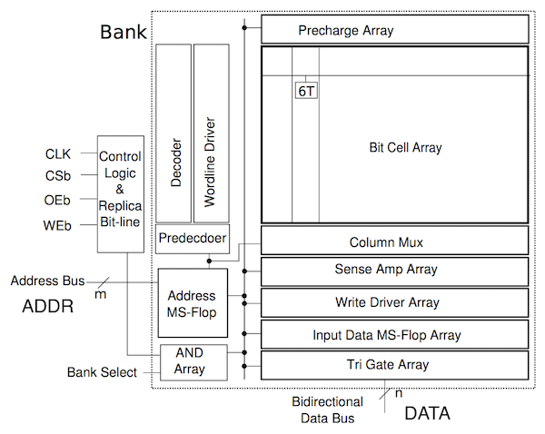
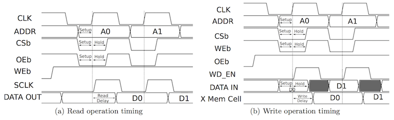
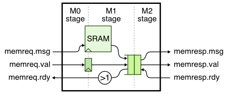

ECE 6745 Section 5: SRAM Generators
==========================================================================

In this section, we will be learning about SRAM generators. Small
memories can be easily synthesized using flip-flop or latch standard
cells, but synthesizing large memories can significantly impact the area,
energy, and timing of the overall design. ASIC designers often use SRAM
generators to "generate" arrays of memory bitcells and the corresponding
peripheral circuitry (e.g., address decoders, bitline drivers, sense
amps) which are combined into what is called an "SRAM macro". These SRAM
generators are parameterized to enable generating a wide range of SRAM
macros with different numbers of rows, columns, and column muxes, as well
as optional support for partial writes, built-in self-test, and error
correction. Similar to a standard-cell library, an SRAM generator must
generate not just layout but also all of the necessary views to capture
logical functionality, timing, geometry, and power usage. These views can
then by used by the ASIC tools to produce a complete design which
includes a mix of both standard cells and SRAM macros. We will first see
how to use the open-source OpenRAM memory generator to generate various
views of an SRAM macro. Then we will see how to use SRAMs in our RTL
designs. Finally, we will put the these two pieces together to combine
synthesizable RTL with SRAM macros and push the composition through the
ASIC toolflow.

The first step is to access `ecelinux`. Use Microsoft Remote Desktop to
log into a specific `ecelinux` server. Then use VS Code to log into the
same specific `ecelinux` server. Once you are at the `ecelinux` prompt,
source the setup script, source the GUI setup script, clone this
repository from GitHub, and define an environment variable to keep track
of the top directory for the project.

```bash
% source setup-ece6745.sh
% source setup-gui.sh
% mkdir -p $HOME/ece6745
% cd $HOME/ece6745
% git clone git@github.com:cornell-ece6745/ece6745-sec05-sram sec05
% cd sec05
% export TOPDIR=$PWD
```

1. OpenRAM Memory Generator
--------------------------------------------------------------------------

Just as with standard-cell libraries, acquiring real SRAM generators is a
complex and potentially expensive process. It requires gaining access to
a specific fabrication technology, negotiating with a company which makes
the SRAM generator, and usually signing multiple non-disclosure
agreements. The OpenRAM memory generator is based on the same "fake" 45nm
technology that we are using for the Nangate standard-cell library. The
"fake" technology is representative enough to provide reasonable area,
energy, and timing estimates for our purposes. Let's take a look at how
to use the OpenRAM memory generator to generate various views of an SRAM
macro.

An SRAM generator takes as input a configuration file which specifies the
various parameters for the desired SRAM macro. Create a configuration
file with the following content using your favorite text editor. You
should name your file `SRAM_32x128_1rw_cfg.py` and it should be located in
the directory shown below.

```bash
% cd $TOPDIR/asic/build-sram/00-openram-memgen
% cat SRAM_32x128_1rw_cfg.py
```

The configuration file should look like this:

```
use_conda       = False

num_rw_ports    = 1
num_r_ports     = 0
num_w_ports     = 0

word_size       = 32
num_words       = 128
num_banks       = 1
words_per_row   = 4
write_size      = 8

tech_name       = "freepdk45"
process_corners = ["TT"]
supply_voltages = [1.1]
temperatures    = [25]

route_supplies  = True
check_lvsdrc    = False

output_path     = "SRAM_32x128_1rw"
output_name     = "SRAM_32x128_1rw"
instance_name   = "SRAM_32x128_1rw"
```

In this example, we are generating a single-ported SRAM which has 128
rows and 32 bits per row for a total capacity of 4096 bits or 512B. This
size is probably near the cross-over point where you might transition
from using synthesized memories to SRAM macros. OpenRAM will take this
configuration file as input and generate many different views of the SRAM
macro including: schematics (`.sp`), layout (`.gds`), a Verilog
behavioral model (`.v`), abstract logical, timing, power view (`.lib`),
and a physical view (`.lef`). These views can then be used by the ASIC
tools.

You can use the following command to run the OpenRAM memory generator.

```bash
% cd $TOPDIR/asic/build-sram/00-openram-memgen
% openram -v -v SRAM_32x128_1rw_cfg.py
```

It will take about 4-5 minutes to generate the SRAM macro. You can see
the resulting views here:

```bash
% cd $TOPDIR/asic/build-sram/00-openram-memgen/SRAM_32x128_1rw
% ls -1
SRAM_32x128_1rw.gds
SRAM_32x128_1rw.lef
SRAM_32x128_1rw.sp
SRAM_32x128_1rw_TT_1p1V_25C.lib
SRAM_32x128_1rw.v
SRAM_32x128_1rw.html
```

You can find more information about the OpenRAM memory generator on the
project's webpage here:

 - <https://openram.org>

Or in this research paper:

 - M. Guthaus et. al, "OpenRAM: An Open-Source Memory Compiler", Int'l
   Conf. on Computer-Aided Design (ICCAD), Nov. 2016.
   (https://doi.org/10.1145/2966986.2980098)

The following excerpt from the paper illustrates the microarchitecture
used in the single-port SRAM macro.



The functionality of the pins are as follows:

 - `clk`: clock
 - `WEb`: write enable (active low)
 - `OEb`: output enable (active low)
 - `CSb`: whole SRAM enable (active low)
 - `ADDR`: address
 - `DATA`: read/write data

Notice that there is a single address, and a single read/write data bus.
This SRAM macro has a single read/write port and only supports executing
a single transaction at a time. The following excerpt from the paper
shows the timing diagram for a read and write transaction.



Prof. Batten will explain this timing diagram in more detail, especially
the important distinction between a _synchronous_ read SRAM and a
_combinational_ read register file. Take a few minutes to look at the
behavioral verilog. See if you can see how this models a synchronous read
SRAM.

```bash
% cd $TOPDIR/asic/build-sram/00-openram-memgen/SRAM_32x128_1rw
% less SRAM_32x128_1rw.v
```

You can take a look at the generated transistor-level netlist for a
single bit-cell like this:

```bash
% cd $TOPDIR/asic/build-sram/00-openram-memgen/SRAM_32x128_1rw
% less -p " cell_1rw " SRAM_32x128_1rw.sp
```

Now let's use Klayout look at the actual layout produced by the OpenRAM
memory generator.

```bash
% cd $TOPDIR/asic/build-sram/00-openram-memgen/SRAM_32x128_1rw
% klayout -l $ECE6745_STDCELLS/klayout.lyp SRAM_32x128_1rw.gds
```

In Klayout, you can show/hide layers by double clicking on them on the
right panel. You can show more of the hierarchy by selecting _Display >
Increment Hierarchy_ or less of the hierarchy by selecting _Display >
Decrement Hierarchy_ from the menu.

Take a quick look at the `.lib` file and the `.lef` file for the SRAM
macro.

```bash
% cd $TOPDIR/asic/build-sram/00-openram-memgen/SRAM_32x128_1rw
% less SRAM_32x128_1rw_TT_1p1V_25C.lib
% less SRAM_32x128_1rw.lef
```

2. SRAM RTL Models
--------------------------------------------------------------------------

Now that we understand how an SRAM generator works, let's see how to
reference an SRAM in Verilog RTL. Our basic SRAMs are located in the
`sim/sram` subdirectory.

```bash
% cd $TOPDIR/sim/sram
% ls
...
SRAM_generic.v
SRAM.v
```

Take a look the interface of the SRAM in `SRAM.v`.

```verilog
module sram_SRAM
#(
  parameter p_data_nbits  = 32,
  parameter p_num_entries = 256,

  // Local constants not meant to be set from outside the module
  parameter c_addr_nbits  = $clog2(p_num_entries),
  parameter c_data_nbytes = (p_data_nbits+7)/8 // $ceil(p_data_nbits/8)
)(
  input  logic                        clk,
  input  logic                        reset,
  input  logic                        port0_val,
  input  logic                        port0_type,
  input  logic [c_addr_nbits-1:0]     port0_idx,
  input  logic [(p_data_nbits/8)-1:0] port0_wben,
  input  logic [p_data_nbits-1:0]     port0_wdata,
  output logic [p_data_nbits-1:0]     port0_rdata
);
```

The SRAM model is parameterized by the number of words and the bits per
word, and has the following pin-level interface:

 - `port0_val`: port enable
 - `port0_type`: transaction type (0 = read, 1 = write)
 - `port0_idx`: which row to read/write
 - `port0_wben`: write byte enables
 - `port0_wdata`: write data
 - `port0_rdata`: read data

Now look at the implementation of the SRAM. You will see a generate if
statement which uses the parameters to either (1) instantiate a specific
SRAM macro or (2) instantiate a generic SRAM. It is critical that the
name of the specific SRAM macro matches the name generated by OpenRAM. In
this discussion section we will be generating an SRAM with 128 words each
of which is 32 bits, and we can see that this SRAM macro is already
included.

Let's run the tests for the specific SRAM we will be using in this
discussion section.

```bash
% mkdir -p $TOPDIR/sim/build
% cd $TOPDIR/sim/build
% pytest ../sram/test/SRAM_test.py -k test_direct_32x128 -s
```

You can run the random test like this:

```bash
% cd $TOPDIR/sim/build
% pytest ../sram/test/SRAM_test.py -k test_random[32-128] -s
```

3. SRAM Minion Wrapper RTL
--------------------------------------------------------------------------

SRAMs use a latency _sensitive_ interface meaning a user must carefully
manage the timing for correct operation (i.e., set the read address and
then exactly one cycle later use the read data). In addition, the SRAM
cannot be "stalled". To illustrate how to use SRAM macros, we will create
a latency _insensitive_ minion wrapper around an SRAM which enables
writing and reading the SRAM using our standard memory messages. The
following figure illustrates our approach to implementing this wrapper:



Here is a pipeline diagram that illustrates how this works.

```
 cycle : 0  1  2  3  4  5  6  7  8
 msg a : M0 Mx
 msg b :    M0 Mx
 msg c :       M0 M1 M2 M2 M2
 msg d :          M0 M1 q  q  M2     # msg c is in skid buffer
 msg e :             M0 M0 M0 M0 Mx

 cycle M0 M1 [q ] M2
    0: a
    1: b  a       a  # a flows through bypass queue
    2: c  b       b  # b flows through bypass queue
    3: d  c          # M2 is stalled, c will need to go into bypq
    4: e  d    c     #
    5: e      dc     # d skids behind c into the bypq
    6: e       d  c  # c is dequeued from bypq
    7: e          d  # d is dequeued from bypq
    8:    e       e  # e flows through bypass queue
```

Take a closer look at the SRAM minion wrapper we provide you.

```bash
% cd $TOPDIR/sim/tut10_sram
% less SRAMMinion.v
```

To use an SRAM, simply include `sram/SRAM.v`, instantiate the SRAM, and
set the number of words and number of bits per word. Here is what the
instantiation of the SRAM looks like in the wrapper.

```verilog
`include "sram/SRAM.v"
...
sram_SRAM#(32,128) sram
(
  .clk         (clk),
  .reset       (reset),
  .port0_idx   (sram_addr_M0),
  .port0_type  (sram_wen_M0),
  .port0_val   (sram_en_M0),
  .port0_wben  (sram_wben_M0),
  .port0_wdata (memreq_msg_data_M0),
  .port0_rdata (sram_read_data_M1)
);
```

We can run a test on the SRAM minion wrapper like this:

```bash
 % cd $TOPDIR/sim/build
 % pytest ../tut10_sram/test/SRAMMinion_test.py -k random_0_3 -s
```

Here is what the trace output should look like.

```
  1r                           > (  (). ) > .
  2r                           > (  (). ) > .
  3:                           > (  (). ) > .
  4: wr:00:00000000:0:55fceed9 > (wr(). ) > .
  5: wr:01:00000004:0:5bec8a7b > (wr()# ) > #
  6: #                         > (# ()# ) > #
  7: #                         > (# ()wr) > wr:00:0:0:
  8: #                         > (# ()# ) > #
  9: #                         > (# ()# ) > #
 10: #                         > (# ()# ) > #
 11: #                         > (# ()wr) > wr:01:0:0:
 12: wr:02:00000008:0:b1aa20f1 > (wr(). ) > .
 13: wr:03:0000000c:0:a5b6b6bb > (wr()# ) > #
 14: #                         > (# ()# ) > #
 15: #                         > (# ()wr) > wr:02:0:0:
```

The first write transaction takes a single cycle to go through the SRAM
minion wrapper, but then the response interface is not ready on cycles
5-6. The second write transaction is still accepted by the SRAM minion
wrapper and it will end up in the bypass queue, but the later
transactions are stalled because the request interface is not ready. No
transactions are lost.

Let's now use an interactive simulator to generate the pickled Verilog
and a test bench for pushing through the ASIC flow.

```bash
% cd $TOPDIR/sim/build
% ../tut10_sram/sram-sim --impl rtl --input random --translate --dump-vtb
```

4. ASIC Front-End Flow with SRAM Macros
--------------------------------------------------------------------------

Now we will push our SRAM minion wrapper through the ASIC front-end flow.
We have already generated the SRAM macro using OpenRAM at the beginning
of the discussion section. We want to move the key generated files to
make them easier to use by the ASIC tools.

```bash
% cd $TOPDIR/asic/build-sram/00-openram-memgen/SRAM_32x128_1rw
% mv *.gds *.lib *.lef *.v ..
```

We need to convert the `.lib` file into a `.db` file using the Synopsys
Library Compiler (LC) tool.

```
% cd $TOPDIR/asic/build-sram/00-openram-memgen
% cp SRAM_32x128_1rw_TT_1p1V_25C.lib SRAM_32x128_1rw.lib
% lc_shell
lc_shell> read_lib SRAM_32x128_1rw.lib
lc_shell> write_lib SRAM_32x128_1rw_TT_1p1V_25C_lib \
  -format db -output SRAM_32x128_1rw.db
lc_shell> exit
```

As always, we start by using four-state RTL simulation to further verify
our design.

```bash
% mkdir -p ${TOPDIR}/asic/build-sram/01-synopsys-vcs-rtlsim
% cd ${TOPDIR}/asic/build-sram/01-synopsys-vcs-rtlsim
% vcs -sverilog -xprop=tmerge -override_timescale=1ns/1ps -top Top \
   +vcs+dumpvars+waves.vcd \
   +incdir+${TOPDIR}/sim/build \
   ${TOPDIR}/sim/build/SRAMMinion_noparam__pickled.v \
   ${TOPDIR}/sim/build/SRAMMinion_noparam_sram-rtl-random_tb.v
% ./simv
```

Now we can use Synopsys DC to synthesize the logic which goes around the
SRAM macro.

```
% mkdir -p ${TOPDIR}/asic/build-sram/02-synopsys-dc-synth
% cd ${TOPDIR}/asic/build-sram/02-synopsys-dc-synth
% dc_shell-xg-t
dc_shell> set_app_var target_library "$env(ECE6745_STDCELLS)/stdcells.db ../00-openram-memgen/SRAM_32x128_1rw.db"
dc_shell> set_app_var link_library   "* $env(ECE6745_STDCELLS)/stdcells.db ../00-openram-memgen/SRAM_32x128_1rw.db"
dc_shell> analyze -format sverilog ../../../sim/build/SRAMMinion_noparam__pickled.v
dc_shell> elaborate SRAMMinion_noparam
dc_shell> create_clock clk -name ideal_clock1 -period 2.0
dc_shell> compile
dc_shell> write -format ddc     -hierarchy -output post-synth.ddc
dc_shell> write -format verilog -hierarchy -output post-synth.v
dc_shell> report_area   -hierarchy
dc_shell> report_timing -nets
dc_shell> exit
```

We are basically using the same steps we used in the ASIC front-end flow
section. Notice how we must point Synopsys DC to the `.db` file generated
by the OpenRAM memory generator so Synopsys DC knows the abstract logical
and timing views of the SRAM.

If you look for the SRAM module in the synthesized gate-level netlist,
you will see that it is referenced but not declared. This is what we
expect since we are not synthesizing the memory but instead using an SRAM
macro.

```bash
% cd ${TOPDIR}/asic/build-sram/02-synopsys-dc-synth
% less -p SRAM post-synth.v
```

We can use fast-functional gate-level simulation to simulate the
gate-level netlist integrated with the Verilog RTL models for the SRAMs.

```bash
% mkdir -p $TOPDIR/asic/build-sram/03-synopsys-vcs-ffglsim
% cd $TOPDIR/asic/build-sram/03-synopsys-vcs-ffglsim
% vcs -sverilog -xprop=tmerge -override_timescale=1ns/1ps -top Top \
    +delay_mode_zero \
    +vcs+dumpvars+waves.vcd \
    +incdir+${TOPDIR}/sim/build \
    ${ECE6745_STDCELLS}/stdcells.v \
    ../00-openram-memgen/SRAM_32x128_1rw.v \
    ../02-synopsys-dc-synth/post-synth.v \
    ${TOPDIR}/sim/build/SRAMMinion_noparam_sram-rtl-random_tb.v
% ./simv
```

4. ASIC Back-End Flow with SRAM Macros
--------------------------------------------------------------------------

Now we can use Cadence Innovus to place the SRAM macro and the standard
cells, and then automatically route everything together.

```bash
% mkdir -p $TOPDIR/asic/build-sram/04-cadence-innovus-pnr
% cd $TOPDIR/asic/build-sram/04-cadence-innovus-pnr
```

As in the ASIC back-end flow section, we need to create two files before
starting Cadence Innovus. Use VS Code to create a file named
`constraints.sdc`.

```bash
% cd $TOPDIR/asic/build-sram/04-cadence-innovus-pnr
% code constraints.sdc
```

The file should have the following constraint:

```
create_clock clk -name ideal_clock -period 2.0
```

Now use VS Code to create a file named `setup-timing.tcl`.

```bash
% cd $TOPDIR/asic/build-sram/04-cadence-innovus-pnr
% code setup-timing.tcl
```

The file should have the following content:

```
create_rc_corner -name typical \
   -cap_table "$env(ECE6745_STDCELLS)/rtk-typical.captable" \
   -T 25

create_library_set -name libs_typical \
   -timing [list "$env(ECE6745_STDCELLS)/stdcells.lib" \
                 "../00-openram-memgen/SRAM_32x128_1rw.lib" ]

create_delay_corner -name delay_default \
   -library_set libs_typical \
   -rc_corner typical

create_constraint_mode -name constraints_default \
   -sdc_files [list constraints.sdc]

create_analysis_view -name analysis_default \
   -constraint_mode constraints_default \
   -delay_corner delay_default

set_analysis_view -setup analysis_default -hold analysis_default
```

Notice that we are including the `.lib` file generated by the OpenRAM
memory generator. Now let's start Cadence Innovus, load in the design,
and complete power routing just as in the previous ASIC back-end section.
**We recommend working with a partner on this section to avoid
overloading the ecelinux servers by running so many copies of Cadence
Innovus as the same time.**

```
% cd $TOPDIR/asic/build-sram/04-cadence-innovus-pnr
% innovus
innovus> set init_mmmc_file "setup-timing.tcl"
innovus> set init_verilog   "../02-synopsys-dc-synth/post-synth.v"
innovus> set init_top_cell  "SRAMMinion_noparam"
innovus> set init_lef_file  "$env(ECE6745_STDCELLS)/rtk-tech.lef \
                             $env(ECE6745_STDCELLS)/stdcells.lef \
                             ../00-openram-memgen/SRAM_32x128_1rw.lef"
innovus> set init_gnd_net   "VSS"
innovus> set init_pwr_net   "VDD"
innovus> init_design
innovus> floorPlan -d 175 175 4.0 4.0 4.0 4.0
```

Now let's place the design.

```
innovus> place_design
```

You should be able to see the SRAM macro as a black box in the middle of
the layout and then various standard cells placed around the perimeter.
Now let's go ahead and do some simple power and signal routing.

```
innovus> globalNetConnect VDD -type pgpin -pin VDD -inst * -verbose
innovus> globalNetConnect VSS -type pgpin -pin VSS -inst * -verbose
innovus> sroute -nets {VDD VSS}
innovus> routeDesign
innovus> extractRC
```

You can now see all of the routing between the standard cells and the
SRAM macro. We can now go ahead and add filler cells.

```
innovus> setFillerMode -core {FILLCELL_X4 FILLCELL_X2 FILLCELL_X1}
innovus> addFiller
```

Let's now save the final merged GDS file.

```
innovus> streamOut post-pnr.gds \
  -merge "$env(ECE6745_STDCELLS)/stdcells.gds \
          ../00-openram-memgen/SRAM_32x128_1rw.gds" \
  -mapFile "$env(ECE6745_STDCELLS)/rtk-stream-out.map"
```

Notice how we need to provide the GDS for the SRAM macro when doing the
final GDS merge. Finally we can look at some timing and area reports.

```
innovus> report_timing -late  -path_type full_clock -net
innovus> report_timing -early -path_type full_clock -net
innovus> report_area
```

While the design should meet the setup time constraint it will likely
fail the hold time constraint. A more advanced place-and-route script
will include specific steps for fixing hold time violations.

Let's exit Cadence Innovus.

```
innovus> exit
```

Then we can use Klayout to take a look at the final layout.

```
% cd $TOPDIR/asic/build-sram/04-cadence-innovus-pnr
% klayout -l ${ECE6745_STDCELLS}/klayout.lyp post-pnr.gds
```

