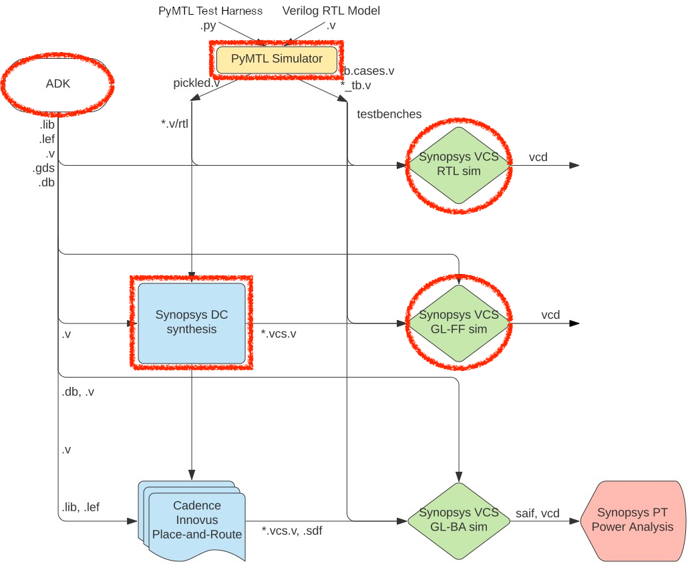
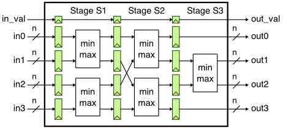
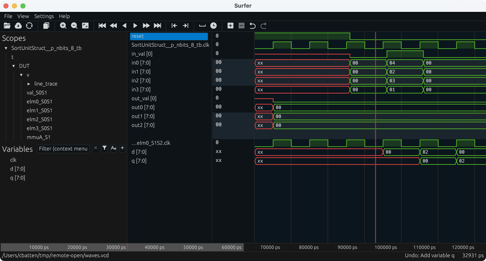
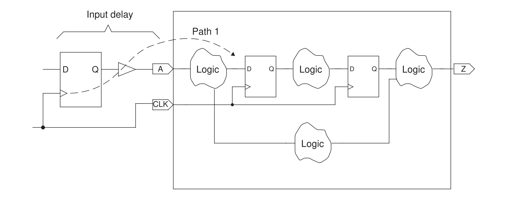
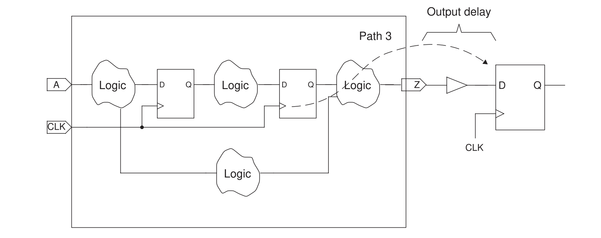
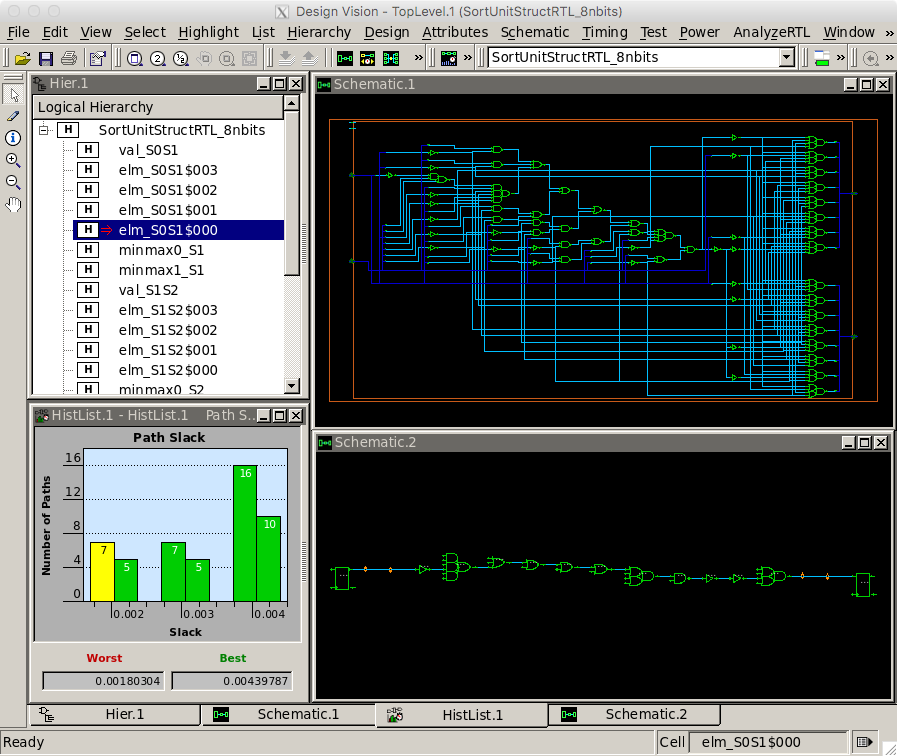

ECE 6745 Tutorial 6: ASIC Front-End Flow
==========================================================================

The tutorial will discuss the key tools used for ASIC front-end flow
which includes RTL simulation, synthesis, and fast-functional gate-level
simulation. This tutorial requires entering commands manually for each of
the tools to enable students to gain a better understanding of the
detailed steps involved in this process. A later tutorial will illustrate
how this process can be automated to facilitate rapid design-space
exploration. This tutorial assumes you have already completed the
tutorials on Linux, Git, and Verilog.

The following diagram illustrates the five primary tools we will be using
in ECE 6745 along with a few smaller secondary tools. The tools that
make-up the ASIC front-end flow are highlighted in red. Notice that the
ASIC tools all require various views from the standard-cell library.
Before starting this tutorial, you must complete the ASIC standard-cell
tutorial so you can understand all of these views.



 1. We write our RTL models in Verilog, and we use the PyMTL framework to
    test, verify, and evaluate the execution time (in cycles) of our
    design. This part of the flow is very similar to the flow used in
    ECE 4750. Once we are sure our design is working correctly, we can
    then start to push the design through the flow.

 2. We use **Synopsys VCS** to compile and run both 4-state RTL and
    gate-level simulations. These simulations help us to build confidence
    in our design as we push our designs through different stages of the
    flow. From these simulations, we also generate waveforms in `.vcd`
    (Verilog Change Dump) format, and per-net average activity factors
    stored in `.saif` format. These activity factors will be used for
    power analysis. Gate-level simulation is an valuable tool for
    ensuring the tools did not optimize something away which impacts the
    correctness of the design, and also provides an avenue for obtaining
    a more accurate power analysis than RTL simulation. While static
    timing analysis (STA) analyzes all paths, GL simulation can also
    serve as a backup to check for hold and setup time violations (chip
    designers must be paranoid!)

 3. We use **Synopsys Design Compiler (DC)** to synthesize our design,
    which means to transform the Verilog RTL model into a Verilog
    gate-level netlist where all of the gates are selected from the
    standard-cell library. We need to provide Synopsys DC with abstract
    logical and timing views of the standard-cell library in `.db`
    format. In addition to the Verilog gate-level netlist, Synopsys DC
    can also generate a `.ddc` file which contains information about the
    gate-level netlist and timing, and this `.ddc` file can be inspected
    using Synopsys Design Vision (DV). We will also use Synopsys DC to
    generate a `.sdc` which captures timing constraints which can then be
    used as input to the place-and-route tool.

 4. We use **Cadence Innovus** to place-and-route our design, which means
    to place all of the gates in the gate-level netlist into rows on the
    chip and then to generate the metal wires that connect all of the
    gates together. We need to provide Cadence Innovus with the same
    abstract logical and timing views used in Synopsys DC, but we also
    need to provide Cadence Innovus with technology information in
    `.lef`, and `.captable` format and abstract physical views of the
    standard-cell library also in `.lef` format. Cadence Innovus will
    generate an updated Verilog gate-level netlist, a `.spef` file which
    contains parasitic resistance/capacitance information about all nets
    in the design, and a `.gds` file which contains the final layout. The
    `.gds` file can be inspected using the open-source Klayout GDS
    viewer. Cadence Innovus also generates reports which can be used to
    accurately characterize area and timing.

 5. We use **Synopsys PrimeTime (PT)** to perform power analysis of our
    design. We need to provide Synopsys PT with the same abstract
    logical, timing, and power views used in Synopsys DC and Cadence
    Innovus, but in addition we need to provide switching activity
    information for every net in the design (which comes from the `.saif`
    file), and capacitance information for every net in the design (which
    comes from the `.spef` file). Synopsys PT puts the switching
    activity, capacitance, clock frequency, and voltage together to
    estimate the power consumption of every net and thus every module in
    the design, and these estimates are captured in various reports.

Extensive documentation is provided by Synopsys and Cadence for these
ASIC tools. We have organized this documentation and made it available to
you on the public course webpage:

 - <https://www.csl.cornell.edu/courses/ece6745/asicdocs>

The first step is to access `ecelinux`. Use VS Code to log into a
specific `ecelinux` server and then use Microsoft Remote Desktop to log
into the same server. Once you are at the `ecelinux` prompt, source the
setup script, source the GUI setup script, clone this repository from
GitHub, and define an environment variable to keep track of the top
directory for the project.

```bash
% source setup-ece6745.sh
% source setup-gui.sh
% mkdir -p $HOME/ece6745
% cd $HOME/ece6745
% git clone git@github.com:cornell-ece6745/ece6745-tut06-asic-front-end tut06
% cd tut06
% export TOPDIR=$PWD
```

1. PyMTL3-Based Testing, Simulation, Translation
--------------------------------------------------------------------------

Our goal in this tutorial is to generate a gate-level netlist for the
sort unit from the Verilog tutorial using the ASIC tools. As a reminder,
the sort unit takes as input four integers and a valid bit and outputs
those same four integers in increasing order with the valid bit. The sort
unit is implemented using a three-stage pipelined, bitonic sorting
network and the datapath is shown below.



### 1.1. Implement, Test, and Translate a Sort Unit

Let's start by running the tests for the sort unit and note that the
tests for the `SortUnitStruct` will fail.

```bash
% mkdir -p $TOPDIR/sim/build
% cd $TOPDIR/sim/build
% pytest ../tut3_verilog/sort
```

You can just copy over your implementation of the `MinMaxUnit` from when
you completed the Verilog tutorial. If you have not completed the Verilog
tutorial then you might want to go back and do that now. Basically the
`MinMaxUnit` should look like this:

```python
module tut3_verilog_sort_MinMaxUnit
#(
  parameter p_nbits = 1
)(
  input  logic [p_nbits-1:0] in0,
  input  logic [p_nbits-1:0] in1,
  output logic [p_nbits-1:0] out_min,
  output logic [p_nbits-1:0] out_max
);

  always_comb begin

    // Find min/max

    if ( in0 >= in1 ) begin
      out_max = in0;
      out_min = in1;
    end
    else if ( in0 < in1 ) begin
      out_max = in1;
      out_min = in0;
    end

    // Handle case where there is an X in the input

    else begin
      out_min = 'x;
      out_max = 'x;
    end

  end

endmodule
```

Once you have your design working rerun the tests with the
`--test-verilog` and `--dump-vtb` command line options.

```bash
% cd $TOPDIR/sim/build
% pytest ../tut3_verilog/sort --test-verilog --dump-vtb
```

The `--test-verilog` and `--dump-vtb` command line options tells the
PyMTL3 framework to dump a Verilog testbench. While PyMTL3 enables
combining Python testbenches with Verilator Verilog simulation, we need
to translate our testbenches to Verilog so that we can use Synopsys VCS
to do 4-state and gate-level simulation. Let's look at a testbench cases
file generated from using the `--dump-vtb` flag.

```bash
% cd $TOPDIR/sim/build
% cat SortUnitStruct__p_nbits_8_test_basic_tb.v.cases

 `T('h00,'h00,'h00,'h00,'h0,'h00,'h00,'h00,'h00,'h0);
 `T('h04,'h02,'h03,'h01,'h1,'h00,'h00,'h00,'h00,'h0);
 `T('h00,'h00,'h00,'h00,'h0,'h00,'h00,'h00,'h00,'h0);
 `T('h00,'h00,'h00,'h00,'h0,'h00,'h00,'h00,'h00,'h0);
 `T('h00,'h00,'h00,'h00,'h0,'h01,'h02,'h03,'h04,'h1);
 `T('h00,'h00,'h00,'h00,'h0,'h00,'h00,'h00,'h00,'h0);
 `T('h00,'h00,'h00,'h00,'h0,'h00,'h00,'h00,'h00,'h0);
 `T('h00,'h00,'h00,'h00,'h0,'h00,'h00,'h00,'h00,'h0);
 `T('h00,'h00,'h00,'h00,'h0,'h00,'h00,'h00,'h00,'h0);
```

This file is generated by logging the inputs and outputs of the Verilator
RTL simulation each cycle. It will be passed into a Verilog testbench
runner that will use these values to set the inputs each cycle and to
verify the outputs each cycle. So note that when we utilize these
testbenches later on, we are running a simulation that is simply
confirming that we acheive the same behavior as the Verilator RTL
simulation we ran using PyMTL3, and it is not actually using any
assertions you wrote in your Python tests for your design. Therefore, it
is important that your RTL simulations pass using PyMTL3 and Verilator
before you move on to other simulations. Also take a look at the
testbench itself to get a sense for how it works. It essentially
instantiates your top module as `DUT`, sets the inputs, and performs a
check every cycle on the outputs.

```bash
% cd $TOPDIR/sim/build
% less SortUnitStruct__p_nbits_8_test_basic_tb.v
```

### 2.2. Interactive Simulator for Sort Unit

After running the tests we use the interactive simulator for the sort
unit to do the final evaluation.

```bash
% cd $TOPDIR/sim/build
% ../tut3_verilog/sort/sort-sim --short-mname --impl rtl-struct --stats \
                                --translate --dump-vtb
num_cycles          = 106
num_cycles_per_sort = 1.06
```

Take a moment to open up the translated Verilog which should be in a file
named `SortUnitStruct__pickled.v`. The Verilog module name includes a
suffix to make it unique for a specific set of parameters.

2. Synopsys VCS for 4-state RTL simulation
-------------------------------------------------------------------------

Using the PyMTL simulation framework can give us a good foundation in
verifying a design. However, the Verilator RTL simulator is only a
2-state simulation, meaning a signal can only be `0` or `1`. An
alternative form of RTL simulation is a 4-state simulation, in which
signals can be `0`, `1`, `x`, or `z`.

It is important to note a key difference between 2-state and 4-state
simulation. In 2-state simulation, each variable is initialized to a
predetermined value. This initial condition assumption may or may not be
what happens in actual silicon! As a result, a different initial
condition could introduce a bug that was not caught by our 2-state
Verilator RTL simulation. In 4-state simulations no such assumptions are
made. Instead, every signal begins as `x`, and only resolves to a `0` or
`1` after it is driven or resolved using x-propagation. Consider the
following pseudocode:

```verilog
always @(*)
begin
  if ( control_signal )
    // set signal "signal_a", but bug causes chip to fail
  else
    // set signal "signal_a" such that everything works fine
end
```

If `control_signal` is not reset, then in 2-state simulation if you
initialize all state to zero it will look like the chip works fine, but
this is not a safe assumption! The real chip does not guarantee that all
state is initialized to zero, so we can model that in four state
simulation as an `x`. Since the control signal could initialize to 1,
this could non-deterministically cause the chip to fail! What you would
see in simulation is that `signal_a` would become an `x`, because we do
not know the value of `control_signal` on reset. This `x` is propagated
through the design, and some simulators are more optimistic/pessimistic
about x's than others. For example, a pessimistic simulator may just
assume that any piece of logic that has an x on the input, outputs an x.
This is pessimistic because it is *possible* that you can still resolve
the output (imagine a mux where two inputs are the same but the select
bit is an `x`). Optimism is the opposite, resolving signals to `0` or `1`
that should remain an `x`.

If your design is passing every 2-state simulation, but failing every
4-state simulation, it may be because invalid fields are being set to
`x`'s. Our test harnesses require all outputs to always be `0` or `1`
even if a field is invalid. So you may need to force invalid fields to
zero and ensure that during a correct execution the outputs of your
module are never `x`'s. You can see this in the implementation of
`SortUnitStruct`:

```verilog
assign out_val = val_S3;
assign out0    = elm0_S3         & {p_nbits{val_S3}};
assign out1    = mmuA_out_min_S3 & {p_nbits{val_S3}};
assign out2    = mmuA_out_max_S3 & {p_nbits{val_S3}};
assign out3    = elm3_S3         & {p_nbits{val_S3}};
```

We run Synopsys VCS to compile a simulation, and `./simv` to run the
simulation. Let's run a 4-state simulation for `test_basic` using the
design `SortUnitStruct__pickled.v`.

```bash
% cd $TOPDIR/asic/build-sort/01-synopsys-vcs-rtlsim
% vcs -sverilog -xprop=tmerge -override_timescale=1ns/1ps -top Top \
    +vcs+dumpvars+waves.vcd \
    +incdir+${TOPDIR}/sim/build \
    ${TOPDIR}/sim/build/SortUnitStruct__p_nbits_8_test_basic_tb.v \
    ${TOPDIR}/sim/build/SortUnitStruct__p_nbits_8__pickled.v
% ./simv
```

Here some of the key command line options for Synopsys VCS:

```
-sverilog                     indicates we are using SystemVerilog
-xprop=tmerge                 use more advanced X propoagation
-override_timescale=1ns/1ps   changes the timescale. Units/precision
-top Top                      name of the top module (located within the VTB)
+vcs+dumpvars+filename.vcd    dump VCD in current dir with the name filename.vcd
+incdir+$TOPDIR/sim/build     specifies directories to search for `include
```

Synopsys VCS is a sophisticated tool with many command line options. If
you want to learn more on your own about other options that are available
to you with Synopsys VCS, you can look at the user guides on the course
webpage:

 - <https://www.csl.cornell.edu/courses/ece6745/asicdocs>

Open up the resulting VCD filea and notice how all of the input ports
start as X values and then eventually become non-X values after reset.
Notice how the pipeline registers are not reset so it takes a few cycles
for them to be output non-X values.



Let's run another 4-state simulation, this time using the testbench from
the sort-rtl simulator run that we ran earlier. Note that while we can
use this VCD for power analysis, for the purposes of this tutorial we
will only be doing power analysis using the gate-level netlist.

```bash
% cd $TOPDIR/asic/build-sort/01-synopsys-vcs-rtlsim
% vcs -sverilog -xprop=tmerge -override_timescale=1ns/1ps -top Top \
      +vcs+dumpvars+waves.vcd \
      +incdir+${TOPDIR}/sim/build \
      ${TOPDIR}/sim/build/SortUnitStruct_random_tb.v \
      ${TOPDIR}/sim/build/SortUnitStruct__pickled.v
% ./simv
```

To simplify rerunning a simulation, we can put the above command lines in
a shell script. We have created such a run script for you. Let's take a
look to confirm these scripts match the manual commands we used above.

```bash
% cd $TOPDIR/asic/build-sort
% cat ./01-synopsys-vcs-rtlsim/run
```

You can rerun four-state RTL simulation as follows.

```bash
% cd $TOPDIR/asic/build-sort
% ./01-synopsys-vcs-rtlsim/run
```

3. Synopsys Design Compiler for Synthesis
--------------------------------------------------------------------------

We use Synopsys Design Compiler (DC) to synthesize Verilog RTL models
into a gate-level netlist where all of the gates are from the standard
cell library. So Synopsys DC will synthesize the Verilog `+` operator
into a specific arithmetic block at the gate-level. Based on various
constraints it may synthesize a ripple-carry adder, a carry-look-ahead
adder, or even more advanced parallel-prefix adders.

We start by creating a subdirectory for our work, and then launching
Synopsys DC.

```bash
% cd $TOPDIR/asic/build-sort/02-synopsys-dc-synth
% dc_shell-xg-t
```

To make it easier to copy-and-paste commands from this document, we tell
Synopsys DC to ignore the prefix `dc_shell>` using the following:

```
dc_shell> alias "dc_shell>" ""
```

### 3.1. Initial Setup

There are two important variables we need to set before starting to work
in Synopsys DC. The `target_library` variable specifies the standard
cells that Synopsys DC should use when synthesizing the RTL. The
`link_library` variable should search the standard cells, but can also
search other cells (e.g., SRAMs) when trying to resolve references in our
design. These other cells are not meant to be available for Synopsys DC
to use during synthesis, but should be used when resolving references.
Including `*` in the `link_library` variable indicates that Synopsys DC
should also search all cells inside the design itself when resolving
references.

```
dc_shell> set_app_var target_library "$env(ECE6745_STDCELLS)/stdcells.db"
dc_shell> set_app_var link_library   "* $env(ECE6745_STDCELLS)/stdcells.db"
```

Note that we can use `$env(ECE6745_STDCELLS)` to get access to the
`$ECE6745_STDCELLS` environment variable which specifies the directory
containing the standard cells, and that we are referencing the abstract
logical and timing views in the `.db` format.

We also need to tell Synopsys DC not use scan flip-flops and clock-gating
cells which are included in our standard-cell library. If Synopsys DC
uses these cells it can cause isses with gate-level simulation. We can do
this using the `set_dont_use` command as follows.

```
dc_shell> set_dont_use -power {
  NangateOpenCellLibrary/SDFF_X1
  NangateOpenCellLibrary/SDFF_X2
  NangateOpenCellLibrary/SDFFS_X1
  NangateOpenCellLibrary/SDFFS_X2
  NangateOpenCellLibrary/SDFFR_X1
  NangateOpenCellLibrary/SDFFR_X2
  NangateOpenCellLibrary/SDFFRS_X1
  NangateOpenCellLibrary/SDFFRS_X2
  NangateOpenCellLibrary/CLKGATETST_X1
  NangateOpenCellLibrary/CLKGATETST_X2
  NangateOpenCellLibrary/CLKGATETST_X4
  NangateOpenCellLibrary/CLKGATETST_X8
}
```

### 3.2. Inputs

As an aside, if you want to learn more about any command in any Synopsys
tool, you can simply type `man toolname` at the shell prompt. We are now
ready to read in the Verilog file which contains the top-level design and
all referenced modules. We do this with two commands. The `analyze`
command reads the Verilog RTL into an intermediate internal
representation. The `elaborate` command recursively resolves all of the
module references starting from the top-level module, and also infers
various registers and/or advanced data-path components.

```
dc_shell> analyze -format sverilog ../../../sim/build/SortUnitStruct__pickled.v
dc_shell> elaborate SortUnitStruct
```

### 3.3. Timing Constraints

We need to create a clock constraint to tell Synopsys DC what our target
cycle time is. Synopsys DC will not synthesize a design to run "as fast
as possible". Instead, the designer gives Synopsys DC a target cycle time
and the tool will try to meet this constraint while minimizing area and
power. The `create_clock` command takes the name of the clock signal in
the Verilog (which in this course will always be `clk`), the label to
give this clock (i.e., `ideal_clock1`), and the target clock period in
nanoseconds. So in this example, we are asking Synopsys DC to see if it
can synthesize the design to run at 1.4GHz (i.e., a cycle time of 700ps).

```
dc_shell> create_clock clk -name ideal_clock1 -period 0.7
```

In addition to the clock constraint we also need to constrain the max
transition time to ensure no net takes a very long time to transition.
Here we constrain the max transition to be 250ps.

```
dc_shell> set_max_transition 0.250 SortUnitStruct
```

We need to constrain what kind of cells are expected to drive the input
pins and what kind of load is expected at the output pin so Synopsys DC
can properly synthesize the design. here we constrain the input cells to
be inverters with 2x drive strength and the output load to be 7fF.

```
dc_shell> set_driving_cell -no_design_rule -lib_cell INV_X2 [all_inputs]
dc_shell> set_load -pin_load 7 [all_outputs]
```

In an ideal world, all inputs would change immediately with the clock
edge. In reality, this is not the case since there will be some logic
before this block on the chip as shown in the following figure.



We need to include reasonable propagation and contamination delays for
the input ports so Synopsys DC can factor these into its timing analysis.
Here, we choose the max input delay constraint to be 50ps (i.e., the
block needs to meet the setup time constraints even if the inputs change
50ps after the rising edge of the clock), and we choose the min input
delay constraint to be 0ps (i.e., the block needs to meet the hold time
constraints even if the inputs change right on the rising edge clock).

```
dc_shell> set_input_delay -clock ideal_clock1 -max 0.050 [all_inputs -exclude_clock_ports]
dc_shell> set_input_delay -clock ideal_clock1 -min 0.000 [all_inputs -exclude_clock_ports]
```

We also need to constrain the output ports since there will be some logic
after this block on the chip as shown in the following figure.



We need to include reasonable setup and hold time constraints for the
output ports so Synopsys DC can factor these into into its timing
analysis. Here we choose a setup time constraint of 50ps meaning the
output data must be stable 50ps before the rising edge of the clock, and
we choose a hold time constraint of 0ps meaning the outputs can change
right on the rising edge of the clock.

```
dc_shell> set_output_delay -clock ideal_clock1 -max 0.050 [all_outputs]
dc_shell> set_output_delay -clock ideal_clock1 -min 0.000 [all_outputs]
```

Finally we also need to constraint any combinational paths which go
directly from the input ports to the output ports. Here we constrain such
paths to be no longer than one cycle cycle.

```
dc_shell> set_max_delay 0.7 -from [all_inputs -exclude_clock_ports] -to [all_outputs]
```

Once we have finished setting all of the constraints we can use
`check_timing` to make sure there are no unconstrained paths or other
issues.

### 3.4. Synthesis

We can use the `check_design` command to make sure there are no obvious
errors in our Verilog RTL.

```
dc_shell> check_design
```

It is _critical_ that you carefully review all warnings and errors when
you analyze and elaborate a design with Synopsys DC. There may be many
warnings, but you should still skim through them. Often times there will
be something very wrong in your Verilog RTL which means any results from
using the ASIC tools is completely bogus. Synopsys DC will output a
warning, but Synopsys DC will usually just keep going, potentially
producing a completely incorrect gate-level model!

Finally, the `compile` command will do the synthesis.

```
dc_shell> compile
```

During synthesis, Synopsys DC will display information about its
optimization process. It will report on its attempts to map the RTL into
standard-cells, optimize the resulting gate-level netlist to improve the
delay, and then optimize the final design to save area.

The `compile` command does not _flatten_ your design. Flatten means to
remove module hierarchy boundaries; so instead of having module A and
module B within module C, Synopsys DC will take all of the logic in
module A and module B and put it directly in module C. You can enable
flattening with the `-ungroup_all` option. Without extra hierarchy
boundaries, Synopsys DC is able to perform more optimizations and
potentially achieve better area, energy, and timing. However, an
unflattened design is much easier to analyze, since if there is a module
A in your RTL design that same module will always be in the synthesized
gate-level netlist.

The `compile` command does not perform many optimizations. Synopsys DC
also includes `compile_ultra` which does many more optimizations and will
likely produce higher quality of results. Keep in mind that the `compile`
command _will not_ flatten your design by default, while the
`compile_ultra` command _will_ flattened your design by default. You can
turn off flattening by using the `-no_autoungroup` option with the
`compile_ultra` command. `compile_ultra` also has the option
`-gate_clock` which automatically performs clock gating on your design,
which can save quite a bit of power. Once you finish this tutorial, feel
free to go back and experiment with this command.

```
dc_shell> compile_ultra -no_autoungroup -gate_clock`
```

### 3.4. Outputs

Now that we have synthesized the design, we output the resulting
gate-level netlist in two different file formats: `.ddc` (which we will
use with Synopsys DesignVision) and Verilog. We also output an `.sdc`
file which contains the constraint information we gave Synopsys DC. We
will pass this same constraint information to Cadence Innovus during the
place and route portion of the flow.

```
dc_shell> write -format ddc     -hierarchy -output post-synth.ddc
dc_shell> write -format verilog -hierarchy -output post-synth.v
dc_shell> write_sdc post-synth.sdc
```

We can use various commands to generate reports about timing and area.
The `report_timing` command will show the critical path through the
design. Part of the report is displayed below.

```
dc_shell> report_timing -nets
 Point                                      Fanout Incr  Path
 ---------------------------------------------------------------
 clock ideal_clock1 (rise edge)                    0.00  0.00
 clock network delay (ideal)                       0.00  0.00
 v/elm1_S0S1/q_reg[1]/CK (DFF_X1)                  0.00  0.00 r
 v/elm1_S0S1/q_reg[1]/Q (DFF_X1)                   0.08  0.08 f
 v/elm1_S0S1/q[1] (net)                     2      0.00  0.08 f
 v/elm1_S0S1/q[1] (vc_Reg_p_nbits8_11)             0.00  0.08 f
 v/elm1_S1[1] (net)                                0.00  0.08 f
 v/mmuA_S1/in1[1] (MinMaxUnit)                     0.00  0.08 f
 v/mmuA_S1/in1[1] (net)                            0.00  0.08 f
 v/mmuA_S1/U10/ZN (INV_X1)                         0.04  0.12 r
 v/mmuA_S1/n22 (net)                        3      0.00  0.12 r
 v/mmuA_S1/U45/ZN (AOI21_X1)                       0.03  0.15 f
 v/mmuA_S1/n8 (net)                         1      0.00  0.15 f
 v/mmuA_S1/U46/ZN (AOI222_X1)                      0.09  0.24 r
 v/mmuA_S1/n9 (net)                         1      0.00  0.24 r
 v/mmuA_S1/U9/ZN (NOR3_X1)                         0.03  0.27 f
 v/mmuA_S1/n10 (net)                        1      0.00  0.27 f
 v/mmuA_S1/U6/ZN (NOR3_X1)                         0.06  0.33 r
 v/mmuA_S1/n11 (net)                        1      0.00  0.33 r
 v/mmuA_S1/U3/ZN (NOR3_X1)                         0.03  0.36 f
 v/mmuA_S1/n12 (net)                        1      0.00  0.36 f
 v/mmuA_S1/U47/ZN (AOI221_X1)                      0.08  0.44 r
 v/mmuA_S1/n13 (net)                        1      0.00  0.44 r
 v/mmuA_S1/U48/ZN (OAI22_X1)                       0.05  0.49 f
 v/mmuA_S1/n15 (net)                        2      0.00  0.49 f
 v/mmuA_S1/U27/ZN (OAI21_X1)                       0.04  0.53 r
 v/mmuA_S1/N1 (net)                         1      0.00  0.53 r
 v/mmuA_S1/U49/ZN (INV_X2)                         0.06  0.59 f
 v/mmuA_S1/n23 (net)                        6      0.00  0.59 f
 v/mmuA_S1/U43/ZN (OAI22_X1)                       0.06  0.65 r
 v/mmuA_S1/out_max[7] (net)                 1      0.00  0.65 r
 v/mmuA_S1/out_max[7] (MinMaxUnit)                 0.00  0.65 r
 v/mmuA_out_max_S1[7] (net)                        0.00  0.65 r
 v/elm1_S1S2/d[7] (vc_Reg_p_nbits8_7)              0.00  0.65 r
 v/elm1_S1S2/d[7] (net)                            0.00  0.65 r
 v/elm1_S1S2/q_reg[7]/D (DFF_X1)                   0.01  0.66 r
 data arrival time                                       0.66

 clock ideal_clock1 (rise edge)                    0.70  0.70
 clock network delay (ideal)                       0.00  0.70
 v/elm1_S1S2/q_reg[7]/CK (DFF_X1)                  0.00  0.70 r
 library setup time                               -0.04  0.66
 data required time                                      0.66
 ---------------------------------------------------------------
 data required time                                      0.66
 data arrival time                                       0.66
 ---------------------------------------------------------------
 slack (MET)                                             0.00
```

This timing report uses _static timing analysis_ to find the critical
path. Static timing analysis checks the timing across all paths in the
design (regardless of whether these paths can actually be used in
practice) and finds the longest path. For more information about static
timing analysis, consult Chapter 1 of the [Synopsys Timing Constraints
and Optimization User
Guide](http://www.csl.cornell.edu/courses/ece6745/asicdocs/tcoug.pdf).
The report clearly shows that the critical path starts at bit 1 of a
pipeline register in between the S0 and S1 stages (`elm1_S0S1`), goes
into an input of a `MinMaxUnit`, comes out the `out_max` port of the
`MinMaxUnit`, and ends at the pipeline register between the S1 and S2
stages (`elm1_S1S21). The report shows the delay through each logic gate
(e.g., the clk-to-q delay of the initial DFF is 80ps, the propagation
delay of a AOI21_X1 gate is 150ps) and the total delay for the critical
path which in this case is 0.66ns.

The difference between the required arrival time and the actual arrival
time is called the _slack_. In the above report we just meet timing with
zero slack. Positive slack means the path arrived before it needed to
while negative slack means the path arrived after it needed to. If you
end up with negative slack, then you need to rerun the tools with a
longer target clock period until you can meet timing with no negative
slack. The process of tuning a design to ensure it meets timing is called
"timing closure". In this course, we are primarily interested in
design-space exploration as opposed to meeting some externally defined
target timing specification. So you will need to sweep a range of target
clock periods. **Your goal is to choose the shortest possible clock
period which still meets timing without any negative slack!** This will
result in a well-optimized design and help identify the "fundamental"
performance of the design. Alternatively, if you are comparing multiple
designs, sometimes the best situation is to tune the baseline so it meets
timing and then ensure the alternative designs have similar cycle times.
This will enable a fair comparison since all designs will be running at
the same cycle time.

The `report_area` command will show how much area is required to
implement each module in the design.

```
                    Global cell area          Local cell area
                    ------------------  ---------------------------
Hierarchical cell   Absolute   Percent  Combi-    Noncombi-  Black-
                    Total      Total    national  national   boxes   Design
------------------  ---------  -------  --------  ---------  ------  -----------------------------------------
SortUnitStruct       745.0660    100.0    0.0000     0.0000  0.0
  SortUnitStruct
v                    745.0660    100.0   35.9100     0.0000  0.0000  tut3_verilog_sort_SortUnitStruct_p_nbits8
v/elm0_S0S1           36.1760      4.9    0.0000    36.1760  0.0000  vc_Reg_p_nbits8_0
v/elm0_S1S2           36.1760      4.9    0.0000    36.1760  0.0000  vc_Reg_p_nbits8_8
v/elm0_S2S3           36.1760      4.9    0.0000    36.1760  0.0000  vc_Reg_p_nbits8_4
v/elm1_S0S1           36.1760      4.9    0.0000    36.1760  0.0000  vc_Reg_p_nbits8_11
v/elm1_S1S2           36.1760      4.9    0.0000    36.1760  0.0000  vc_Reg_p_nbits8_7
v/elm1_S2S3           36.1760      4.9    0.0000    36.1760  0.0000  vc_Reg_p_nbits8_3
v/elm2_S0S1           36.1760      4.9    0.0000    36.1760  0.0000  vc_Reg_p_nbits8_10
v/elm2_S1S2           36.1760      4.9    0.0000    36.1760  0.0000  vc_Reg_p_nbits8_6
v/elm2_S2S3           36.1760      4.9    0.0000    36.1760  0.0000  vc_Reg_p_nbits8_2
v/elm3_S0S1           36.1760      4.9    0.0000    36.1760  0.0000  vc_Reg_p_nbits8_9
v/elm3_S1S2           36.1760      4.9    0.0000    36.1760  0.0000  vc_Reg_p_nbits8_5
v/elm3_S2S3           36.1760      4.9    0.0000    36.1760  0.0000  vc_Reg_p_nbits8_1
v/mmuA_S1             50.0080      6.7   50.0080     0.0000  0.0000  tut3_verilog_sort_MinMaxUnit_p_nbits8_0
v/mmuA_S2             50.0080      6.7   50.0080     0.0000  0.0000  tut3_verilog_sort_MinMaxUnit_p_nbits8_3
v/mmuA_S3             57.1900      7.7   57.1900     0.0000  0.0000  tut3_verilog_sort_MinMaxUnit_p_nbits8_1
v/mmuB_S1             50.2740      6.7   50.2740     0.0000  0.0000  tut3_verilog_sort_MinMaxUnit_p_nbits8_4
v/mmuB_S2             50.0080      6.7   50.0080     0.0000  0.0000  tut3_verilog_sort_MinMaxUnit_p_nbits8_2
v/val_S0S1             5.8520      0.8    1.3300     4.5220  0.0000  vc_ResetReg_p_nbits1_0
v/val_S1S2             5.8520      0.8    1.3300     4.5220  0.0000  vc_ResetReg_p_nbits1_2
v/val_S2S3             5.8520      0.8    1.3300     4.5220  0.0000  vc_ResetReg_p_nbits1_1
------------------  ---------  -------  --------  ---------  ------  -----------------------------------------
Total                                   297.3880   447.6780  0.0000
```

The design requires 745um^2. Each pipeline register requires about 5% of
the total area and each min/max unit requires about 7% of the total area.
The area required for all 12 pipeline registers is about 60% of the total
area, and the area required for all five of the min/max units is about
35% of the total area.

Finally, we go ahead and exit Synopsys DC.

```
dc_shell> exit
```

Take a few minutes to examine the resulting Verilog gate-level netlist.
Notice that the module hierarchy is preserved and also notice that the
`MinMaxUnit` synthesizes into a large number of basic logic gates.

```bash
% cd $TOPDIR/asic/build-sort/02-synopsys-dc-synth
% more post-synth.v
```

### 3.5. Synopsys Design Vision

We can use the Synopsys Design Vision (DV) tool for browsing the
resulting gate-level netlist, plotting critical path histograms, and
generally analyzing our design. Start Synopsys DV and setup the
`target_library` and `link_library` variables as before.

```
% cd $TOPDIR/asic/build-sort/02-synopsys-dc-synth
% design_vision-xg
design_vision> set_app_var target_library "$env(ECE6745_STDCELLS)/stdcells.db"
design_vision> set_app_var link_library   "* $env(ECE6745_STDCELLS)/stdcells.db"
```

You can use the following steps to open the `.ddc` file generated during
synthesis.

 - Choose _File > Read_ from the menu
 - Open the `post-synth.dcc` file

You can then use the following steps to browse the gate-level schematic.
First select a module in the Logical Hierarchy panel. Then choose
_Schematic > New Schematic View_. You can double click on modules to
expand them. You might also want to try this approach to see the entire
design at once:

 - Select the `SortUnitStruct__p_nbits_8` module in the Logical Hierarchy panel
 - Choose _Select > Cells > Leaf Cells of Selected Cells_ from the menu
 - Choose _Schematic > New Schematic View_ from the menu
 - Choose _Select > Clear_ from the menu

You can use the following steps to view a histogram of path slack, and
also to open a gave-level schematic of just the critical path.

 - Choose _Timing > Path Slack_ from the menu
 - Click _OK_ in the pop-up window
 - Select the left-most bar in the histogram to see list of most critical paths
 - Select one of the paths in the path list to highlight the path in the schematic view

Or you can right click on a path and choose _Path Schematic_ to see just
the gates that lie on the critical path. Notice that there eight levels
of logic (including the register at the start) on the critical path. The
number of levels of logic on the critical path can provide some very
rough first-order intuition on whether or not we might want to explore a
more aggressive clock constraint and/or adding more pipeline stages. If
there are just a few levels of logic on the critical path then our design
is probably very simple (as in this case!), while if there are more than
50 levels of logic then there is potentially room for signficant
improvement. The following screen capture illutrates using Synopsys
Design Vision to explore the post-synthesis results. While this can be
interesting, in this course, we almost always prefer exploring the
post-place-and-route results, so we will not really use Synopsys DV that
often.



### 3.6. Automating Synthesis

You can automate the above steps by putting a sequence of commands in a
`.tcl` file and run Synopsys DC using those commands in one step like
this:

```bash
% cd $TOPDIR/asic/build-sort/02-synopsys-dc-synth
% dc_shell-xg-t -f run.tcl
```

To further simplify rerunning this step, we can put the above command
line in its own shell script. We have created such run scripts for you.
Let's take a look to confirm these scripts match the manual commands we
used above.

```bash
% cd $TOPDIR/asic/build-sort
% cat ./02-synopsys-dc-synth/run
% cat ./02-synopsys-dc-synth/run.tcl
```

You can rerun synthesis as follows.

```bash
% cd $TOPDIR/asic/build-sort
% ./02-synopsys-dc-synth/run
```

4. Synopsys VCS for Fast-Functional Gate-Level Simulation
--------------------------------------------------------------------------

Before synthesis, we used Synopsys VCS to do a 4-state simulation. This
time, we'll be using VCS to perform a gate-level simulation, since we now
have a gate-level netlist available to us. Gate-level simulation provides
an advantage over RTL simulation because it more precisely represents the
specification of the true hardware generated by the tools. This sort of
simulation could propogate X's into the design that were not found by the
4-state RTL simulation, and it also verifies that the tools did not
optimize anything away during synthesis. We will use Synopsys VCS to run
our gate-level simulation on the `sort-rtl-struct-random` simulator
testbench:

```bash
% cd $TOPDIR/asic/build-sort/03-synopsys-vcs-ffglsim
% vcs -sverilog -xprop=tmerge -override_timescale=1ns/1ps -top Top \
   +delay_mode_zero \
   +vcs+dumpvars+waves.vcd \
   +incdir+$TOPDIR/sim/build \
   ${ECE6745_STDCELLS}/stdcells.v \
   ${TOPDIR}/sim/build/SortUnitStruct_random_tb.v \
   ../02-synopsys-dc-synth/post-synth.v
% ./simv
```

Notice there are some differences in the Synopsys VCS command we ran
here, and the one we ran for 4-state RTL simulation. In this version, we
use the gate-level netlist `post-synth.v` instead of the pickled file. We
also include the option `+delay_mode_zero` which tells Synopsys VCS to
run a fast-functional simulation in which no delays are considered. This
is similar to RTL simulation, and you should notice that all signals will
change on the clock edge. We also include the macros `CYCLE_TIME`,
`VTB_INPUT_DELAY` , `VTB_OUTPUT_ASSERT_DELAY`. These values control how
long after the rising edge we change the inputs and how long after the
rising edge we check the outputs.

To simplify rerunning a simulation, we can put the above command lines in
a shell script. We have created such a run script for you. Let's take a
look to confirm these scripts match the manual commands we used above.

```bash
% cd $TOPDIR/asic/build-sort
% cat ./03-synopsys-vcs-ffglsim/run
```

You can rerun fast-functional gate-level simulation as follows.

```bash
% cd $TOPDIR/asic/build-sort
% ./03-synopsys-vcs-ffglsim/run
```

5. To-Do On Your Own
--------------------------------------------------------------------------

Now we can use what you have learned so far to push the GCD unit through
the ASIC front-end flow. First, run a simulation of the GCD unit.

```
% cd $TOPDIR/sim/build
% ../tut3_verilog/gcd/gcd-sim --short-mname --impl rtl --input random --stats \
                              --translate --dump-vtb
% less GcdUnit__pickled.v
```

Now create a new ASIC build directory and copy the scripts we used to
push the sort unit through the ASIC front-end flow.

```
% mkdir -p $TOPDIR/asic/build-gcd/01-synopsys-vcs-rtlsim
% mkdir -p $TOPDIR/asic/build-gcd/02-synopsys-dc-synth
% mkdir -p $TOPDIR/asic/build-gcd/03-synopsys-vcs-ffglsim

% cp $TOPDIR/asic/build-sort/01-synopsys-vcs-rtlsim/run   $TOPDIR/asic/build-gcd/01-synopsys-vcs-rtlsim
% cp $TOPDIR/asic/build-sort/02-synopsys-dc-synth/run.tcl $TOPDIR/asic/build-gcd/02-synopsys-dc-synth
% cp $TOPDIR/asic/build-sort/02-synopsys-dc-synth/run     $TOPDIR/asic/build-gcd/02-synopsys-dc-synth
% cp $TOPDIR/asic/build-sort/03-synopsys-vcs-ffglsim/run  $TOPDIR/asic/build-gcd/03-synopsys-vcs-ffglsim
```

Now open up each of these files and modify so they push the GCD unit
instead of the sort unit through the flow. You will need to update the
name of the Verilog source files and the top module name as follows:

 - Verilog source file name: `GcdUnit__pickled.v`
 - Verilog test source file name: `GcdUnit_random_tb.v`
 - Top module name for synthesis: `GcdUnit`

Basically, you just need to change `SortUnitStruct` to `GcdUnit` in all
of the run scripts. You can use `sed` to do this:

```
% cd $TOPDIR/asic/build-gcd
% find . -type f -exec sed -i.bak 's/SortUnitStruct/GcdUnit/' {} \;
```

Keep the cycle time constraint as 700ps and the other constraints as
before. Once you have updated the scripts you can then push the GCD unit
through the flow like this:

```bash
% cd $TOPDIR/asic/build-gcd
% ./01-synopsys-vcs-rtlsim/run
% ./02-synopsys-dc-synth/run
% ./03-synopsys-vcs-ffglsim/run
```

Carefully look at the post-synthesis timing report to ensure your design
meetings timing:

```bash
% cd $TOPDIR/asic/build-gcd
% cat 02-synopsys-dc-synth/timing.rpt
```

If your design does not meet timing, increase the cycle time constraint
and try again until it does meet timing. Spend time looking at the
post-synthesis gate-level netlist in `post-synth.v` and load the design
into Synopsys Design Vision to examine the critical path. Carefully look
and the results from running the fast-functional gate-level simulation to
verify that the design is passing the test. Convince yourself that the
GCD unit was successfully pushed through the ASIC front-end flow.

