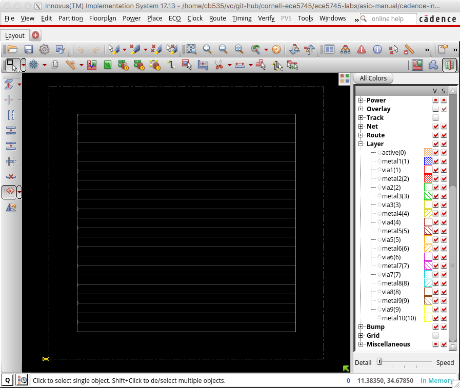
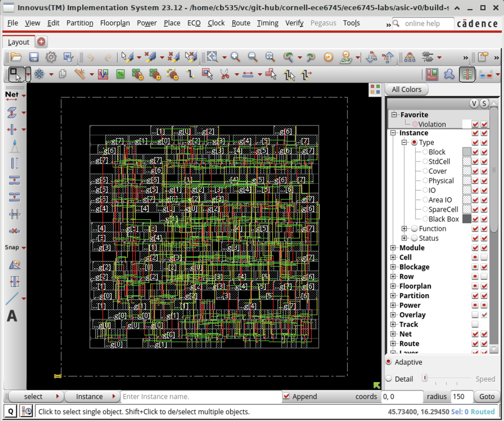
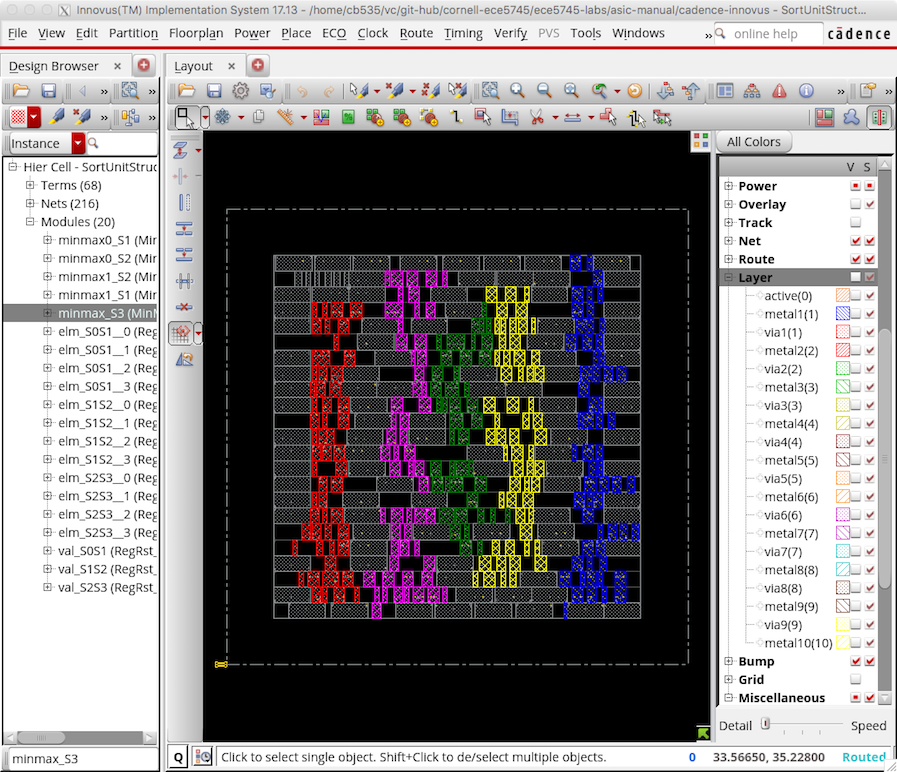
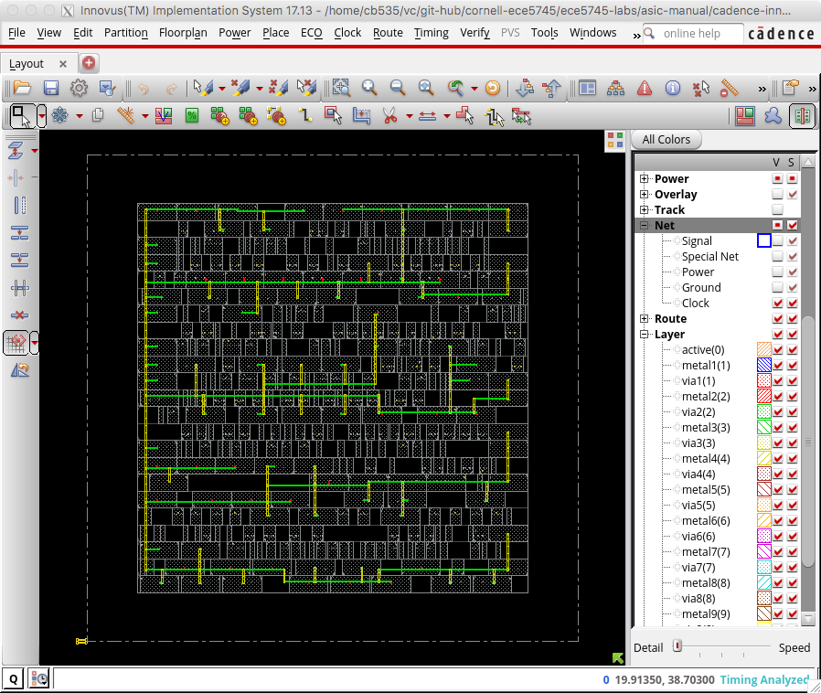
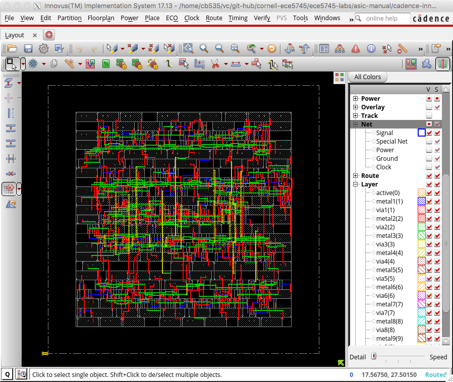
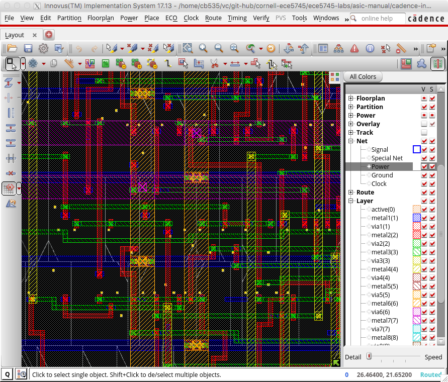
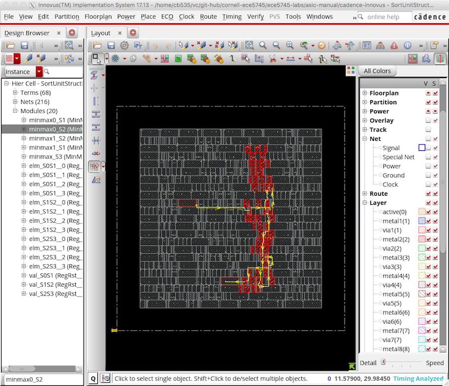
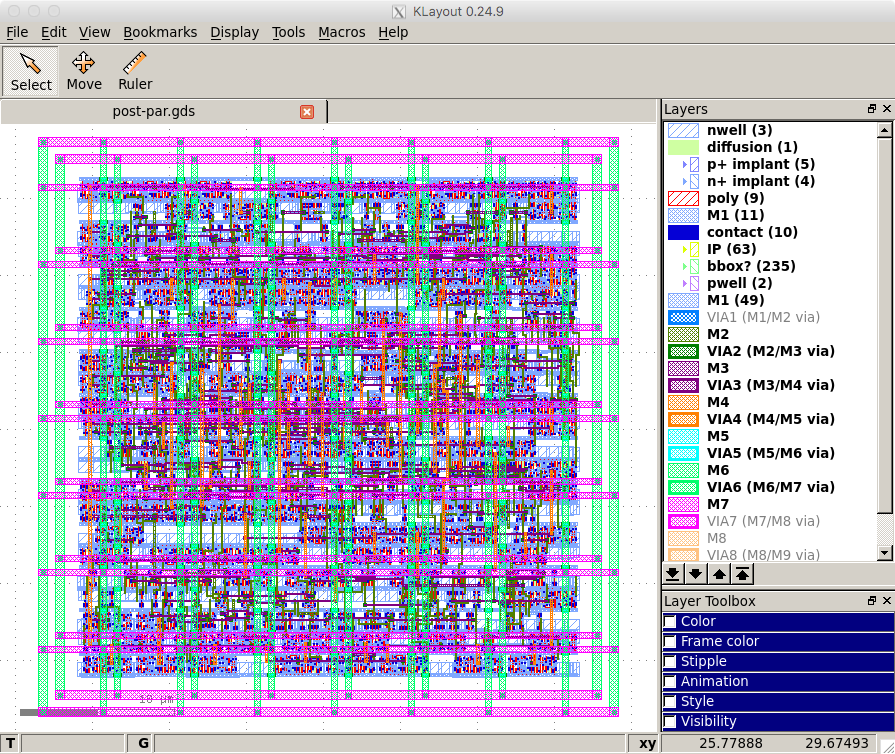
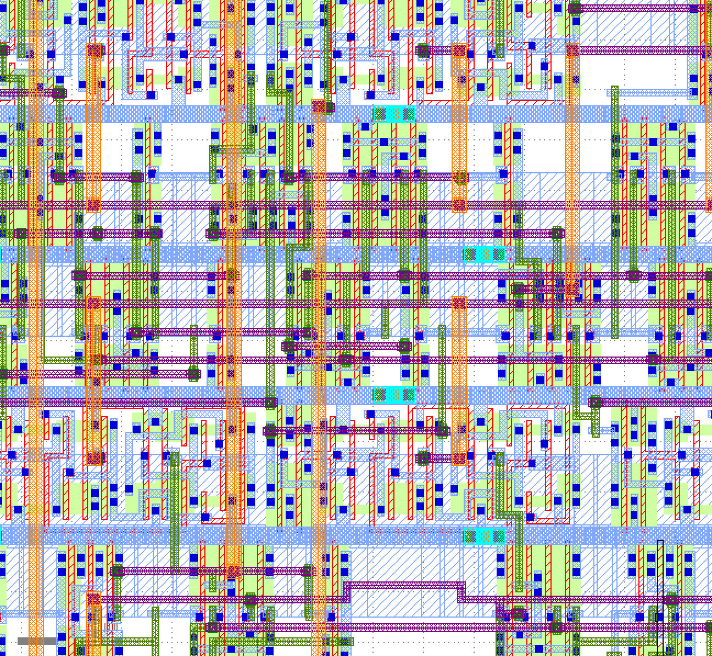
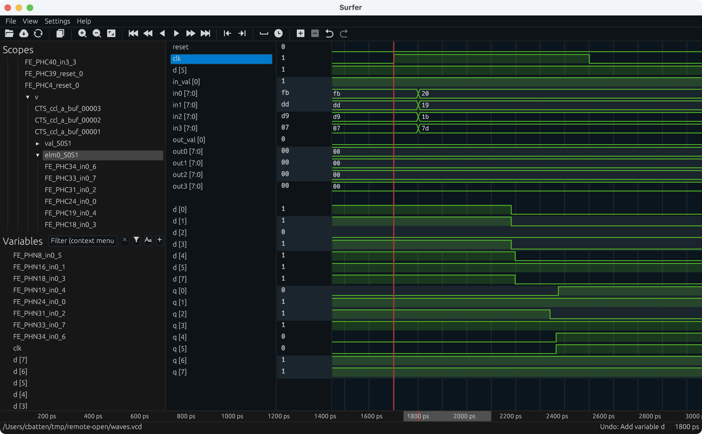

ECE 6745 Tutorial 6: ASIC Back-End Flow
==========================================================================

The tutorial will discuss the key tools used for ASIC back-end flow which
includes place-and-route, back-annotated gate-level simulation, and power
analysis. This tutorial requires entering commands manually for each of
the tools to enable students to gain a better understanding of the
detailed steps involved in this process. A later tutorial will illustrate
how this process can be automated to facilitate rapid design-space
exploration. This tutorial assumes you have already completed the
tutorials on Linux, Git, and Verilog.

The following diagram illustrates the five primary tools we will be using
in ECE 6745 along with a few smaller secondary tools. The tools that
make-up the ASIC back-end flow are highlighted in red. Notice that the
ASIC tools all require various views from the standard-cell library.
Before starting this tutorial, you must complete the ASIC standard-cell
tutorial so you can understand all of these views and you must complete
the ASIC front-end flow tutorial.


 1. We write our RTL models in Verilog, and we use the PyMTL framework to
    test, verify, and evaluate the execution time (in cycles) of our
    design. This part of the flow is very similar to the flow used in
    ECE 4750. Once we are sure our design is working correctly, we can
    then start to push the design through the flow.

 2. We use **Synopsys VCS** to compile and run both 4-state RTL and
    gate-level simulations. These simulations help us to build confidence
    in our design as we push our designs through different stages of the
    flow. From these simulations, we also generate waveforms in `.vcd`
    (Verilog Change Dump) format, and per-net average activity factors
    stored in `.saif` format. These activity factors will be used for
    power analysis. Gate-level simulation is an valuable tool for
    ensuring the tools did not optimize something away which impacts the
    correctness of the design, and also provides an avenue for obtaining
    a more accurate power analysis than RTL simulation. While static
    timing analysis (STA) analyzes all paths, GL simulation can also
    serve as a backup to check for hold and setup time violations (chip
    designers must be paranoid!)

 3. We use **Synopsys Design Compiler (DC)** to synthesize our design,
    which means to transform the Verilog RTL model into a Verilog
    gate-level netlist where all of the gates are selected from the
    standard-cell library. We need to provide Synopsys DC with abstract
    logical and timing views of the standard-cell library in `.db`
    format. In addition to the Verilog gate-level netlist, Synopsys DC
    can also generate a `.ddc` file which contains information about the
    gate-level netlist and timing, and this `.ddc` file can be inspected
    using Synopsys Design Vision (DV). We will also use Synopsys DC to
    generate a `.sdc` which captures timing constraints which can then be
    used as input to the place-and-route tool.

 4. We use **Cadence Innovus** to place-and-route our design, which means
    to place all of the gates in the gate-level netlist into rows on the
    chip and then to generate the metal wires that connect all of the
    gates together. We need to provide Cadence Innovus with the same
    abstract logical and timing views used in Synopsys DC, but we also
    need to provide Cadence Innovus with technology information in
    `.lef`, and `.captable` format and abstract physical views of the
    standard-cell library also in `.lef` format. Cadence Innovus will
    generate an updated Verilog gate-level netlist, a `.spef` file which
    contains parasitic resistance/capacitance information about all nets
    in the design, and a `.gds` file which contains the final layout. The
    `.gds` file can be inspected using the open-source Klayout GDS
    viewer. Cadence Innovus also generates reports which can be used to
    accurately characterize area and timing.

 5. We use **Synopsys PrimeTime (PT)** to perform power analysis of our
    design. We need to provide Synopsys PT with the same abstract
    logical, timing, and power views used in Synopsys DC and Cadence
    Innovus, but in addition we need to provide switching activity
    information for every net in the design (which comes from the `.saif`
    file), and capacitance information for every net in the design (which
    comes from the `.spef` file). Synopsys PT puts the switching
    activity, capacitance, clock frequency, and voltage together to
    estimate the power consumption of every net and thus every module in
    the design, and these estimates are captured in various reports.

Extensive documentation is provided by Synopsys and Cadence for these
ASIC tools. We have organized this documentation and made it available to
you on the public course webpage:

 - <https://www.csl.cornell.edu/courses/ece6745/asicdocs>

The first step is to access `ecelinux`. Use VS Code to log into a
specific `ecelinux` server and then use Microsoft Remote Desktop to log
into the same server. Once you are at the `ecelinux` prompt, source the
setup script, source the GUI setup script, clone this repository from
GitHub, and define an environment variable to keep track of the top
directory for the project.

```bash
% source setup-ece6745.sh
% source setup-gui.sh
% mkdir -p $HOME/ece6745
% cd $HOME/ece6745
% git clone git@github.com:cornell-ece6745/ece6745-tut07-asic-back-end tut07
% cd tut07
% export TOPDIR=$PWD
```

1. Revisiting the ASIC Flow Front-End
--------------------------------------------------------------------------

Our goal in this tutorial is to generate layout for the sort unit from
the Verilog tutorial using the ASIC tools. As a reminder, the sort unit
takes as input four integers and a valid bit and outputs those same four
integers in increasing order with the valid bit. The sort unit is
implemented using a three-stage pipelined, bitonic sorting network and
the datapath is shown below.


Before we can place and route a gate-level netlist, we need to synthesize
that netlist. This is what we learned about in the last section. Here are
the steps to test and then synthesize the design using Synopsys DC.

### 1.1. Test, Simulate, Translate

Always run the tests before pushing anything through the ASIC flow. There
is no sense in running the flow if the design is incorrect!

```bash
% mkdir -p $TOPDIR/sim/build
% cd $TOPDIR/sim/build
% pytest ../tut3_verilog/sort
```

The tests are for verification. When we push a design through the flow we
want to use a simulator which is focused on evaluation. You can run the
simulator for our sort unit like this:

```bash
% cd $TOPDIR/sim/build
% ../tut3_verilog/sort/sort-sim --short-mname --impl rtl-struct --stats \
                                --translate --dump-vtb
num_cycles          = 106
num_cycles_per_sort = 1.06
```

You should now have the Verilog that we want to push through the ASIC
flow.

### 1.2. Simulate, Synthesize, Simulate

Let's take a look at each script to confirm it matches the manual
commands we used in the previous discussion section. Here is the run
script for four-start RTL simulation.

```bash
% cd $TOPDIR/asic/build-sort
% cat ./01-synopsys-vcs-rtlsim/run
```

Here is the run script for synthesis.

```bash
% cd $TOPDIR/asic/build-sort
% cat ./02-synopsys-dc-synth/run
```

Notice that this script simply executes `dc_shell-xg-t` with a TCL script
which contains the commands to: configure the standard cell library,
analyze and elaborate the design; setup timing constraints; synthesize
the design; write outputs; and write final outputs (i.e., Verilog and
DDC) and reports (i.e., timing report and area report).

```bash
% cd $TOPDIR/asic/build-sort
% cat ./02-synopsys-dc-synth/run.tcl
```

Finally, here is the run script for fast-functional gate-level
simulation. The key difference from four-state RTL simulation is that
this simulation takes as input the Verilog for the standard-cell library
and the Verilog for the post-synthesis gate-level netlist.

```bash
% cd $TOPDIR/asic/build-sort
% cat ./03-synopsys-vcs-ffglsim/run
```

You can run these steps as follows:

```bash
% cd $TOPDIR/asic/build-sort
% ./01-synopsys-vcs-rtlsim/run
% ./02-synopsys-dc-synth/run
% ./03-synopsys-vcs-ffglsim/run
```

Verify that your design passes four-state RTL simulation and
fast-functional gate-level simulation. Then take a look at the synthesis
reports.

```bash
% cd $TOPDIR/asic/build-sort
% less ./02-synopsys-dc-synth/timing.rpt
% less ./02-synopsys-dc-synth/area.rpt
```

Finally, take a few minutes to examine the resulting Verilog gate-level
netlist. Notice that the module hierarchy is preserved.

```bash
% cd $TOPDIR/asic/build-sort
% less ./02-synopsys-dc-synth/post-synth.v
```

This is the gate-level netlist that we now want to push through the ASIC
back-end flow.

2. Cadence Innovus for Place-and-Route
--------------------------------------------------------------------------

We use Cadence Innovus for placing standard cells in rows and then
automatically routing all of the nets between these standard cells. We
also use Cadence Innovus to route the power and ground rails in a grid
and connect this grid to the power and ground pins of each standard cell,
and to automatically generate a clock tree to distribute the clock to all
sequential state elements with hopefully low skew.

We will be running Cadence Innovus in a separate directory to keep the
files separate from the other tools.

```bash
% mkdir -p $TOPDIR/asic/build-sort/04-cadence-innovus-pnr
% cd $TOPDIR/asic/build-sort/04-cadence-innovus-pnr
```

### 2.1. Timing Analysis Setup File

Before starting Cadence Innovus, we need to create a file to setup the
timing analysis. This file specifies what "corner" to use for our timing
analysis. A corner is a characterization of the standard cell library and
technology with specific assumptions about the process, temperature, and
voltage (PVT). So we might have a "fast" corner which assumes best-case
process variability, low temperature, and high voltage, or we might have
a "slow" corner which assumes worst-case variability, high temperature,
and low voltage. To ensure our design will work across a range of
operating conditions, we need to evaluate our design across a range of
corners. In this course, we will keep things simple by only considering a
"typical" corner (i.e., average PVT). Use VS Code to create a file named
`setup-timing.tcl`.

```bash
% cd $TOPDIR/asic/04-cadence-innovus-pnr
% code setup-timing.tcl
```

The file should have the following content:

```
create_rc_corner -name typical \
   -cap_table "$env(ECE6745_STDCELLS)/rtk-typical.captable" \
   -T 25

create_library_set -name libs_typical \
   -timing [list "$env(ECE6745_STDCELLS)/stdcells.lib"]

create_delay_corner -name delay_default \
   -library_set libs_typical \
   -rc_corner typical

create_constraint_mode -name constraints_default \
   -sdc_files [list ../02-synopsys-dc-synth/post-synth.sdc]

create_analysis_view -name analysis_default \
   -constraint_mode constraints_default \
   -delay_corner delay_default

set_analysis_view -setup analysis_default -hold analysis_default
```

The `create_rc_corner` command loads in the `.captable` file that we
examined earlier. This file includes information about the resistance and
capacitance of every metal layer. Notice that we are loading in the
"typical" captable and we are specifying an "average" operating
temperature of 25 degC. The `create_library_set` command loads in the
`.lib` file that we examined earlier. This file includes information
about the input/output capacitance of each pin in each standard cell
along with the delay from every input to every output in the standard
cell. The `create_delay_corner` specifies a specific corner that we would
like to use for our timing analysis by putting together a `.captable` and
a `.lib` file. In this specific example, we are creating a typical corner
by putting together the typical `.captable` and typical `.lib` we just
loaded. The `create_constraint_mode` command loads in the post-synthesis
`.sdc` file which captures all of the timing constraints after synthesis.
The `create_analysis_view` command puts together constraints with a
specific corner, and the `set_analysis_view` command tells Cadence
Innovus that we would like to use this specific analysis view for both
setup and hold time analysis.

### 2.2. Initial Setup

Now that we have created our `setup-timing.tcl` file we can start Cadence
Innovus:

```bash
% cd $TOPDIR/asic/04-cadence-innovus-pnr
% innovus
```

As we enter commands we will be able use the GUI to see incremental
progress towards a fully placed-and-routed design. We need to set various
variables before starting to work in Cadence Innovus. These variables
tell Cadence Innovus the location of the MMMC file, the location of the
Verilog gate-level netlist, the name of the top-level module in our
design, the location of the `.lef` files, and finally the names of the
power and ground nets.

```
innovus> set init_mmmc_file "setup-timing.tcl"
innovus> set init_verilog   "../02-synopsys-dc-synth/post-synth.v"
innovus> set init_top_cell  "SortUnitStruct"
innovus> set init_lef_file  "$env(ECE6745_STDCELLS)/rtk-tech.lef $env(ECE6745_STDCELLS)/stdcells.lef"
innovus> set init_gnd_net   "VSS"
innovus> set init_pwr_net   "VDD"
```

We are now ready to use the `init_design` command to read in the verilog,
set the design name, setup the timing analysis views, read the technology
`.lef` for layer information, and read the standard cell `.lef` for
physical information about each cell used in the design.

```
innovus> init_design
```

We also need to tell Cadence Innovus the process node are using so it can
roughly estimate specific technology parameters.

```
innovus> setDesignMode -process 45
```

Cadence Innovus includes many advanced timing-driven optimizations by
default. Two examples include signal integrity analysis (e.g., capacitive
coupling across signal wires) and useful clock skew (e.g., purposefully
introducing clock skew to give more time for critical paths at the
expense of other paths). To simply our timing analysis we will turn these
optimizations off as follows.

```
innovus> setDelayCalMode -SIAware false
innovus> setOptMode -usefulSkew false
```

Cadence Innovus can fix hold-time violations by inserting extra buffers
to delay certain paths. We add an extra hold-time target slack so that
Cadence Innovus will work extra hard to meet the hold-time, and we need
to tell Cadence Innovus which standard cells to use when fixing hold-time
violations as follows.

```
innovus> setOptMode -holdTargetSlack 0.010
innovus> setOptMode -holdFixingCells {
  BUF_X1 BUF_X1 BUF_X2 BUF_X4 BUF_X8 BUF_X16 BUF_X32
}
```

### 2.3. Floorplanning

The next substep is floorplaning. This is where we broadly organize the
chip in terms of its overall dimensions and the placement of any
previously designed blocks. For now we just do some very simple
floorplanning using the `floorPlan` command.

```
innovus> floorPlan -r 1.0 0.70 4.0 4.0 4.0 4.0
```

In this example, we have chosen the aspect ratio to be 1.0 and a target
cell utilization to be 70%. The cell utilization is the percentage of the
final chip that will actually contain useful standard cells as opposed to
just "filler" cells (i.e., empty cells). Ideally, we would like the cell
utilization to be 100% but this is simply not reasonable. If the cell
utilization is too high, Cadence Innovus will spend way too much time
trying to optimize the design and will eventually simply give up. A
target cell utilization of 70% makes it more likely that Cadence Innovus
can successfuly place and route the design. We have also added 4.0um of
margin around the top, bottom, left, and right of the chip to give us
room for the power ring which will go around the entire chip.

The following screen capture illustrates what you should see: a square
floorplan with rows where the standard cells will eventually be placed.
You can use the _View > Fit_ menu option to see the entire chip.



### 2.4. Placement

The next substep is cell placement. We can do the placement and initial
routing of the standard cells using the `place_opt_design` command:

```
innovus> place_opt_design
```

The following screen capture illustrates what you should see: the gates
have been placed underneath a sea of wiring on the various metal layers.



Note that Cadence Innovus has only done a very preliminary routing,
primarily to help improve placement. You can use the Amobea workspace to
help visualize how modules are mapped across the chip. Choose _Windows >
Workspaces > Amoeba_ from the menu. However, we recommend using the
design browser to help visualize how modules are mapped across the chip.
Here are the steps:

 - Choose _Windows > Workspaces > Design Browser + Physical_ from the menu
 - Hide all of the metal layers by pressing the number keys
 - Browse the design hierarchy using the panel on the left
 - Right click on a module, click _Highlight_, select a color

In this way you can view where various modules are located on the chip.
The following screen capture illustrates the location of the five min/max
units.



Notice how Cadence Innovus has grouped each module together. The
placement algorithm tries to keep connected standard cells close together
to minimize wiring.

If our design has any constant values, then we need to insert special
standard cells to "tie" those constant values to either VDD or ground
using the `addTieHiLo` command.

```
innovus> addTieHiLo -cell "LOGIC1_X1 LOGIC0_X1"
```

After placement and tie cell insertion, we can assign IO pin locations
for our block-level design. Since this is not a full chip with IO pads,
or a hierarchical block, we don't really care exactly where all of the
pins line up, so we'll let the tool assign the location for all of the
pins.

```
innovus> assignIoPins -pin *
```

### 2.5. Power Routing

The next substep is power routing. Recall that each standard cell has
internal M1 power and ground rails which will connect via abutment when
the cells are placed into rows. If we were just to supply power to cells
using these rails we would likely have large IR drop and the cells in the
middle of the chip would effectively be operating at a much lower
voltage. During power routing, we create a grid of power and ground wires
on the top metal layers and then connect this grid down to the M1 power
rails in each row. We also create a power ring around the entire
floorplan. Before doing the power routing, we need to use the
`globalNetCommand` command to tell Cadence Innovus which nets are power
and which nets are ground (there are _many_ possible names for power and
ground!).

```
innovus> globalNetConnect VDD -type pgpin -pin VDD -all -verbose
innovus> globalNetConnect VSS -type pgpin -pin VSS -all -verbose
innovus> globalNetConnect VDD -type tiehi -pin VDD -all -verbose
innovus> globalNetConnect VSS -type tielo -pin VSS -all -verbose
```

We can now draw M1 "rails" for the power and ground rails that go along
each row of standard cells.

```
innovus> sroute -nets {VDD VSS}
```

We now create a power ring around our chip using the `addRing` command. A
power ring ensures we can easily get power and ground to all standard
cells. The command takes parameters specifying the width of each wire in
the ring, the spacing between the two rings, and what metal layers to use
for the ring. We will put the power ring on M7 and M8; we often put the
power routing on the top metal layers since these are fundamentally
global routes and these top layers have low resistance which helps us
minimize static IR drop and di/dt noise. These top layers have high
capacitance but this is not an issue since the power and ground rails are
not switching (and indeed this extra capacitance can serve as a very
modest amount of decoupling capacitance to smooth out time variations in
the power supply).

```
innovus> addRing \
  -nets {VDD VSS} -width 0.8 -spacing 0.8 \
  -layer [list top 9 bottom 9 left 8 right 8]
```

We have power and ground rails along each row of standard cells and a
power ring, so now we need to hook these up. We can use the `addStripe`
command to draw wires and automatically insert vias whenever wires cross.
First, we draw the horizontal "stripes".

```
innovus> addStripe \
  -nets {VSS VDD} -layer 9 -direction horizontal \
  -width 0.8 -spacing 4.8 \
  -set_to_set_distance 11.2 -start_offset 2.4
```

And then we draw the vertical "stripes".

```
innovus> addStripe \
  -nets {VSS VDD} -layer 8 -direction vertical \
  -width 0.8 -spacing 4.8 \
  -set_to_set_distance 11.2 -start_offset 2.4
```

The following screen capture illustrates what you should see: a power
ring and grid on M7 and M8 connected to the horizontal power and ground
rails on M1.


You can toggle the visibility of metal layers by using the panel on the
right. Click the checkbox in the V column to toggle the visibility of the
corresponding layer. You can also simply use the number keys on your
keyboard. Pressing the 7 key will toggle M7 and pressing the 8 key will
toggle M8. Zoom in on a via and toggle the visibility of the metal layers
to see how Cadence Innovus has automatically inserted a via stack that
goes from M1 all the way up to M7 or M8.

### 2.6. Clock-Tree Synthesis

The next substep is clock-tree synthesis. First, let's display the
preliminary clock tree created in the previous step so we can clearly see
the impact of optimized clock tree routing. In the right panel click on
_Net_ and then deselect the checkbox in the V column next to _Signal_,
_Special Net_, _Power_, and _Ground_ so that only _Clock_ is selected.
You should be able to see the clock snaking around the chip connecting
the clock port of all of the registers. Now use the `ccopt_design`
command to optimize the clock tree routing.

```
innovus> create_ccopt_clock_tree_spec
innovus> set_ccopt_property update_io_latency false
innovus> clock_opt_design
```

By default, Cadence Innovus can optimize the clock tree by adding a
"clock source insertion latency". Essentially this means that Cadence
Innovus might decide that the top-level chip should adjust the delay
between the input pins and the clock. Unfortunately, this makes it more
difficult for us to perform block-level back-annotated gate-level
simulation so for now we will disable this optimization.

If you watch closely you should see a significant difference in the clock
tree routing before and after optimization. The following screen capture
illustrates the optimized clock tree routing.



The routes are straighter, shorter, and well balanced. This will result
in much lower clock skew.

We should now use the `optDesign` command to try and fix both setup time
violations (e.g., by choosing different standard cells to reduce the
delay of the critical path) and hold time violations (e.g., by inserting
buffers to increase the delay of certain fast paths).

```
innovus> optDesign -postCTS -setup
innovus> optDesign -postCTS -hold
```

### 2.7. Routing

The next substep is routing. Although we already did a preliminary
routing during the placement substep, we now want to optimize this signal
routing. Display just the signals but not the power and ground routing by
clicking on the checkbox in the V column next to _Signal_ in the left
panel. Then use the `routeDesign` command to optimize the signal routing.
We follow this with another iteration of `optDesign` to fix any violating
paths that were created during `routeDesign`.

```
innovus> routeDesign
```

If you watch closely you should see a significant difference in the
signal routing before and after optimization. The following screen
capture illustrates the optimized signal routing.



Again the routes are straighter and shorter. This will reduce the
interconnect resistance and capacitance and thus improve the delay and
energy of our design.

Once again, we can now use the `optDesign` command to try and fix both
setup time violations (e.g., by choosing different standard cells to
reduce the delay of the critical path) and hold time violations (e.g., by
inserting buffers to increase the delay of certain fast paths).

```
innovus> optDesign -postRoute -setup
innovus> optDesign -postRoute -hold
```

Now that our design is fully placed and routed, we can extract the
parasitic resistance and capacitances to enable more accurate timing and
power analysis.

```
innovus> extractRC
```

### 2.8. Finishing

One final step is to insert "filler" cells. Filler cells are essentially
empty standard cells whose sole purpose is to connect the wells across
each standard cell row.

```
innovus> setFillerMode -core {FILLCELL_X4 FILLCELL_X2 FILLCELL_X1}
innovus> addFiller
```

Zoom in to see some of the detailed routing and take a moment to
appreciate how much effort the tools have done for us automatically to
synthesize, place, and route this design. The following screen capture
shows some of this detailed routing.



Notice how each metal layer always goes in the same direction. So M2 is
always vertical, M3 is always horizontal, M4 is always vertical, etc.
This helps reduce capacitive coupling across layers and also simplifies
the routing algorithm. Actually, if you look closely in the above screen
shot you can see situations on M2 (red) and M3 (green) where the router
has generated a little "jog" meaning that on a single layer the wire goes
both vertically and horizontally. This is an example of the sophisticated
algorithms used in these tools.

Another final step do is verify that the gate-level netlist matches what
is really in the final layout. We can do this using the
`verifyConnectivity` command. We can also do a preliminary "design rule
check" to make sure that the generated metal interconnect does not
violate any design rules with the `verify_drc` command.

```
innovus> verifyConnectivity
innovus> verify_drc
```

### 2.9. Outputs and Reports

Now we can generate various output files and reports. We start by saving
the design so we can reload the design into Cadence Innovus for later
analysis using the GUI.

```
innovus> saveDesign post-pnr.enc
```

We also need to save the final gate-level netlist to enable
back-annotated gate-level simulation, since Cadence Innovus will often
insert new cells or change cells during its optimization passes.

```
innovus> saveNetlist post-pnr.v
```

We can write parasitic information to a special `.spef` file. This file
can be used for later power analysis.

```
innovus> rcOut -rc_corner typical -spef post-pnr.spef
```

You may get an error regarding open nets. This is actually more of a
warning message, and for the purposes of RC extraction we can ignore
this.

We also need to extract delay information and write this to an `.sdf`
(Standard Delay Format) file, which we'll use for our back-annotated
gate-level simulations.

```
innovus> write_sdf post-pnr.sdf
```

Finally, we of course need to generate the real layout as a `.gds` file.
This is what we will send to the foundry when we are ready to tapeout the
chip.

```
innovus> streamOut post-pnr.gds \
  -merge "$env(ECE6745_STDCELLS)/stdcells.gds" \
  -mapFile "$env(ECE6745_STDCELLS)/rtk-stream-out.map"
```

We can also use Cadence Innovus to do timing, area, and power analysis
similar to what we did with Synopsys DC. These post-pnr results will be
_much_ more accurate than the preliminary post-synthesis results. Let's
start with a basic setup timing report.

```
innovus> report_timing -late -path_type full_clock -net
...
Other End Arrival Time          0.000
- External Delay                0.050
+ Phase Shift                   0.700
= Required Time                 0.650
- Arrival Time                  0.607
= Slack Time                    0.043
     Clock Rise Edge                      0.000
     + Drive Adjustment                   0.008
     = Beginpoint Arrival Time            0.008
     +---------------------------------------------------------------------------------------------------------------------+
     |               Pin               | Edge |             Net              |      Cell      | Delay | Arrival | Required |
     |                                 |      |                              |                |       |  Time   |   Time   |
     |---------------------------------+------+------------------------------+----------------+-------+---------+----------|
     | clk[0]                          |  ^   | clk[0]                       |                |       |   0.008 |    0.052 |
     | v/CTS_ccl_a_buf_00001/A         |  ^   | clk[0]                       | CLKBUF_X3      | 0.000 |   0.008 |    0.052 |
     | v/CTS_ccl_a_buf_00001/Z         |  ^   | v/CTS_1                      | CLKBUF_X3      | 0.059 |   0.068 |    0.111 |
     | v/elm2_S2S3/q_reg[1]/CK         |  ^   | v/CTS_1                      | DFF_X1         | 0.002 |   0.069 |    0.113 |
     | v/elm2_S2S3/q_reg[1]/Q          |  ^   | v/elm2_S3[1]                 | DFF_X1         | 0.101 |   0.170 |    0.213 |
     | v/mmuA_S3/FE_DBTC2_elm2_S3_1/A  |  ^   | v/elm2_S3[1]                 | INV_X1         | 0.000 |   0.170 |    0.213 |
     | v/mmuA_S3/FE_DBTC2_elm2_S3_1/ZN |  v   | v/mmuA_S3/FE_DBTN2_elm2_S3_1 | INV_X1         | 0.014 |   0.184 |    0.227 |
     | v/mmuA_S3/U62/B2                |  v   | v/mmuA_S3/FE_DBTN2_elm2_S3_1 | AOI21_X1       | 0.000 |   0.184 |    0.227 |
     | v/mmuA_S3/U62/ZN                |  ^   | v/mmuA_S3/n22                | AOI21_X1       | 0.030 |   0.214 |    0.257 |
     | v/mmuA_S3/U17/A1                |  ^   | v/mmuA_S3/n22                | NAND2_X1       | 0.000 |   0.214 |    0.257 |
     | v/mmuA_S3/U17/ZN                |  v   | v/mmuA_S3/n13                | NAND2_X1       | 0.017 |   0.231 |    0.274 |
     | v/mmuA_S3/U8/A2                 |  v   | v/mmuA_S3/n13                | NAND3_X1       | 0.000 |   0.231 |    0.274 |
     | v/mmuA_S3/U8/ZN                 |  ^   | v/mmuA_S3/n5                 | NAND3_X1       | 0.019 |   0.250 |    0.293 |
     | v/mmuA_S3/U6/A1                 |  ^   | v/mmuA_S3/n5                 | NAND3_X1       | 0.000 |   0.250 |    0.293 |
     | v/mmuA_S3/U6/ZN                 |  v   | v/mmuA_S3/n4                 | NAND3_X1       | 0.017 |   0.267 |    0.310 |
     | v/mmuA_S3/U3/A3                 |  v   | v/mmuA_S3/n4                 | AND3_X1        | 0.000 |   0.267 |    0.310 |
     | v/mmuA_S3/U3/ZN                 |  v   | v/mmuA_S3/n23                | AND3_X1        | 0.035 |   0.302 |    0.345 |
     | v/mmuA_S3/U2/A1                 |  v   | v/mmuA_S3/n23                | NOR2_X1        | 0.000 |   0.302 |    0.345 |
     | v/mmuA_S3/U2/ZN                 |  ^   | v/mmuA_S3/n24                | NOR2_X1        | 0.025 |   0.326 |    0.370 |
     | v/mmuA_S3/U36/A1                |  ^   | v/mmuA_S3/n24                | NOR3_X1        | 0.000 |   0.326 |    0.370 |
     | v/mmuA_S3/U36/ZN                |  v   | v/mmuA_S3/n25                | NOR3_X1        | 0.011 |   0.337 |    0.381 |
     | v/mmuA_S3/U32/A1                |  v   | v/mmuA_S3/n25                | OAI22_X1       | 0.000 |   0.337 |    0.381 |
     | v/mmuA_S3/U32/ZN                |  ^   | v/mmuA_S3/n27                | OAI22_X1       | 0.037 |   0.374 |    0.418 |
     | v/mmuA_S3/U13/A                 |  ^   | v/mmuA_S3/n27                | OAI21_X1       | 0.000 |   0.374 |    0.418 |
     | v/mmuA_S3/U13/ZN                |  v   | v/mmuA_S3/n16                | OAI21_X1       | 0.023 |   0.397 |    0.441 |
     | v/mmuA_S3/FE_OFC1_n16/A         |  v   | v/mmuA_S3/n16                | CLKBUF_X1      | 0.000 |   0.397 |    0.441 |
     | v/mmuA_S3/FE_OFC1_n16/Z         |  v   | v/mmuA_S3/FE_OFN5_n16        | CLKBUF_X1      | 0.095 |   0.492 |    0.535 |
     | v/mmuA_S3/U57/B1                |  v   | v/mmuA_S3/FE_OFN5_n16        | OAI22_X1       | 0.001 |   0.493 |    0.537 |
     | v/mmuA_S3/U57/ZN                |  ^   | v/mmuA_out_max_S3[2]         | OAI22_X1       | 0.059 |   0.553 |    0.596 |
     | v/U11/A1                        |  ^   | v/mmuA_out_max_S3[2]         | AND2_X1        | 0.000 |   0.553 |    0.596 |
     | v/U11/ZN                        |  ^   | out2[2]                      | AND2_X1        | 0.054 |   0.606 |    0.650 |
     | out2[2]                         |  ^   | out2[2]                      | SortUnitStruct | 0.000 |   0.607 |    0.650 |
     +---------------------------------------------------------------------------------------------------------------------+
```

Note that for these results we used a target clock period of 700ps. From
the above report we can see that our design is still meeting timing even
after place-and-route. This critical path is from the last pipeline
register to the `out2[2]` output pin. Recall the setup time for all
output ports was set to be 50ps in our timing constraints. So this path
must be less than 700ps - 50ps = 650ps to meet the setup time constraint.
The actual arrive time is 607ps and includes 69ps from the input clock
pin to the CK pin of the DFF, 101ps for the clock-to-q delay, 383ps to
get through the min/max unit, and 54ps to go through a final AND gate
before reaching the `out2[2]` output pin for a total delay of 607ps. The
total delay (607ps) is less than the required time (650ps) by 43ps of
positive slack.

Note that it is very likely that the critical path identified by
Synsopsys DC after synthesis will _not_ be the same critical path
identified by Cadence Innovus after place-and-route. This is because
Synopsys DC can only guess the final placement of the cells and
interconnect during static timing analysis, while Cadence Innovus can use
the real placement of the cells and interconnect during static timing
analysis. For the same reason, there is no guarantee that if your design
meets timing after synthesis that it will still meet timing after
place-and-route! It is very possible that your design _will_ meet timing
after synthesis and then _will not_ meet timing after place-and-route.
**If your design does not meet timing after place-and-route you must go
back and use a longer target clock period for synthesis!**

You can use the following steps in Cadence Innovus to display where the
critical path is on the actual chip.

 - Choose _Timing > Debug Timing_ from the menu
 - Click _OK_ in the pop-up window
 - Right click on first path in the _Path List_
 - Choose _Highlight > Only This Path > Color_

You can also use the Design Browser to highlight specific modules to
visualize how the critical path is routed across the chip between these
modules. The following screen capture illustrates the critical path in
our three-stage sort unit. From the above timing report we know the
critical path basically goes through the `mmuA_S3` module, so we have
highlighted that module in red using the Design Browser. Cadence Innovus
has worked hard in both placement and routing to keep the critical path
short. If your critical path stretches across the entire chip you may
need to take extra steps such as explicit floorplanning or hierarchical
design to help the tools produce a better quality of result.



In addition to checking to see if we met our setup time constraints, we
also must check to see if we have met our hold time constraints.

```
innovus> report_timing -early -path_type full_clock -net
Other End Arrival Time          0.070
+ Hold                          0.015
+ Phase Shift                   0.000
= Required Time                 0.085
  Arrival Time                  0.085
  Slack Time                    0.000
     Clock Rise Edge                      0.000
     + Input Delay                        0.000
     + Drive Adjustment                   0.004
     = Beginpoint Arrival Time            0.004
     Timing Path:
     +--------------------------------------------------------------------------------------------------------+
     |             Pin              | Edge |            Net             |  Cell  | Delay | Arrival | Required |
     |                              |      |                            |        |       |  Time   |   Time   |
     |------------------------------+------+----------------------------+--------+-------+---------+----------|
     | in3[6]                       |  ^   | in3[6]                     |        |       |   0.004 |    0.004 |
     | FE_PHC106_in3_6/A            |  ^   | in3[6]                     | BUF_X1 | 0.000 |   0.004 |    0.004 |
     | FE_PHC106_in3_6/Z            |  ^   | FE_PHN106_in3_6            | BUF_X1 | 0.020 |   0.024 |    0.024 |
     | FE_PHC81_in3_6/A             |  ^   | FE_PHN106_in3_6            | BUF_X1 | 0.000 |   0.024 |    0.024 |
     | FE_PHC81_in3_6/Z             |  ^   | FE_PHN81_in3_6             | BUF_X1 | 0.021 |   0.045 |    0.045 |
     | FE_PHC46_in3_6/A             |  ^   | FE_PHN81_in3_6             | BUF_X1 | 0.000 |   0.045 |    0.045 |
     | FE_PHC46_in3_6/Z             |  ^   | FE_PHN46_in3_6             | BUF_X1 | 0.020 |   0.065 |    0.065 |
     | v/elm3_S0S1/FE_PHC28_in3_6/A |  ^   | FE_PHN46_in3_6             | BUF_X1 | 0.000 |   0.065 |    0.065 |
     | v/elm3_S0S1/FE_PHC28_in3_6/Z |  ^   | v/elm3_S0S1/FE_PHN28_in3_6 | BUF_X1 | 0.020 |   0.085 |    0.085 |
     | v/elm3_S0S1/q_reg[6]/D       |  ^   | v/elm3_S0S1/FE_PHN28_in3_6 | DFF_X1 | 0.000 |   0.085 |    0.085 |
     +--------------------------------------------------------------------------------------------------------+
     Clock Rise Edge                      0.000
     + Drive Adjustment                   0.008
     = Beginpoint Arrival Time            0.008
     Other End Path:
     +-----------------------------------------------------------------------------------+
     |           Pin           | Edge |   Net   |   Cell    | Delay | Arrival | Required |
     |                         |      |         |           |       |  Time   |   Time   |
     |-------------------------+------+---------+-----------+-------+---------+----------|
     | clk[0]                  |  ^   | clk[0]  |           |       |   0.008 |    0.009 |
     | v/CTS_ccl_a_buf_00002/A |  ^   | clk[0]  | CLKBUF_X3 | 0.000 |   0.008 |    0.009 |
     | v/CTS_ccl_a_buf_00002/Z |  ^   | v/CTS_2 | CLKBUF_X3 | 0.061 |   0.069 |    0.069 |
     | v/elm3_S0S1/q_reg[6]/CK |  ^   | v/CTS_2 | DFF_X1    | 0.001 |   0.070 |    0.070 |
     +-----------------------------------------------------------------------------------+
```

In our original design, there was basically no logic on the path from the
input pin `in2[3]` and the `D` input of the DFF in the `elm2_S0S1`
pipeline register. This makes this path a "fast path" which might cause a
hold time violation. Indeed, in the above timing report, we can see that
Cadence Innovus has inserted buffers (i.e., with the `FE_PHC` prefix) to
delay the data to meet the hold time constraint. The timing report shows
that the delay from the block's clock pin to the CK pin of the DFF (i.e.,
clock tree insertion delay) is 70ps and the contamination delay from the
block's `in2[3]` pin to the D pin of the DFF is 85ps. Since 85ps - 75ps
is 15ps which is greater than or equal to the hold time of 15ps this path
now meets the hold time constraint.

As in Synopsys DC, the `report_area` command can show the area each
module uses and can enable detailed area breakdown analysis. These area
results will be far more accurate than the post-synthesis results.

```
innovus> report_area
    Hinst Name   Module Name                         Inst Count Tot Area
------------------------------------------------------------------------
SortUnitStruct                                              520  841.890
  v              tut3_verilog_sort_SortUnitStruct_p_nbits8  424  765.282
    v/elm0_S0S1  vc_Reg_p_nbits8_0                           16   42.560
    v/elm0_S1S2  vc_Reg_p_nbits8_8                            8   36.176
    v/elm0_S2S3  vc_Reg_p_nbits8_4                            8   36.176
    v/elm1_S0S1  vc_Reg_p_nbits8_11                          16   42.560
    v/elm1_S1S2  vc_Reg_p_nbits8_7                            8   36.176
    v/elm1_S2S3  vc_Reg_p_nbits8_3                            8   36.176
    v/elm2_S0S1  vc_Reg_p_nbits8_10                          16   42.560
    v/elm2_S1S2  vc_Reg_p_nbits8_6                            8   36.176
    v/elm2_S2S3  vc_Reg_p_nbits8_2                            8   36.176
    v/elm3_S0S1  vc_Reg_p_nbits8_9                           16   42.560
    v/elm3_S1S2  vc_Reg_p_nbits8_5                            8   36.176
    v/elm3_S2S3  vc_Reg_p_nbits8_1                            8   36.176
    v/mmuA_S1    tut3_verilog_sort_MinMaxUnit_p_nbits8_0     48   48.678
    v/mmuA_S2    tut3_verilog_sort_MinMaxUnit_p_nbits8_3     48   48.678
    v/mmuA_S3    tut3_verilog_sort_MinMaxUnit_p_nbits8_1     57   53.466
    v/mmuB_S1    tut3_verilog_sort_MinMaxUnit_p_nbits8_4     47   47.082
    v/mmuB_S2    tut3_verilog_sort_MinMaxUnit_p_nbits8_2     49   49.742
    v/val_S0S1   vc_ResetReg_p_nbits1_0                       6    8.246
    v/val_S1S2   vc_ResetReg_p_nbits1_2                       3    5.852
    v/val_S2S3   vc_ResetReg_p_nbits1_1                       3    5.852
```

The `Inst Count` column indicates the number of non-filler cells in that
module. There are a total of 520 standard cells in the design. Each
register should have eight standard cells; eight flip-flops since it is
an eight-bit register. However, notice that some of the pipeline
registers have 16 standard cells. You can look in the post-pnr gate-level
netlist to see why. This is because these pipeline registers have
inserted extra buffers to fix hold-time violations. The min/max units
have a different number of cells since they have been optimized
differently. The min/max units consume about ~47% of the area.

Finally, we go ahead and exit Cadence Innovus.

```
innovus> exit
```

### 2.10. Final Layout

We can now look at the actual `.gds` file for our design to see the final
layout including all of the cells and the interconnect using the
open-source Klayout GDS viewer. Choose _Display > Full Hierarchy_ from
the menu to display the entire design. Zoom in and out to see the
individual transistors as well as the entire chip.

```bash
% cd $TOPDIR/asic/build-sort/04-cadence-innovus-pnr
% klayout -l ${ECE6745_STDCELLS}/klayout.lyp post-pnr.gds
```

The following screen capture illutrates using Klayout to view the layout
for the entire sort unit.



The following figure shows a zoomed portion of the layout. You can
clearly see the active layer inside the standard cells along with the
signal routing on the lower metal layers. The power routing on the upper
metal layers has been hiddent for clarity.



### 2.11. Automating Place and Route

You can automate the above steps by putting a sequence of commands in a
`.tcl` file and run Cadence Innovus using those commands in one step like
this:

```bash
% cd $TOPDIR/asic/build-sort/04-cadence-innovus-pnr
% innovus -no_gui -files run.tcl
```

To further simplify rerunning this step, we can put the above command
line in its own a shell script. We have created such run scripts for you.
Let's take a look to confirm these scripts match the manual commands we
used above.

```bash
% cd $TOPDIR/asic/build-sort
% cat ./04-cadence-innovus-pnr/run
% cat ./04-cadence-innovus-pnr/run.tcl
```

You can rerun synthesis as follows.

```bash
% cd $TOPDIR/asic/build-sort
% ./04-cadence-innovus-pnr/run
```

And you can then open up the Cadence Innovus design in the GUI as
follows.

```bash
% cd $TOPDIR/asic/build-sort/04-cadence-innovus-pnr
% innovus
innovus> source post-pnr.enc
```

3. Using Synopsys VCS for Back-Annotated Gate-Level Simulation
--------------------------------------------------------------------------

In the previous tutorial, we used Synopsys VCS to do 4-state simulation
and gate-level simulation. This time, we'll be using VCS to perform
back-annotated gate-level simulation. The key difference between
fast-functional and back-annotated gate-level simulation, is that we can
now use an `.sdf` file to annotate delays in the gate-level simulation.
In previous simulations, we only see signals change on the clock edge;
however, with a back-annotated simulation, we'll know more precisely when
signals are arriving by using the delay information provided by the
`.sdf`. This means that running a back-annotated simulation with a cycle
time that is too fast can potentially cause setup time violations or fast
paths can potentially cause hold time violations. Back-annotated
gate-level simulation is the primary way we will verify that our final
design is functionally correct.

We will be running Synopsys VCS in a separate directory to keep the files
separate from the other tools.

```bash
% mkdir -p $TOPDIR/asic/build-sort/05-synopsys-vcs-baglsim
% cd $TOPDIR/asic/build-sort/05-synopsys-vcs-baglsim
```

Given the more realistic timing implications of a back-annotated
simulation, we need to be more careful about the cycle time, input
delays, and output delays that we provide to Synopsys VCS. Notice the
differences between the following command and the fast-functional
gate-level simulation command from the previous tutorial.

```bash
% cd $TOPDIR/asic/build-sort/05-synopsys-vcs-baglsim
% vcs -sverilog -xprop=tmerge -override_timescale=1ns/1ps -top Top \
    +neg_tchk +sdfverbose \
    -sdf max:Top.DUT:../04-cadence-innovus-pnr/post-pnr.sdf \
    +define+CYCLE_TIME=0.400 \
    +define+VTB_INPUT_DELAY=0.025 \
    +define+VTB_OUTPUT_DELAY=0.025 \
    +vcs+dumpvars+waves.vcd \
    +incdir+${TOPDIR}/sim/build \
    ${ECE6745_STDCELLS}/stdcells.v \
    ../04-cadence-innovus-pnr/post-pnr.v \
    ${TOPDIR}/sim/build/SortUnitStruct_random_tb.v
% ./simv
```

This time, we add the flag `+neg_tchk`, which enables negative values in
timing checks. Negative values in timing checks are important for cells
which have negative hold times, for example. We also include the
`+sdfverbose` flag which reads in the `post-pnr.sdf`. Note that we also
assign non-zero values for `+define+VTB_INPUT_DELAY` and
`+define+VTB_OUTPUT_DELAY`. These values are based on the input and
output delay timing constraints during the Synopsys DC synthesis step.
All inputs from the test bench will be set 25ps after the rising edge;
recall that we used an input min delay of 0ps and max delay of 50ps so
changing the inputs 25ps after the rising edge should meet hold and setup
time constraints. All outputs will be checked 25ps before the next rising
edge; recall that we used an output max delay of 50ps which corresponds
to the setup time of the output pin so the output data should be stable
by 25ps before the rising edge.

The above command uses a cycle time of 400ps but recall that we used a
cycle time constraint of 700ps. You should see a failing timing check and
testbench failure similar to below.

```
"/classes/ece6745/install/adks/freepdk-45nm/stdview/stdcells.v", 2122:
  Timing violation in Top.DUT.v.elm0_S1S2.\q_reg[4]
  $setuphold( posedge CK:2265, posedge D:2271, limits: (32,23) );

...

The test bench received a value containing X/Z's! Please note
that the VTB is pessmistic about X's and you should make sure
all output ports of your DUT does not produce X's after reset.
- Timestamp      : 3 (default unit: ns)
- Cycle number   : 5 (variable: cycle_count)
- line number    : line 4 in SortUnitStruct_random_tb.v.cases
- port name      : out[1] (out1 in Verilog)
- expected value : 0x77
- actual value   : 0xxX
```

The timing check is failing because the clock is rising at 2265ps and the
data input is changing at 2271ps for the `elm0_S1S2.q_reg[4]` DFF; this
means the data is changing 6ps after the rising edge but the hold time
for this specific flip-flop is 23ps. If you open up the resulting
waveforms and look at these signals at 2265ps you should be able to see
this exact scenario.

Let's rerun the simulation with our actual target cycle time of 700ps and
verify back-annotated gate-level simulation passes the simulation.

```bash
% cd $TOPDIR/asic/build-sort/05-synopsys-vcs-baglsim
% vcs -sverilog -xprop=tmerge -override_timescale=1ns/1ps -top Top \
    +neg_tchk +sdfverbose \
    -sdf max:Top.DUT:../04-cadence-innovus-pnr/post-pnr.sdf \
    +define+CYCLE_TIME=0.700 \
    +define+VTB_INPUT_DELAY=0.025 \
    +define+VTB_OUTPUT_DELAY=0.025 \
    +define+VTB_DUMP_SAIF=waves.saif \
    +vcs+dumpvars+waves.vcd \
    +incdir+${TOPDIR}/sim/build \
    ${ECE6745_STDCELLS}/stdcells.v \
    ../04-cadence-innovus-pnr/post-pnr.v \
    ${TOPDIR}/sim/build/SortUnitStruct_random_tb.v
% ./simv
```

The `.vcd` file contains information about the state of every net in the
design on every cycle. This can make these `.vcd` files very large and
thus slow to analyze. For average power analysis, we only need to know
the activity factor on each net, so we also dump out an `.saif` file that
only contains a single average activity factor for every net.

Take a look at the vcd file from this simulation. Here we can see some
subcycle delays that shows us how long it takes for data to stabilize
before the following cycle. This is showing the first stage of the sort
unit pipeline. It shows the input and output of one of the stage 0
min/max units.



To simplify rerunning a simulation, we can put the above command lines in
a shell script. We have created such a run script for you. Let's take a
look to confirm these scripts match the manual commands we used above.

```bash
% cd $TOPDIR/asic/build-sort
% cat ./05-synopsys-vcs-baglsim/run
```

You can rerun back-annotated gate-level simulation as follows.

```bash
% cd $TOPDIR/asic/build-sort
% ./05-synopsys-vcs-baglsim/run
```

4. Synopsys PrimeTime for Power Analysis
--------------------------------------------------------------------------

Synopsys PrimeTime (PT) is primarily used for very accurate "sign-off"
static timing analysis (more accurate than the analysis performed by
Synopsys DC and Cadence Innovus), but in this course, we will only use
Synopsys PT for power analysis. There are many ways to perform power
analysis. We can use Synopsys DC and Cadence Innovus for statistical
power analysis where we simply assume some toggle probability on each
net. For more accurate power analysis we need to find out the actual
activity for every net for a given experiment, which is exactly what the
`.saif` file from the previous section provides.

We will be running Synopsys PT in a separate directory to keep the files
separate from the other tools.

```bash
% mkdir -p $TOPDIR/asic/build-sort/06-synopsys-pt-pwr
% cd $TOPDIR/asic/build-sort/06-synopsys-pt-pwr
% pt_shell
```

To make it easier to copy-and-paste commands from this document, we tell
Synopsys PT to ignore the prefix `pt_shell>` using the following:

```
pt_shell> alias "pt_shell>" ""
```

### 4.1. Initial Setup

We begin by setting the `target_library` and `link_library` variables as
before.

```
pt_shell> set_app_var target_library "$env(ECE6745_STDCELLS)/stdcells.db"
pt_shell> set_app_var link_library   "* $env(ECE6745_STDCELLS)/stdcells.db"
```

Since Synopsys PT is primarily used for static timing analysis, we need
to explicitly tell Synopsys PT that we want to use it for power analysis.

```
pt_shell> set_app_var power_enable_analysis true
```

### 4.2. Inputs

We need to read in the gate-level netlist, tell Synopsys PT we want to do
power analysis for the top-level module, and link the design (i.e.,
recursively resolve all of the module references starting from the
top-level module).

```
pt_shell> read_verilog ../04-cadence-innovus-pnr/post-pnr.v
pt_shell> current_design SortUnitStruct
pt_shell> link_design
```

We need to read in the actual activity factors which will be used for
power analysis. The `.saif` file comes from a `.vcd` file which in turn
came from running a simulation with a test harness. We need to strip off
part of the instance names in the `.saif` file since the gate-level
netlist does not have this test harness.

```
pt_shell> read_saif ../05-synopsys-vcs-baglsim/waves.saif -strip_path Top/DUT
```

The `.db` file includes parasitic capacitance estimates for every pin of
every standard cell, but to improve the accuracy of power analysis, we
also need to include parasitic capacitances from the interconnect. Recall
that we used Cadence Innovus to generate exactly this information in a
`.spef` file. So we now read in these additional parasitic capacitance
values for every net in the gate-level netlist.

```
pt_shell> read_parasitics -format spef ../04-cadence-innovus-pnr/post-pnr.spef
```

### 4.3. Timing Constraints

In order to do power analysis, Synopsys PT needs to know the clock
period. Here we will set the clock frequency to be the same as the
initial clock constraint, but note that this is only valid if our design
actually met timing. If our design has negative slack, then this means we
cannot actually run the design at the target clock frequency and we will
need to iterate to meet timing.

```
pt_shell> create_clock clk -name ideal_clock1 -period 0.7
```

### 4.4. Power Analysis

We now have everything we need to perform the power analysis: (1) the
activity factor of a subset set of the nets, (2) the capacitance of every
net/port, (3) the supply voltage, and (4) the clock frequency. We use the
`update_power` command to propagate activity factors to unannotated nest
and to estimate the power of our design.

```
pt_shell> update_power
```

### 4.5. Outputs

We can use the `report_power` command to show a high-level overview of
how much power the sort unit consumes.

```
pt_shell> report_power
 ...
                Internal  Switching  Leakage    Total
 Power Group    Power     Power      Power      Power   (     %)  Attrs
 -----------------------------------------------------------------------
 clock_network  5.871e-04 2.163e-04 9.175e-08 8.035e-04 (29.22%)  i
 register       6.058e-04 1.292e-04 7.822e-06 7.428e-04 (27.01%)
 combinational  6.564e-04 5.365e-04 1.092e-05 1.204e-03 (43.77%)
 sequential        0.0000    0.0000    0.0000    0.0000 ( 0.00%)
 memory            0.0000    0.0000    0.0000    0.0000 ( 0.00%)
 io_pad            0.0000    0.0000    0.0000    0.0000 ( 0.00%)
 black_box         0.0000    0.0000    0.0000    0.0000 ( 0.00%)

  Net Switching Power  = 8.819e-04   (32.07%)
  Cell Internal Power  = 1.849e-03   (67.25%)
  Cell Leakage Power   = 1.884e-05   ( 0.68%)
                         ---------
Total Power            = 2.750e-03  (100.00%)
```

These numbers are in Watts. We can see that the sort unit consumes
~2.75mW of power when processing random input data. Power is the rate
change of energy (i.e., energy divided by execution time), so the total
energy is just the product of the total power, the number of cycles, and
the cycle time. When we ran the sort unit simulator at the beginning of
the tutorial, we saw that the simulation required 106 cycles. Assuming
our sort unit runs as 0.7ns, this means the total energy is 2.5mW * 106 *
0.7ns = 185pJ. Since we are doing 100 sorts, this corresponds to about
1.8pJ per sort.

The power is broken down into internal, switching, and leakage power.
Internal and switching power are both forms of dynamic power, while
leakage power is a form of static power. Notice that in this case, the
dynamic power is much more significant than the static power. Internal
power was described earlier in this tutorial, so you may want to revisit
that section. Note that internal power includes short circuit power, but
it can also include the local clock power internal to the cell. In this
overview, the power is also broken down by the power consumed in the
global clock network, registers, and combinational logic. Switching power
is the power dissipated by the charging and discharging of the load
capacitance at the output of each cell. Leakage power is the constant
power due to subthreshold leakage. Sometimes we might want to factor out
the static leakage power and focus more on the dynamic energy since
including leakage power would mix energy and performance (i.e., using
more cycles requires more leakage power even if we are not doing any more
work during those cycles).

Although the above breakdown is somewhat useful, it is even more useful
to use the `report_power` command to show how much power each module
consumes in the design.

```
pt_shell> report_power -hierarchy
 ...
                                      Int      Switch   Leak     Total
Hierarchy                             Power    Power    Power    Power    %
----------------------------------------------------------------------------------
SortUnitStruct                        1.85e-03 8.82e-04 1.88e-05 2.75e-03 100.0
  v (SortUnitStruct_p_nbits8)         1.68e-03 8.12e-04 1.62e-05 2.51e-03  91.2
    mmuA_S1 (MinMaxUnit_p_nbits8_0)   7.75e-05 8.51e-05 1.21e-06 1.64e-04   6.0
    mmuA_S2 (MinMaxUnit_p_nbits8_3)   7.83e-05 9.41e-05 1.26e-06 1.74e-04   6.3
    elm3_S2S3 (vc_Reg_p_nbits8_1)     9.39e-05 3.49e-06 6.31e-07 9.80e-05   3.6
    elm2_S2S3 (vc_Reg_p_nbits8_2)     9.37e-05 1.25e-05 6.33e-07 1.07e-04   3.9
    mmuA_S3 (MinMaxUnit_p_nbits8_1)   7.77e-05 8.44e-05 1.31e-06 1.63e-04   5.9
    elm1_S2S3 (vc_Reg_p_nbits8_3)     9.71e-05 1.17e-05 6.31e-07 1.09e-04   4.0
    elm3_S0S1 (vc_Reg_p_nbits8_9)     1.01e-04 1.63e-05 8.07e-07 1.18e-04   4.3
    elm0_S2S3 (vc_Reg_p_nbits8_4)     9.42e-05 3.24e-06 6.30e-07 9.81e-05   3.6
    elm2_S0S1 (vc_Reg_p_nbits8_10)    1.04e-04 1.57e-05 8.04e-07 1.20e-04   4.4
    elm1_S0S1 (vc_Reg_p_nbits8_11)    1.01e-04 1.64e-05 8.04e-07 1.18e-04   4.3
    val_S2S3 (vc_ResetReg_p_nbits1_1) 9.19e-06 7.25e-07 1.17e-07 1.00e-05   0.4
    elm0_S0S1 (vc_Reg_p_nbits8_0)     1.01e-04 1.34e-05 8.04e-07 1.15e-04   4.2
    val_S0S1 (vc_ResetReg_p_nbits1_0) 1.02e-05 3.57e-07 4.51e-07 1.10e-05   0.4
    elm3_S1S2 (vc_Reg_p_nbits8_5)     9.34e-05 1.62e-05 6.32e-07 1.10e-04   4.0
    elm2_S1S2 (vc_Reg_p_nbits8_6)     9.46e-05 1.25e-05 6.32e-07 1.08e-04   3.9
    elm1_S1S2 (vc_Reg_p_nbits8_7)     9.67e-05 1.24e-05 6.31e-07 1.10e-04   4.0
    mmuB_S1 (MinMaxUnit_p_nbits8_4)   7.48e-05 8.74e-05 1.19e-06 1.63e-04   5.9
    mmuB_S2 (MinMaxUnit_p_nbits8_2)   7.12e-05 8.76e-05 1.27e-06 1.60e-04   5.8
    elm0_S1S2 (vc_Reg_p_nbits8_8)     9.50e-05 1.19e-05 6.32e-07 1.08e-04   3.9
    val_S1S2 (vc_ResetReg_p_nbits1_2) 9.18e-06 7.81e-08 1.17e-07 9.38e-06   0.3
```

From this breakdown, you can see that each min/max unit consumes about 6%
of the total power and each register consumes about 4% of the total
power. There are five min/max units so overall they consume about 30% of
the total power and there are 12 registers so overall they consume 48% of
the total power. So while each min/max unit consumes more energy than
each register, there are more registers than min/max units such that
overall more energy is consumed in the registers than the min/max units.

Finally, we go ahead and exit Synopsys PT.

### 4.6. Automating Power Analysis

```
pt_shell> exit
```

You can automate the above steps by putting a sequence of commands in a
`.tcl` file and run Synopsys PT using those commands in one step like
this:

```bash
% cd $TOPDIR/asic/build-sort/06-synopsys-pt-pwr
% pt_shell -f run.tcl
```

To further simplify rerunning this step, we can put the above command
line in its own shell script. We have created such run scripts for you.
Let's take a look to confirm these scripts match the manual commands we
used above.

```bash
% cd $TOPDIR/asic/build-sort
% cat ./06-synopsys-pt-pwr/run
% cat ./06-synopsys-pt-pwr/run.tcl
```

You can rerun power analysis as follows.

```bash
% cd $TOPDIR/asic/build-sort
% ./06-synopsys-pt-pwr/run
```

5. To-Do On Your Own
--------------------------------------------------------------------------

Now we can use what you have learned so far to push the GCD unit through
the ASIC front-end and back-end flow. First, run a simulation of the GCD
unit.

```
% cd $TOPDIR/sim/build
% ../tut3_verilog/gcd/gcd-sim --short-mname --impl rtl --input random --stats \
                              --translate --dump-vtb
% less GcdUnit__pickled.v
```

Now create a new ASIC build directory and copy the scripts we used to
push the sort unit through the ASIC front-end flow.

```
% mkdir -p $TOPDIR/asic/build-gcd/01-synopsys-vcs-rtlsim
% mkdir -p $TOPDIR/asic/build-gcd/02-synopsys-dc-synth
% mkdir -p $TOPDIR/asic/build-gcd/03-synopsys-vcs-ffglsim
% mkdir -p $TOPDIR/asic/build-gcd/04-cadence-innovus-pnr
% mkdir -p $TOPDIR/asic/build-gcd/05-synopsys-vcs-baglsim
% mkdir -p $TOPDIR/asic/build-gcd/06-synopsys-pt-pwr

% cp $TOPDIR/asic/build-sort/01-synopsys-vcs-rtlsim/run              $TOPDIR/asic/build-gcd/01-synopsys-vcs-rtlsim
% cp $TOPDIR/asic/build-sort/02-synopsys-dc-synth/run.tcl            $TOPDIR/asic/build-gcd/02-synopsys-dc-synth
% cp $TOPDIR/asic/build-sort/02-synopsys-dc-synth/run                $TOPDIR/asic/build-gcd/02-synopsys-dc-synth
% cp $TOPDIR/asic/build-sort/03-synopsys-vcs-ffglsim/run             $TOPDIR/asic/build-gcd/03-synopsys-vcs-ffglsim
% cp $TOPDIR/asic/build-sort/04-cadence-innovus-pnr/setup-timing.tcl $TOPDIR/asic/build-gcd/04-cadence-innovus-pnr/setup-timing.tcl
% cp $TOPDIR/asic/build-sort/04-cadence-innovus-pnr/run              $TOPDIR/asic/build-gcd/04-cadence-innovus-pnr/run
% cp $TOPDIR/asic/build-sort/04-cadence-innovus-pnr/run.tcl          $TOPDIR/asic/build-gcd/04-cadence-innovus-pnr/run.tcl
% cp $TOPDIR/asic/build-sort/05-synopsys-vcs-baglsim/run             $TOPDIR/asic/build-gcd/05-synopsys-vcs-baglsim/run
% cp $TOPDIR/asic/build-sort/06-synopsys-pt-pwr/run                  $TOPDIR/asic/build-gcd/06-synopsys-pt-pwr/run
% cp $TOPDIR/asic/build-sort/06-synopsys-pt-pwr/run.tcl              $TOPDIR/asic/build-gcd/06-synopsys-pt-pwr/run.tcl
```

Now open up each of these files and modify so they push the GCD unit
instead of the sort unit through the flow. You will need to update the
name of the Verilog source files and the top module name as follows:

 - Verilog source file name: `GcdUnit__pickled.v`
 - Verilog test source file name: `GcdUnit_random_tb.v`
 - Top module name for synthesis: `GcdUnit`

Basically, you just need to change `SortUnitStruct` to `GcdUnit` in all
of the run scripts. You can use `sed` to do this:

```
% cd $TOPDIR/asic/build-gcd
% find . -type f -exec sed -i.bak 's/SortUnitStruct/GcdUnit/' {} \;
```

Keep the cycle time constraint as 700ps and the other constraints as
before. Once you have updated the scripts you can then push the GCD unit
through the flow like this:

```bash
% cd $TOPDIR/asic/build-gcd
% ./01-synopsys-vcs-rtlsim/run
% ./02-synopsys-dc-synth/run
% ./03-synopsys-vcs-ffglsim/run
% ./04-cadence-innovus-pnr/run
% ./05-synopsys-vcs-baglsim/run
% ./06-synopsys-pt-pwr/run
```

Carefully look at the post-synthesis and post-pnr timing reports to ensure
your design meetings timing.

```bash
% cd $TOPDIR/asic/build-gcd
% cat 02-synopsys-dc-synth/timing.rpt
% cat 04-cadence-innovus-pnr/timing-setup.rpt
% cat 04-cadence-innovus-pnr/timing-hold.rpt
```

If your design does not meet timing post-pnr, increase the cycle time
constraint and try again until it does meet timing. If your design does
not meet timing post-synthesis but _does_ meet timing post-pnr this is
means your overall design _does_ meet timing. It just means the timing
analysis used by Synopsys DC was overly conservative and/or Cadence
Innovus was able to further optimize your design to meet timing.
Carefully look and the results from running the four-state RTL
simulation, fast-functional gate-level simulation, and back-annotated
gate-level simulation to verify that the design is passing the
simulations. Spend time looking at the post-synthesis gate-level netlist
in `post-pnr.v` and load the design into Cadence Innovus to examine the
placement. Convince yourself that the GCD unit was successfully pushed
through the entire ASIC flow.

