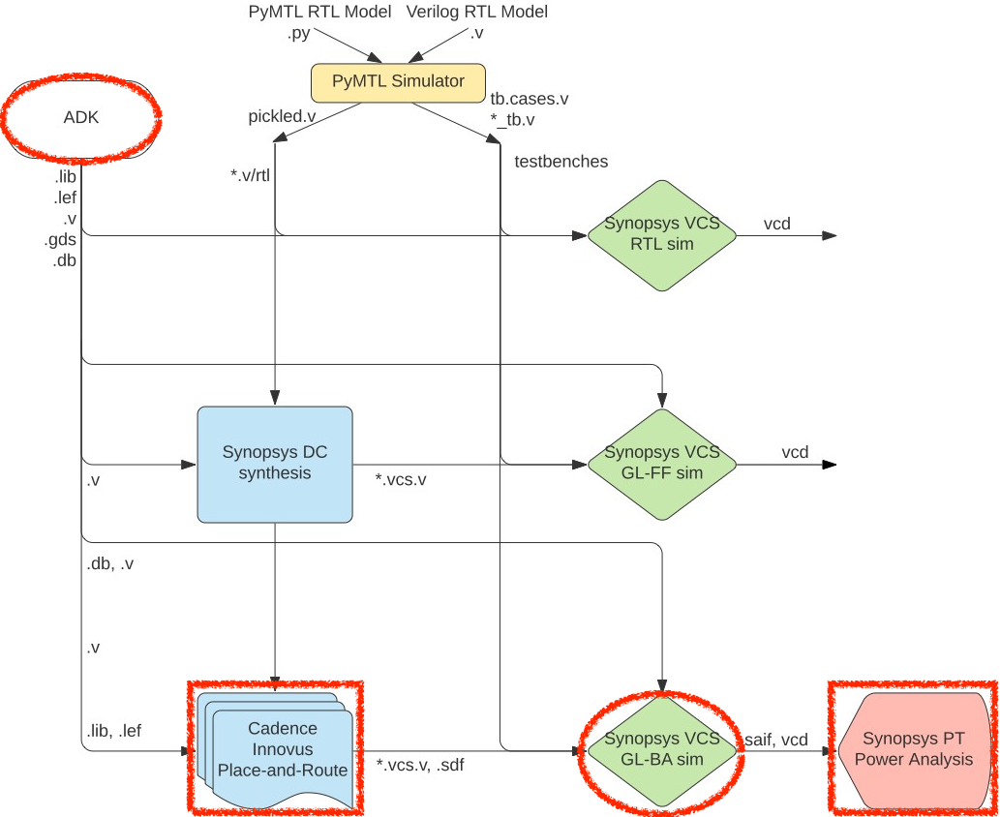

ECE 6745 Tutorial 6: ASIC Back-End Flow
==========================================================================

The tutorial will discuss the key tools used for ASIC back-end flow which
includes place-and-route, back-annotated gate-level simulation, and power
analysis. This tutorial requires entering commands manually for each of
the tools to enable students to gain a better understanding of the
detailed steps involved in this process. A later tutorial will illustrate
how this process can be automated to facilitate rapid design-space
exploration. This tutorial assumes you have already completed the
tutorials on Linux, Git, and Verilog.

The following diagram illustrates the five primary tools we will be using
in ECE 6745 along with a few smaller secondary tools. The tools that
make-up the ASIC back-end flow are highlighted in red. Notice that the
ASIC tools all require various views from the standard-cell library.
Before starting this tutorial, you must complete the ASIC standard-cell
tutorial so you can understand all of these views and you must complete
the ASIC front-end flow tutorial.



 1. We write our RTL models in Verilog, and we use the PyMTL framework to
    test, verify, and evaluate the execution time (in cycles) of our
    design. This part of the flow is very similar to the flow used in
    ECE 4750. Once we are sure our design is working correctly, we can
    then start to push the design through the flow.

 2. We use **Synopsys VCS** to compile and run both 4-state RTL and
    gate-level simulations. These simulations help us to build confidence
    in our design as we push our designs through different stages of the
    flow. From these simulations, we also generate waveforms in `.vcd`
    (Verilog Change Dump) format, and we use `vcd2saif` to convert these
    waveforms into per-net average activity factors stored in `.saif`
    format. These activity factors will be used for power analysis.
    Gate-level simulation is an valuable tool for ensuring the tools did
    not optimize something away which impacts the correctness of the
    design, and also provides an avenue for obtaining a more accurate
    power analysis than RTL simulation. While static timing analysis
    (STA) analyzes all paths, GL simulation can also serve as a backup to
    check for hold and setup time violations (chip designers must be
    paranoid!)

 3. We use **Synopsys Design Compiler (DC)** to synthesize our design,
    which means to transform the Verilog RTL model into a Verilog
    gate-level netlist where all of the gates are selected from the
    standard-cell library. We need to provide Synopsys DC with abstract
    logical and timing views of the standard-cell library in `.db`
    format. In addition to the Verilog gate-level netlist, Synopsys DC
    can also generate a `.ddc` file which contains information about the
    gate-level netlist and timing, and this `.ddc` file can be inspected
    using Synopsys Design Vision (DV). We will also use Synopsys DC to
    generate a `.sdc` which captures timing constraints which can then be
    used as input to the place-and-route tool.

 4. We use **Cadence Innovus** to place-and-route our design, which means
    to place all of the gates in the gate-level netlist into rows on the
    chip and then to generate the metal wires that connect all of the
    gates together. We need to provide Cadence Innovus with the same
    abstract logical and timing views used in Synopsys DC, but we also
    need to provide Cadence Innovus with technology information in
    `.lef`, and `.captable` format and abstract physical views of the
    standard-cell library also in `.lef` format. Cadence Innovus will
    generate an updated Verilog gate-level netlist, a `.spef` file which
    contains parasitic resistance/capacitance information about all nets
    in the design, and a `.gds` file which contains the final layout. The
    `.gds` file can be inspected using the open-source Klayout GDS
    viewer. Cadence Innovus also generates reports which can be used to
    accurately characterize area and timing.

 5. We use **Synopsys PrimeTime (PT)** to perform power analysis of our
    design. We need to provide Synopsys PT with the same abstract
    logical, timing, and power views used in Synopsys DC and Cadence
    Innovus, but in addition we need to provide switching activity
    information for every net in the design (which comes from the `.saif`
    file), and capacitance information for every net in the design (which
    comes from the `.spef` file). Synopsys PT puts the switching
    activity, capacitance, clock frequency, and voltage together to
    estimate the power consumption of every net and thus every module in
    the design, and these estimates are captured in various reports.

Extensive documentation is provided by Synopsys and Cadence for these
ASIC tools. We have organized this documentation and made it available to
you on the public course webpage:

 - <https://www.csl.cornell.edu/courses/ece6745/asicdocs>

The first step is to source the setup script, clone this repository from
GitHub, and define an environment variable to keep track of the top
directory for the project.

```bash
% source setup-ece6745.sh
% mkdir -p $HOME/ece6745
% cd $HOME/ece6745
% git clone git@github.com:cornell-ece6745/ece6745-tut07-asic-back-end tut07
% cd tut07
% export TOPDIR=$PWD
```

1. Revisiting the ASIC Flow Front-End
--------------------------------------------------------------------------

Our goal in this tutorial is to generate layout for the sort unit from
the Verilog tutorial using the ASIC tools. As a reminder, the sort unit
takes as input four integers and a valid bit and outputs those same four
integers in increasing order with the valid bit. The sort unit is
implemented using a three-stage pipelined, bitonic sorting network and
the datapath is shown below.


Before we can place and route a gate-level netlist, we need to synthesize
that netlist. This is what we learned about in the last section. Here are
the steps to test and then synthesize the design using Synopsys DC.

### 1.1. Test, Simulate, Translate

Always run the tests before pushing anything through the ASIC flow. There
is no sense in running the flow if the design is incorrect!

```bash
% mkdir -p $TOPDIR/sim/build
% cd $TOPDIR/sim/build
% pytest ../tut3_verilog/sort
```

Next we should rerun all the tests with the `--test-verilog` and
`--dump-vtb` command line options to ensure that the design also works
after translated into Verilog and that we generate a Verilog test-bench
for gate-level simulation. You should do this step even if you are using
Verilog for your RTL design.

```bash
% cd $TOPDIR/sim/build
% pytest ../tut3_verilog/sort --test-verilog --dump-vtb
```

The tests are for verification. When we push a design through the flow we
want to use a simulator which is focused on evaluation. You can run the
simulator for our sort unit like this:

```bash
% cd $TOPDIR/sim/build
% ../tut3_verilog/sort/sort-sim --impl rtl-struct --stats --translate --dump-vtb
% num_cycles          = 106
% num_cycles_per_sort = 1.06
```

You should now have the Verilog that we want to push through the ASIC
flow.

### 1.2. Simulate, Synthesize, Simulate

We have provided you run scripts that will reproduce the three key steps
we learned about in the previous tutorial:

 - Use Synopsys VCS for four-state RTL simulation
 - Use Synopsys DC to synthesize RTL to gate-level netlist
 - Use Synopsys VCS for fast-functional gate-level simulation

You can run these steps as follows:

```bash
% cd $TOPDIR/asic
% ./01-synopsys-vcs-rtlsim/run
% ./02-synopsys-dc-synth/run
% ./03-synopsys-vcs-ffglsim/run
```

Verify that your design passes four-state RTL simulation and
fast-functional gate-level simulation. Then take a look at the synthesis
reports

```bash
% less ./02-synopsys-dc-synth/resources.rpt
% less ./02-synopsys-dc-synth/area.rpt
% less ./02-synopsys-dc-synth/timing.rpt
```

Finally, take a few minutes to examine the resulting Verilog gate-level
netlist. Notice that the module hierarchy is preserved.

```bash
% less ./02-synopsys-dc-synth/post-synth.v
```

This is the gate-level netlist that we now want to push through the ASIC
back-end flow.

2. Using Cadence Innovus for Place-and-Route
--------------------------------------------------------------------------

We use Cadence Innovus for placing standard cells in rows and then
automatically routing all of the nets between these standard cells. We
also use Cadence Innovus to route the power and ground rails in a grid
and connect this grid to the power and ground pins of each standard cell,
and to automatically generate a clock tree to distribute the clock to all
sequential state elements with hopefully low skew.

We will be running Cadence Innovus in a separate directory to keep the
files separate from the other tools.

```bash
% mkdir -p $TOPDIR/asic/build-sort/04-cadence-innovus-pnr
% cd $TOPDIR/asic/build-sort/04-cadence-innovus-pnr
```

### 2.1. Constraint and Timing Input Files

Before starting Cadence Innovus, we need two files which will be loaded
into the tool. The first file is a `.sdc` file which contains timing
constraint information about our design. This file is where we specify
our target clock period, but it is also where we could specify input or
output delay constraints (e.g., the output signals must be stable 200ps
before the rising edge). We created this file at the end of our synthesis
step using Synopsys DC. Before we get started, let's open that file to
take a look at the constraint DC generated.

```bash
% less ../02-synopsys-dc-synth/post-synth.sdc
```

The `create_clock` command is similar to the command we used in
synthesis, and we usually use the same target clock period that we used
for synthesis. In this case, we are targeting a 1.67GHz clock frequency
(i.e., a 0.6ns clock period). Note that we also see the constraints that
we set for max transition, driving scells, output loads, input delays,
and output delays.

The second file is a "multi-mode multi-corner" (MMMC) analysis file. This
file specifies what "corner" to use for our timing analysis. A corner is
a characterization of the standard cell library and technology with
specific assumptions about the process, temperature, and voltage (PVT).
So we might have a "fast" corner which assumes best-case process
variability, low temperature, and high voltage, or we might have a "slow"
corner which assumes worst-case variability, high temperature, and low
voltage. To ensure our design will work across a range of operating
conditions, we need to evaluate our design across a range of corners. In
this course, we will keep things simple by only considering a "typical"
corner (i.e., average PVT). Use VS Code to create a file named
`setup-timing.tcl`.

```bash
% cd $TOPDIR/asic/04-cadence-innovus-pnr
% code setup-timing.tcl
```

The file should have the following content:

```
 create_rc_corner -name typical \
    -cap_table "$env(ECE6745_STDCELLS)/rtk-typical.captable" \
    -T 25

 create_library_set -name libs_typical \
    -timing [list "$env(ECE6745_STDCELLS)/stdcells.lib"]

 create_delay_corner -name delay_default \
    -library_set libs_typical \
    -rc_corner typical

 create_constraint_mode -name constraints_default \
    -sdc_files [list ../02-synopsys-dc-synth/post-synth.sdc]

 create_analysis_view -name analysis_default \
    -constraint_mode constraints_default \
    -delay_corner delay_default

 set_analysis_view -setup analysis_default -hold analysis_default
```

The `create_rc_corner` command loads in the `.captable` file that we
examined earlier. This file includes information about the resistance and
capacitance of every metal layer. Notice that we are loading in the
"typical" captable and we are specifying an "average" operating
temperature of 25 degC. The `create_library_set` command loads in the
`.lib` file that we examined earlier. This file includes information
about the input/output capacitance of each pin in each standard cell
along with the delay from every input to every output in the standard
cell. The `create_delay_corner` specifies a specific corner that we would
like to use for our timing analysis by putting together a `.captable` and
a `.lib` file. In this specific example, we are creating a typical corner
by putting together the typical `.captable` and typical `.lib` we just
loaded. The `create_constraint_mode` command loads in the `.sdc` file we
mentioned earlier in this section. The `create_analysis_view` command
puts together constraints with a specific corner, and the
`set_analysis_view` command tells Cadence Innovus that we would like to
use this specific analysis view for both setup and hold time analysis.

### 2.2. Initial Setup and Floorplanning

Now that we have created our `setup-timing.tcl` file we can start Cadence
Innovus:

```bash
% cd $TOPDIR/asic/04-cadence-innovus-pnr
% innovus
```

As we enter commands we will be able use the GUI to see incremental
progress towards a fully placed-and-routed design. We need to set various
variables before starting to work in Cadence Innovus. These variables
tell Cadence Innovus the location of the MMMC file, the location of the
Verilog gate-level netlist, the name of the top-level module in our
design, the location of the `.lef` files, and finally the names of the
power and ground nets.

```
innovus> set init_mmmc_file "setup-timing.tcl"
innovus> set init_verilog   "../02-synopsys-dc-synth/post-synth.v"
innovus> set init_top_cell  "SortUnitStruct"
innovus> set init_lef_file  "$env(ECE6745_STDCELLS)/rtk-tech.lef $env(ECE6745_STDCELLS)/stdcells.lef"
innovus> set init_gnd_net   "VSS"
innovus> set init_pwr_net   "VDD"
```

We are now ready to use the `init_design` command to read in the verilog,
set the design name, setup the timing analysis views, read the technology
`.lef` for layer information, and read the standard cell `.lef` for
physical information about each cell used in the design.

```
innovus> init_design
```

Then, we tell innovus the type of timing analysis we want it to do. In
on-chip variation (OCV) mode, the software calculates clock and data path
delays based on minimum and maximum operating conditions for setup
analysis and vice-versa for hold analysis. These delays are used together
in the analysis of each check. The OCV is the small difference in the
operating parameter value across the chip. Each timing arc in the design
can have an early and a late delay to account for the on-chip process,
voltage, and temperature variation. We need this mode in order to do
proper hold time fixing later on.

```
innovus> setAnalysisMode -analysisType onChipVariation -cppr both
```

The next step is to do some floorplaning. This is where we broadly
organize the chip in terms of its overall dimensions and the placement of
any previously designed blocks. For now we just do some very simple
floorplanning using the `floorPlan` command.

```
innovus> floorPlan -r 1.0 0.70 4.0 4.0 4.0 4.0
```

In this example, we have chosen the aspect ratio to be 1.0 and a target
cell utilization to be 70%. The cell utilization is the percentage of the
final chip that will actually contain useful standard cells as opposed to
just "filler" cells (i.e., empty cells). Ideally, we would like the cell
utilization to be 100% but this is simply not reasonable. If the cell
utilization is too high, Cadence Innovus will spend way too much time
trying to optimize the design and will eventually simply give up. A
target cell utilization of 70% makes it more likely that Cadence Innovus
can successfuly place and route the design. We have also added 4.0um of
margin around the top, bottom, left, and right of the chip to give us
room for the power ring which will go around the entire chip.

The following screen capture illustrates what you should see: a square
floorplan with rows where the standard cells will eventually be placed.
You can use the _View > Fit_ menu option to see the entire chip.


### 2.3. Power Routing

The next step is to work on power routing. Recall that each standard cell
has internal M1 power and ground rails which will connect via abutment
when the cells are placed into rows. If we were just to supply power to
cells using these rails we would likely have large IR drop and the cells
in the middle of the chip would effectively be operating at a much lower
voltage. During power routing, we create a grid of power and ground wires
on the top metal layers and then connect this grid down to the M1 power
rails in each row. We also create a power ring around the entire
floorplan. Before doing the power routing, we need to use the
`globalNetCommand` command to tell Cadence Innovus which nets are power
and which nets are ground (there are _many_ possible names for power and
ground!).

```
innovus> globalNetConnect VDD -type pgpin -pin VDD -inst * -verbose
innovus> globalNetConnect VSS -type pgpin -pin VSS -inst * -verbose
```

We can now draw M1 "rails" for the power and ground rails that go along
each row of standard cells.

```
innovus> sroute -nets {VDD VSS}
```

We now create a power ring around our chip using the `addRing` command. A
power ring ensures we can easily get power and ground to all standard
cells. The command takes parameters specifying the width of each wire in
the ring, the spacing between the two rings, and what metal layers to use
for the ring. We will put the power ring on M6 and M7; we often put the
power routing on the top metal layers since these are fundamentally
global routes and these top layers have low resistance which helps us
minimize static IR drop and di/dt noise. These top layers have high
capacitance but this is not an issue since the power and ground rails are
not switching (and indeed this extra capacitance can serve as a very
modest amount of decoupling capacitance to smooth out time variations in
the power supply).

```
innovus> addRing -nets {VDD VSS} -width 0.6 -spacing 0.5 \
            -layer [list top 7 bottom 7 left 6 right 6]
```

We have power and ground rails along each row of standard cells and a
power ring, so now we need to hook these up. We can use the `addStripe`
command to draw wires and automatically insert vias whenever wires cross.
First, we draw the vertical "stripes".

```
innovus> addStripe -nets {VSS VDD} -layer 6 -direction vertical \
            -width 0.4 -spacing 0.5 -set_to_set_distance 5 -start 0.5
```

And then we draw the horizontal "stripes".

```
innovus> addStripe -nets {VSS VDD} -layer 7 -direction horizontal \
            -width 0.4 -spacing 0.5 -set_to_set_distance 5 -start 0.5
```

The following screen capture illustrates what you should see: a power
ring and grid on M6 and M7 connected to the horizontal power and ground
rails on M1.


You can toggle the visibility of metal layers by using the panel on the
right. Click the checkbox in the V column to toggle the visibility of the
corresponding layer. You can also simply use the number keys on your
keyboard. Pressing the 6 key will toggle M6 and pressing the 7 key will
toggle M7. Zoom in on a via and toggle the visibility of the metal layers
to see how Cadence Innovus has automatically inserted a via stack that
goes from M1 all the way up to M6 or M7.

### 2.4. Placement

Now that we have finished our basic power planning we can do the initial
placement and routing of the standard cells using the `place_design`
command:

```
innovus> place_design
```

The following screen capture illustrates what you should see: the gates
have been placed underneath a sea of wiring on the various metal layers.


Note that Cadence Innovus has only done a very preliminary routing,
primarily to help improve placement. You can use the Amobea workspace to
help visualize how modules are mapped across the chip. Choose _Windows >
Workspaces > Amoeba_ from the menu. However, we recommend using the
design browser to help visualize how modules are mapped across the chip.
Here are the steps:

 - Choose _Windows > Workspaces > Design Browser + Physical_ from the menu
 - Hide all of the metal layers by pressing the number keys
 - Browse the design hierarchy using the panel on the left
 - Right click on a module, click _Highlight_, select a color

In this way you can view where various modules are located on the chip.
The following screen capture illustrates the location of the five
`MinMaxUnit` modules.


Notice how Cadence Innovus has grouped each module together. The
placement algorithm tries to keep connected standard cells close together
to minimize wiring.

### 2.5. Routing

The next step is to assign IO pin location for our block-level design.
Since this is not a full chip with IOcells, or a hierarchical block, we
don't really care exactly where all of the pins line up, so we'll let the
tool assign the location for all of the pins.

```
innovus> assignIoPins -pin *
```

The next step is to improve the quality of the clock tree routing. First,
let's display just the clock tree so we can clearly see the impact of
optimized clock tree routing. In the right panel click on _Net_ and then
deselect the checkbox in the V column next to _Signal_, _Special Net_,
_Power_, and _Ground_ so that only _Clock_ is selected. You should be
able to see the clock snaking around the chip connecting the clock port
of all of the registers. Now use the `ccopt_design` command to optimize
the clock tree routing.

```
innovus> ccopt_design
```

If you watch closely you should see a significant difference in the
clock tree routing before and after optimization. The following screen
capture illustrates the optimized clock tree routing.


The routes are straighter, shorter, and well balanced. This will result
in much lower clock skew.

To avoid hold time violations (situations where the contamination delay
is smaller than the hold time and new data arrives too quickly) we
include the following commands:

```
innovus> setOptMode -holdFixingCells {BUF_X1}
innovus> setOptMode -holdTargetSlack 0.013 -setupTargetSlack 0.044
innovus> optDesign -postCTS -prefix postCTS_hold -hold
```

Here, we specified a list of buffer cells that innovus can use to add in
delays to paths that violate the hold time constraint. We then tell
innovus our hold and setup time constraints, in nanoseconds, these
numbers were derived from the `.lib` file. Then, we actually fix any
violating paths using the `optDesign` command.

The next step is to improve the quality of the signal routing. Display
just the signals but not the power and ground routing by clicking on the
checkbox in the V column next to _Signal_ in the left panel. Then use the
`routeDesign` command to optimize the signal routing. We follow this with
another iteration of `optDesign` to fix any violating paths that were
created during `routeDesign`.

```
innovus> routeDesign
innovus> optDesign -postRoute -prefix postRoute_hold -hold
```

If you watch closely you should see a significant difference in the
signal routing before and after optimization. The following screen
capture illustrates the optimized signal routing.


Again the routes are straighter and shorter. This will reduce the
interconnect resistance and capacitance and thus improve the delay and
energy of our design.

### 2.6. Final Output and Reports

The final step is to insert "filler" cells. Filler cells are essentially
empty standard cells whose sole purpose is to connect the wells across
each standard cell row.

```
innovus> setFillerMode -corePrefix FILL -core "FILLCELL_X4 FILLCELL_X2 FILLCELL_X1"
innovus> addFiller
```

Zoom in to see some of the detailed routing and take a moment to
appreciate how much effort the tools have done for us automatically to
synthesize, place, and route this design. The following screen capture
shows some of this detailed routing.


Notice how each metal layer always goes in the same direction. So M2 is
always vertical, M3 is always horizontal, M4 is always vertical, etc.
This helps reduce capacitive coupling across layers and also simplifies
the routing algorithm. Actually, if you look closely in the above screen
shot you can see situations on M2 (red) and M3 (green) where the router
has generated a little "jog" meaning that on a single layer the wire goes
both vertically and horizontally. This is an example of the sophisticated
algorithms used in these tools.

Our design is now on silicon! Obviously there are many more steps
required before you can really tape out a chip. We would need to add an
I/O ring with pads so we can connect the chip to the package, we would
need to do further verification, and additional optimization.

For example, one thing we want to do is verify that the gate-level
netlist matches what is really in the final layout. We can do this using
the `verifyConnectivity` command. We can also do a preliminary "design
rule check" to make sure that the generated metal interconnect does not
violate any design rules with the `verify_drc` command.

```
innovus> verifyConnectivity
innovus> verify_drc
```

Now we can generate various output files. We might want to save the final
gate-level netlist for the chip, since Cadence Innovus will often insert
new cells or change cells during its optimization passes.

```
innovus> saveNetlist post-pnr.v
```

We can also extract resistance and capacitance for the metal interconnect
and write this to a special `.spef` file. This file can be used for later
timing and/or power analysis.

```
innovus> extractRC
innovus> rcOut -rc_corner typical -spef post-pnr.spef
```

You may get an error regarding open nets. This is actually more of a warning
message, and for the purposes of RC extraction we can ignore this.

We also need to extract delay information and write this to an
`.sdf`(Standard Delay Format) file, which we'll use for our
back-annotated gate-level simulations.

```
innovus> write_sdf post-pnr.sdf -interconn all -setuphold split
```

Finally, we of course need to generate the real layout as a `.gds` file. This
is what we will send to the foundry when we are ready to tapeout the
chip.

```
innovus> streamOut post-pnr.gds \
            -merge "$env(ECE6745_STDCELLS)/stdcells.gds" \
            -mapFile "$env(ECE6745_STDCELLS)/rtk-stream-out.map"
```

We can also use Cadence Innovus to do timing, area, and power analysis
similar to what we did with Synopsys DC. These post-place-and-route
results will be _much_ more accurate than the preliminary post-synthesis
results. Let's start with a basic timing report.

```
innovus> report_timing
 ...
 Other End Arrival Time          0.000
 - Setup                         0.045
 + Phase Shift                   0.600
 = Required Time                 0.555
 - Arrival Time                  0.502
 = Slack Time                    0.053
     Clock Rise Edge                 0.000
     + Clock Network Latency (Prop)  0.000
     = Beginpoint Arrival Time       0.000
     +-----------------------------------------------------------------------------------------------+
     |                Instance                |     Arc      |   Cell   | Delay | Arrival | Required |
     |                                        |              |          |       |  Time   |   Time   |
     |----------------------------------------+--------------+----------+-------+---------+----------|
     | elm_S1S2__2/out_reg[3]                 | CK ^         |          |       |   0.000 |    0.053 |
     | elm_S1S2__2/out_reg[3]                 | CK ^ -> Q ^  | DFF_X1   | 0.090 |   0.090 |    0.143 |
     | minmax0_S2/FE_DBTC3_elm_S1S2__2__out_3 | A ^ -> ZN v  | INV_X1   | 0.013 |   0.104 |    0.156 |
     | minmax0_S2/U14                         | A2 v -> ZN v | AND2_X1  | 0.029 |   0.133 |    0.186 |
     | minmax0_S2/U7                          | A2 v -> ZN v | OR2_X1   | 0.048 |   0.181 |    0.234 |
     | minmax0_S2/U10                         | A2 v -> ZN ^ | NOR2_X1  | 0.030 |   0.211 |    0.264 |
     | minmax0_S2/U35                         | A1 ^ -> ZN v | NOR2_X1  | 0.011 |   0.222 |    0.275 |
     | minmax0_S2/U11                         | A1 v -> ZN ^ | NOR2_X1  | 0.025 |   0.247 |    0.300 |
     | minmax0_S2/U38                         | A1 ^ -> ZN v | NOR3_X1  | 0.012 |   0.258 |    0.311 |
     | minmax0_S2/U65                         | A1 v -> ZN ^ | OAI22_X1 | 0.026 |   0.284 |    0.337 |
     | minmax0_S2/U13                         | A1 ^ -> ZN v | NAND2_X1 | 0.077 |   0.362 |    0.415 |
     | minmax0_S2/U33                         | A v -> ZN ^  | INV_X1   | 0.109 |   0.471 |    0.524 |
     | minmax0_S2/U60                         | A2 ^ -> ZN v | OAI22_X1 | 0.032 |   0.502 |    0.555 |
     | elm_S2S3__1/out_reg[7]                 | D v          | DFF_X1   | 0.000 |   0.502 |    0.555 |
     +-----------------------------------------------------------------------------------------------+
```

Note that for these results we used a target clock period of 0.6ns. This
was the shortest clock period which still met timing without any negative
slack during synthesis. From the above report we can see that our design
is still meeting timing even after place-and-route. Note that it is very
likely that the critical path identified by Synsopsys DC after synthesis
will _not_ be the same critical path identified by Cadence Innovus after
place-and-route. This is because Synopsys DC can only guess the final
placement of the cells and interconnect during static timing analysis,
while Cadence Innovus can use the real placement of the cells and
interconnect during static timing analysis. For the same reason, there is
no guarantee that if your design meets timing after synthesis that it
will still meet timing after place-and-route! It is very possible that
your design _will_ meet timing after synthesis and then _will not_ meet
timing after place-and-route. **If your design does not meet timing after
place-and-route you must go back and use a longer target clock period for
synthesis!**

You can use the following steps in Cadence Innovus to display where the
critical path is on the actual chip.

 - Choose _Timing > Debug Timing_ from the menu
 - Click _OK_ in the pop-up window
 - Right click on first path in the _Path List_
 - Choose _Highlight > Only This Path > Color_

You can also use the Design Browser to highlight specific modules to
visualize how the critical path is routed across the chip between these
modules. The following screen capture illustrates the critical path in
our three-stage sort unit. From the above timing report we know the
critical path basically goes through the `minmax0_S2` module, so we have
highlighted that module in red using the Design Browser. Cadence Innovus
has worked hard in both placement and routing to keep the critical path
short. If your critical path stretches across the entire chip you may
need to take extra steps such as explicit floorplanning or hierarchical
design to help the tools produce a better quality of result.


As in Synopsys DC, the `report_area` command can show the area each
module uses and can enable detailed area breakdown analysis. These area
results will be far more accurate than the post-synthesis results.

```
innovus> report_area
  Depth  Name                          #Inst  Area (um^2)
  --------------------------------------------------------
  0      SortUnitStructRTL__nbits_8    369    709.688
  1      elm_S1S2__2                   8      36.176
  1      val_S1S2                      3      5.852
  1      minmax0_S1                    58     53.998
  1      elm_S0S1__3                   8      36.176
  1      minmax1_S2                    54     52.934
  1      elm_S0S1__0                   8      36.176
  1      elm_S2S3__0                   8      36.176
  1      elm_S2S3__1                   8      36.176
  1      minmax1_S1                    53     52.934
  1      elm_S1S2__1                   8      36.176
  1      val_S0S1                      3      5.852
  1      elm_S0S1__2                   8      36.176
  1      elm_S2S3__3                   8      36.176
  1      elm_S1S2__3                   8      36.176
  1      val_S2S3                      3      5.852
  1      minmax0_S2                    57     54.264
  1      elm_S1S2__0                   8      36.176
  1      minmax_S3                     42     43.89
  1      elm_S0S1__1                   8      36.176
  1      elm_S2S3__2                   8      36.176
```

The `#Inst` column indicates the number of non-filler cells in that
module. There are a total of 369 standard cells in the design. Each
register has eight standard cells; eight flip-flops since it is an
eight-bit register. The `MinMaxUnit`s have a different number of cells
since they have been optimized differently. The `MinMaxUnit`s consume
about ~40% of the area.

As in Synopsys DC, the `report_power` command can show how much power
each module consumes. Note that this power analysis is still not that
useful yet, since at this stage of the flow the power analysis is still
based purely on statistical activity factor estimation. We will do more
realistic power analysis in the next section.

```
innovus> report_power -hierarchy all
```

Finally, we go ahead and exit Cadence Innovus.

```
innovus> exit
```

### 2.7. Viewing Final Layout

We can now look at the actual `.gds` file for our design to see the final
layout including all of the cells and the interconnect using the
open-source Klayout GDS viewer. Choose _Display > Full Hierarchy_ from
the menu to display the entire design. Zoom in and out to see the
individual transistors as well as the entire chip.

```bash
% cd $TOPDIR/asic/build-sort/04-cadence-innovus-pnr
% klayout -l ${ECE6745_STDCELLS}/klayout.lyp post-pnr.gds
```

The following screen capture illutrates using Klayout to view the layout
for the entire sort unit.


The following figure shows a zoomed portion of the layout. You can
clearly see the active layer inside the standard cells along with the
signal routing on the lower metal layers. The power routing on the upper
metal layers has been hiddent for clarity.


**To Do On Your Own:** Try increasing the bitwidth of the sort unit and
see how this impacts the timing and/or area. For example, experiment with
a sort unit capable of sorting 32-bit or 64-bit values. You will need to
adjust the test harness and simulation driver appropriately.

Try flattening the design during synthesis by using this command:

```
dc_shell> compile -ungroup_all
```

or try using the `compile_ultra` command with (or without) flattening.
Then push the resulting design through place-and-route to see if this
improves the quality of results with respect to timing and/or area.

```
dc_shell> compile_ultra -no_autoungroup
```

You can put a sequence of commands in a `.tcl` file and then run Cadence
Innovus using those commands in one step like this:

```bash
% cd $TOPDIR/asic-manual/cadence-innovus
% innovus -64 -no_gui -files init.tcl
```

The `-no_gui` command prevents Cadence Innovus from opening the GUI which
can make interacting with the tool much faster. So consider placing the
commands from this section into a `.tcl` file to make it easy to rerun
Cadence Innovus.

Using Synopsys VCS for Back-Annotated Gate-Level Simulation
--------------------------------------------------------------------------

Before place and route, we used Synopsys VCS to do 4-state simulation,
and gate-level simulation. This time, we'll be using VCS to perform a
back-annotated gate-level simulation. The key difference between the
previous gate-level simulation and this one is that in this case, we'll
be using an `.sdf` file to annotate delays in the gate-level simulation.
In previous simulations, we only see signals change on the clock edge;
however, with a back-annotated simulation, we'll know more precisely when
signals are arriving by using the delay information provided by the
`.sdf`. This means that running a back-annotated simulation with a cycle
time that is too fast will cause the design to fail! Back-annotated
simulations are also useful for detecting hold-time violations.

Given the more realistic timing implications of a back-annotated
simulation, we need to be more careful about the cycle time, input delay,
and output delay that we provide to vcs. We'll start by creating a build
directory for our post-synth run of vcs, and output directories for the
`.vcd` and `.saif` that we'll generate for power analysis.

```bash
% mkdir -p $TOPDIR/asic/build-sort/05-synopsys-vcs-baglsim
% cd $TOPDIR/asic/build-sort/05-synopsys-vcs-baglsim
```

Then we will use Synopsys VCS to simulate our gate-level model with the
same test bench we used before. Notice the differences between this
command and the fast functional gate-level simulation command:

```bash
% cd $TOPDIR/asic/build-sort/05-synopsys-vcs-baglsim
% vcs -sverilog -xprop=tmerge -override_timescale=1ns/1ps \
    +neg_tchk +sdfverbose \
    -sdf max:SortUnitStruct_tb.DUT:../04-cadence-innovus-pnr/post-pnr.sdf \
    +define+CYCLE_TIME=0.600 \
    +define+VTB_INPUT_DELAY=0.025 \
    +define+VTB_OUTPUT_DELAY=0.025 \
    +vcs+dumpvars+SortUnitStruct_random-600ps.vcd \
    +incdir+$TOPDIR/sim/build \
    -top SortUnitStruct_tb \
    ${ECE6745_STDCELLS}/stdcells.v \
    $TOPDIR/sim/build/SortUnitStruct_random_tb.v \
    ../04-cadence-innovus-pnr/post-pnr.v
% ./simv
```

% vcs ../cadence-innovus/post-par.v
$ECE5745_STDCELLS/stdcells.v
-full64 -sverilog +incdir+../../sim/build +lint=all -xprop=tmerge
-top SortUnitStructRTL__nbits_8_tb
../../sim/build/SortUnitStructRTL__nbits_8_sort-rtl-struct-random_tb.v
+sdfverbose -sdf
min:SortUnitStructRTL__nbits_8_tb.DUT:../cadence-innovus/post-par.sdf
+define+CYCLE_TIME=0.6
+define+VTB_INPUT_DELAY=0.03
+define+VTB_OUTPUT_ASSERT_DELAY=0.57
+vcs+dumpvars+SortUnitStructRTL__nbits_8_sort-rtl-struct-random_vcs.vcd
+neg_tchk -override_timescale=1ns/1ps
% ./simv
```

This time, we add the flag `+neg_tchk`, which enables negative values in
timing checks. Negative values in timing checks are important for cells
which have negative hold times, for example. We also include the
`+sdfverbose` flag which reads in the `post-par.sdf`. Note that we also
assign non-zero values for `+define+VTB_INPUT_DELAY` and
`+define+VTB_OUTPUT_ASSERT_DELAY`. These values are based on the input
and output delays we set during the Synopsys DC synthesis step. Note that
we assert the value at the clock constraint minus the output delay. This
ensures that the signal arrives and is stable by a margin of the output
delay. Including these macros will ensure that our timing checks will
actually mean something. Without this, our simulations may pass because
data arrives before the clock edge, even if it does not arrive before the
output delay. In such a case, the timing checks will be completely bogus.
To illustrate how useful these timing checks can be, lets run another
simulation where we try to push the design to run too quickly. Here, we
reduce the cycle time down to 0.45 ns:

```bash
% cd $TOPDIR/asic-manual/vcs-postpnr-build
% vcs ../cadence-innovus/post-par.v $ECE5745_STDCELLS/stdcells.v -full64 -sverilog +incdir+../../sim/build +lint=all -xprop=tmerge -top SortUnitStructRTL__nbits_8_tb ../../sim/build/SortUnitStructRTL__nbits_8_sort-rtl-struct-random_tb.v +sdfverbose -sdf max:SortUnitStructRTL__nbits_8_tb.DUT:../cadence-innovus/post-par.sdf +define+CYCLE_TIME=0.45 +define+VTB_INPUT_DELAY=0.03 +define+VTB_OUTPUT_ASSERT_DELAY=0.42 +vcs+dumpvars+SortUnitStructRTL__nbits_8_sort-rtl-struct-random_vcs.vcd +neg_tchk -override_timescale=1ns/1ps
% ./simv
```

Note that we also annotated the sdf using the maximum delays, due to the 
`-sdf max:...` flag. It is important to do a check using the maximum delays 
for setup time checks, and using minimum delays for hold time checks. 
Here, we can see the violating flip-flop, and the subsequent testbench 
failure. Note that you resulting netlist and layout may be slightly different 
than the one referenced here, so if your timing violation looks slightly 
different, or you do not yet have a timing violation, that is ok! Feel free 
to run your simulation even faster if that is the case, by changing the 
`CYCLE_TIME` and `VTB_OUTPUT_ASSERT_DELAY` macros.

```
"/work/global/brg/install/adk-pkgs/freepdk-45nm/stdview/stdcells.v", 2123: Timing violation in SortUnitStructRTL__nbits_8_tb.DUT.elm_S1S2__0.\out_reg[1]
    $setuphold( posedge CK:10129, negedge D:10110, limits: (44,10) );


The test bench received a value containing X/Z's! Please note
that the VTB is pessmistic about X's and you should make sure
all output ports of your DUT does not produce X's after reset.
- Timestamp      : 11 (default unit: ns)
- Cycle number   : 23 (variable: cycle_count)
- line number    : line 22 in SortUnitStructRTL__nbits_8_sort-rtl-struct-random_tb.v.cases
- port name      : out[2] (out[2] in Verilog)
- expected value : 0xf5
- actual value   : 0xfX
```

Let's re-run the simulation at the correct clock speed to obtain the 
right vcd for saif generation.

```bash
% vcs ../cadence-innovus/post-par.v $ECE5745_STDCELLS/stdcells.v -full64 -sverilog +incdir+../../sim/build +lint=all -xprop=tmerge -top SortUnitStructRTL__nbits_8_tb ../../sim/build/SortUnitStructRTL__nbits_8_sort-rtl-struct-random_tb.v +sdfverbose -sdf min:SortUnitStructRTL__nbits_8_tb.DUT:../cadence-innovus/post-par.sdf +define+CYCLE_TIME=0.6 +define+VTB_INPUT_DELAY=0.03 +define+VTB_OUTPUT_ASSERT_DELAY=0.57 +vcs+dumpvars+SortUnitStructRTL__nbits_8_sort-rtl-struct-random_vcs.vcd +neg_tchk -override_timescale=1ns/1ps
% ./simv
```

The `.vcd` file contains information about the state of every net in the
design on every cycle. This can make these `.vcd` files very large and
thus slow to analyze. For average power analysis, we only need to know
the activity factor on each net. We can use the `vcd2saif` tool to
convert `.vcd` files into `.saif` files. An `.saif` file only contains a
single average activity factor for every net.

```bash
% cd $TOPDIR/asic-manual/vcs-postpnr-build
% vcd2saif -input ./SortUnitStructRTL__nbits_8_sort-rtl-struct-random_vcs.vcd -output ./SortUnitStructRTL__nbits_8_sort-rtl-struct-random.saif
```

Take a look at the vcd file from this simulation. Here we can see some 
subcycle delays that shows us how long it takes for data to stabilize 
before the following cycle, super cool! This is showing the first stage 
of the sort unit pipeline. It shows the input and output of the stage 0 
pipeline registers, the input/output of the two stage 0 minmax units, 
and the input and output of the stage 1 pipeline registers.


