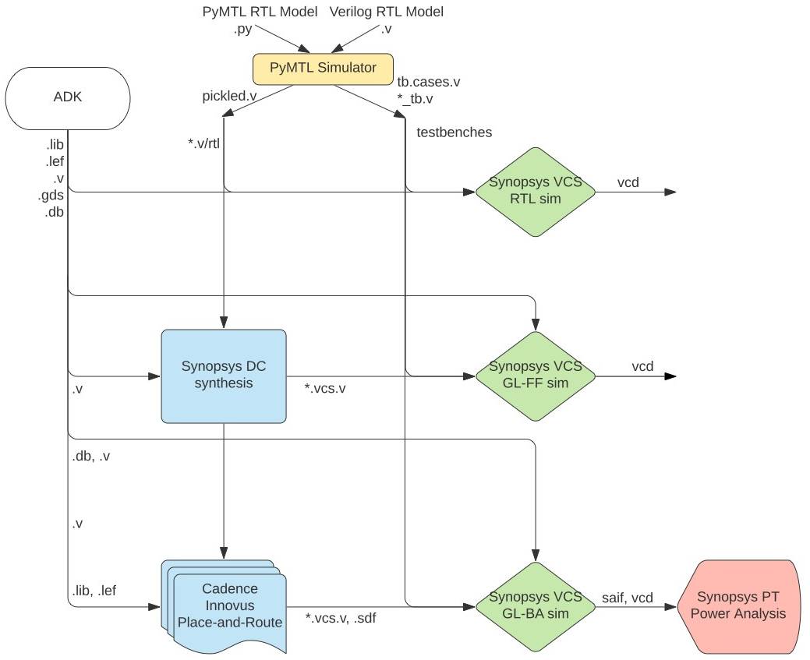

ECE 6745 Tutorial 8: ASIC Automated Flow
==========================================================================

The previous tutorials demonstrated how to take a design from RTL to
layout by both manually entering commands for each tool and also writing
flow scripts. Flow scripts can help automate the process but copying and
modifying these flow scripts for every design is tedious and error prone.
An agile hardware design flow demands automation to simplify rapidly
exploring the area, energy, timing design space of one or more designs.
In this tutorial we will introduce a simple tool called pyhflow which
takes as input a _step templates_ and a _design YAML_ and generates
appropriate flow scripts. This tutorial assumes you have already
completed the tutorials on Linux, Git, and Verilog.

The following diagram illustrates the five primary tools we will be using
in ECE 6745 along with a few smaller secondary tools. Notice that the
ASIC tools all require various views from the standard-cell library.
Before starting this tutorial, you must complete the ASIC standard-cell
tutorial, the ASIC front-end flow tutorial, and the ASIC back-end flow
tutorial.



 1. We write our RTL models in Verilog, and we use the PyMTL framework to
    test, verify, and evaluate the execution time (in cycles) of our
    design. This part of the flow is very similar to the flow used in
    ECE 4750. Once we are sure our design is working correctly, we can
    then start to push the design through the flow.

 2. We use **Synopsys VCS** to compile and run both 4-state RTL and
    gate-level simulations. These simulations help us to build confidence
    in our design as we push our designs through different stages of the
    flow. From these simulations, we also generate waveforms in `.vcd`
    (Verilog Change Dump) format, and per-net average activity factors
    stored in `.saif` format. These activity factors will be used for
    power analysis. Gate-level simulation is an valuable tool for
    ensuring the tools did not optimize something away which impacts the
    correctness of the design, and also provides an avenue for obtaining
    a more accurate power analysis than RTL simulation. While static
    timing analysis (STA) analyzes all paths, GL simulation can also
    serve as a backup to check for hold and setup time violations (chip
    designers must be paranoid!)

 3. We use **Synopsys Design Compiler (DC)** to synthesize our design,
    which means to transform the Verilog RTL model into a Verilog
    gate-level netlist where all of the gates are selected from the
    standard-cell library. We need to provide Synopsys DC with abstract
    logical and timing views of the standard-cell library in `.db`
    format. In addition to the Verilog gate-level netlist, Synopsys DC
    can also generate a `.ddc` file which contains information about the
    gate-level netlist and timing, and this `.ddc` file can be inspected
    using Synopsys Design Vision (DV). We will also use Synopsys DC to
    generate a `.sdc` which captures timing constraints which can then be
    used as input to the place-and-route tool.

 4. We use **Cadence Innovus** to place-and-route our design, which means
    to place all of the gates in the gate-level netlist into rows on the
    chip and then to generate the metal wires that connect all of the
    gates together. We need to provide Cadence Innovus with the same
    abstract logical and timing views used in Synopsys DC, but we also
    need to provide Cadence Innovus with technology information in
    `.lef`, and `.captable` format and abstract physical views of the
    standard-cell library also in `.lef` format. Cadence Innovus will
    generate an updated Verilog gate-level netlist, a `.spef` file which
    contains parasitic resistance/capacitance information about all nets
    in the design, and a `.gds` file which contains the final layout. The
    `.gds` file can be inspected using the open-source Klayout GDS
    viewer. Cadence Innovus also generates reports which can be used to
    accurately characterize area and timing.

 5. We use **Synopsys PrimeTime (PT)** to perform power analysis of our
    design. We need to provide Synopsys PT with the same abstract
    logical, timing, and power views used in Synopsys DC and Cadence
    Innovus, but in addition we need to provide switching activity
    information for every net in the design (which comes from the `.saif`
    file), and capacitance information for every net in the design (which
    comes from the `.spef` file). Synopsys PT puts the switching
    activity, capacitance, clock frequency, and voltage together to
    estimate the power consumption of every net and thus every module in
    the design, and these estimates are captured in various reports.

Extensive documentation is provided by Synopsys and Cadence for these
ASIC tools. We have organized this documentation and made it available to
you on the public course webpage:

 - <https://www.csl.cornell.edu/courses/ece6745/asicdocs>

The first step is to access `ecelinux`. Use Microsoft Remote Desktop to
log into a specific `ecelinux` server. Then use VS Code to log into the
same specific `ecelinux` server. Once you are at the `ecelinux` prompt,
source the setup script, source the GUI setup script, clone this
repository from GitHub, and define an environment variable to keep track
of the top directory for the project.

```bash
% source setup-ece6745.sh
% source setup-gui.sh
% mkdir -p $HOME/ece6745
% cd $HOME/ece6745
% git clone git@github.com:cornell-ece6745/ece6745-tut08-asic-auto tut08
% cd tut08
% export TOPDIR=$PWD
```

1. Testing, Simulation, and Translation
--------------------------------------------------------------------------

As in the previous tutorial, our goal is to characterize the area,
energy, and timing for the sort unit from the Verilog tutorial using the
ASIC tools. As a reminder, the sort unit takes as input four integers and
a valid bit and outputs those same four integers in increasing order with
the valid bit. The sort unit is implemented using a three-stage
pipelined, bitonic sorting network and the datapath is shown below.


Before using the ASIC tools we need to verify that our design passes all
of our tests and use an interactive simulator to drive our design-space
exploration.

### 1.1. Testing the Sort Unit

As always, we can use our Python-based testing framework combined with
the Verilator two-state RTL simulator to verify our design's
functionality. We need to use the `--test-verilog` and `--dump-vtb`
command line options to generate Verilog test benches which can then be
used for four-state RTL simulation, fast-functional gate-level
simulation, and back-annotated gate-level simulation.

```bash
% mkdir -p $TOPDIR/sim/build
% cd $TOPDIR/sim/build
% pytest ../tut3_verilog/sort --test-verilog --dump-vtb
```

Verify the test benches have been generated.

```bash
% cd $TOPDIR/sim/build
% ls SortUnitStruct*tb.v
```

### 1.2. Evaluating the Sort Unit

We can use the provided interactive simulator to run two experiments each
with a different dataset.

```bash
% ../tut3_verilog/sort/sort-sim --impl rtl-struct --input random --stats --translate --dump-vtb
% ../tut3_verilog/sort/sort-sim --impl rtl-struct --input zeros  --stats --translate --dump-vtb
```

Verify the Verilog RTL and test benches have been generated.

```bash
% cd $TOPDIR/sim/build
% ls SortUnitStruct__p_nbits_8__pickled.v
% ls SortUnitStruct__p_nbits_8_sort-sim-rtl-struct-random_tb.v
% SortUnitStruct__p_nbits_8_sort-sim-rtl-struct-zeros_tb.v
```

2. pyhflow For Generating Flows
--------------------------------------------------------------------------

pyflow is based on the idea of _step templates_ which are located in the
`asic/steps` directory.

```bash
% cd $TOPDIR/asic/steps
% tree
.
├── 01-synopsys-vcs-rtlsim
│   └── run
├── 02-synopsys-dc-synth
│   ├── run
│   └── run.tcl
├── 03-synopsys-vcs-ffglsim
│   └── run
├── 04-cadence-innovus-pnr
│   ├── run
│   ├── run.tcl
│   └── setup-timing.tcl
├── 05-synopsys-vcs-baglsim
│   └── run
├── 06-synopsys-pt-pwr
│   ├── run
│   └── run.tcl
└── 07-summarize-results
    ├── run
    └── summarize-results
```

Each step is a directory with a run script and possibly other scripts.
The key difference from the scripts we used in the previous tutorials, is
that these scripts are templated using the Jinja2 templating system:

 - <https://jinja.palletsprojects.com>

So for example, the Synopsys DC run.tcl script is templated based on the
design name and the target clock period as follows

```
analyze -format sverilog $env(TOPDIR)/sim/build/{{design_name}}__pickled.v
elaborate {{design_name}}

create_clock clk -name ideal_clock1 -period {{clock_period}}
```

The `{{ }}` directive is the standard syntax for template variable
substitution using Jinja2. As another example, the RTL, FFGL, and BAGL
simulation scripts are all templated by the list of tests and
evaluations.

```

run_sim {{item}}

```

The `` directive is the standard syntax for more complex templating
using Jinja2.

The pyhflow program takes as input a design YAML file which specifies:

 - what steps make up the flow
 - key/value pairs for variables to substitute into scripts
 - list of tests
 - list of evals

Take a look at the provided design YAML file for the sort unit.

```bash
% cd $TOPDIR/asic/designs
% cat tut08-sort.yml

steps:
 - 01-synopsys-vcs-rtlsim
 - 02-synopsys-dc-synth
 - 03-synopsys-vcs-ffglsim
 - 04-cadence-innovus-pnr
 - 05-synopsys-vcs-baglsim
 - 06-synopsys-pt-pwr
 - 07-summarize-results

src_dir      : ../../../sim/build
design_name  : SortUnitStruct__p_nbits_8
clock_period : 0.7
dump_vcd     : true

tests:
 - SortUnitStruct__p_nbits_8_test_basic
 - SortUnitStruct__p_nbits_8_test_stream
 - SortUnitStruct__p_nbits_8_test_dups
 - SortUnitStruct__p_nbits_8_test_sorted
 - SortUnitStruct__p_nbits_8_test_random_8

evals:
 - SortUnitStruct__p_nbits_8_sort-sim-rtl-struct-random
```

This design YAML file specifies the generated flow should use all seven
steps. Currently the only parameters are the source directory, design
name, and the clock period. We run RTL sim, FFGL sim, and BAGL sim on all
tests and evals, but we only do energy analysis on the evals. The evals
usually come from running an interactive simulator like `sort-sim`. All
pyhflow does is use the YAML file to figure out what to substitute into
the templated steps and then copy the run scripts into the current
working directory. You can also override parameters on pyhflow command
line.

### 2.1. Running ASIC Flow with One Test

Let's go ahead and use pyhflow to generate the flow scripts for the sort
unit.

```bash
% mkdir -p $TOPDIR/asic/build-tut08-sort
% cd $TOPDIR/asic/build-tut08-sort
% pyhflow --one-test ../designs/tut08-sort.yml
```

The `--one-test` command line option tells pyhflow to only include the
first test and no evals in the flow scripts. This is a useful way to get
started with a single test and reduces the overall runtime of the flow.
Once we know that everything works with one test we can circle back and
regenerate the flow scripts with all of the tests and evals.

Let's see how the step template has been filled in for the Verilog RTL
simulation step.

```bash
% cd $TOPDIR/asic/build-tut08-sort
% cat 01-synopsys-vcs-rtlsim/run
...
run_sim SortUnitStruct__p_nbits_8_test_basic
```

Notice how the name of the first test has been filled in. Let's also see
how the step template has been filled in for the Synopsys DC synthesis
step.

```bash
% cd $TOPDIR/asic/build-tut08-sort
% cat 02-synopsys-dc-synth/run.tcl
...
analyze -format sverilog $env(TOPDIR)/sim/build/SortUnitStruct__p_nbits_8__pickled.v
elaborate SortUnitStruct__p_nbits_8
create_clock clk -name ideal_clock1 -period 0.7
```

Notice how the name of the source Verilog RTL File, the top-level
modulename, and the clock period have all been filled in.

After generating a flow, we always recommend explicitly running at least
the first two steps to ensure there are no errors. You can run the
four-state RTL simulation as follows.

```bash
% cd $TOPDIR/asic/build-tut08-sort
% ./01-synopsys-vcs-rtlsim/run
```

Make sure the step can find the source files and passes the test. Then
run synthesis as follows.

```bash
% cd $TOPDIR/asic/build-tut08-sort
% ./02-synopsys-dc-synth/run
```

Carefully look at the output from the synthesis step (also stored in the
`run.log` file). Look for the output after `Running PRESTO HDLC` for any
warnings to ensure that all of your Verilog RTL is indeed synthesizable.
Scan through the rest of the logs to ensure there are no worrying
warnings or errors.

Once you have explicitly run the first two steps to ensure there are no
errors, you can run the remaning steps.

```bash
% cd $TOPDIR/asic/build-tut08-sort
% 03-synopsys-vcs-ffglsim
% 04-cadence-innovus-pnr
% 05-synopsys-vcs-baglsim
% 06-synopsys-pt-pwr
% 07-summarize-results
```

### 2.2. Running ASIC Flow with All Tests and Evals

If all looks good, then you can regenerate the with all of the tests and
evals. **pyhflow will also create a `run-flow` script which will run all
of the steps in sequence for you, but only use this if you are confident
there are no errors!**

```bash
% cd $TOPDIR/asic/build-tut08-sort
% pyhflow ../designs/tut08-sort.yml
% ./run-flow

 timestamp          = 2025-02-19 22:14:30
 design_name        = SortUnitStruct__p_nbits_8
 clock_period       = 0.7
 rtlsim             = 7/7 passed
 synth_setup_slack  = 0.0089 ns
 synth_num_stdcells = 461
 synth_area         = 785.498 um^2
 ffglsim            = 7/7 passed
 pnr_setup_slack    = 0.0683 ns
 pnr_hold_slack     = 0.0102 ns
 pnr_num_stdcells   = 609
 pnr_area           = 930.202 um^2
 baglsim            = 7/7 passed

 SortUnitStruct__p_nbits_8_sort-sim-rtl-struct-random
  - exec_time = 106 cycles
  - exec_time = 74.5750 ns
  - power     = 2.9100 mW
  - energy    = 0.2170 nJ
```

The final step summarizes the results and includes the following
information.

 - Timestamp
 - Design name
 - Clock period in ns
 - Four-state RTL simulation results
 - Synthesis setup slack in ns
 - Synthesis num stdcells
 - Synthesis area in um^2
 - Fast-functional gate-level simulation results
 - Place-and-route setup slack in ns
 - Place-and-route hold slack in ns
 - Place-and-route num stdcells
 - Place-and-route area in um^2
 - Back-annotated gate-level simulation results
 - For each evaluation
    + Execution time in cycles
    + Execution time in ns
    + Power in mW
    + Energy in nJ

For the results to be valid, the following must be true:

 - all four-state RTL simulations pass
 - all fast-functional gate-level simulations pass
 - all back-annotated gate-level simulations pass
 - place-and-route setup slack is positive
 - place-and-route hold slack is positive

If your design does not meet timing after synthesis but _does_ meet
timing after place-and-route then these are still valid results. It just
means Synopsys DC was conservative and/or Cadence Innovus did a good job
further optimizing the design.

### 2.3. Debugging Issues

Every step logs its output to a `run.log` file. The four-state RTL
simulation, fast-functional gate-level simulation, and back-annotated
gate-level simulation save the output of each simulation in a separate
log file and also save a VCD file.

If you pass two-state RTL simulation but fail four-state RTL simulation
then the likely cause is either Verilog syntax that Synopsys VCS does not
like (e.g., using signals before they are declared), mishandling register
initialization, not handling inputs which are X correctly, and/or not
forcing the outputs to always be known values (i.e., you cannot produces
Xs on the outputs of your block after reset). Use Surfer and start from
the observable error and work backwards through your design in both space
and time. If you are seeing Xs in the output work backwards to try and
figure out where these Xs are coming from.

If you pass two-state RTL simulation and four-state RTL simulation but
fail fast-functional gate-level simulation then the likely cause is some
kind of synthesis issue such as inferred latches, parts of your design
are being optimized away incorrectly, or the Synopsys DC TCL script has
an issue. While you can look at waveforms for gate-level simulation it is
not fun; it might be best to carefully look through the `run.log` file
for the synthesis step first.

If you pass two-state RTL simulation, four-state RTL simulation,
fast-functional gate-level simulation, and your design has positive setup
and hold slack after place-and-route then the likely cause is the Cadence
Innovus TCL script has an issue. While you can look at waveforms for
gate-level simulation it is not fun; it might be best to carefully look
through the `run.log` file for the place-and-route step first.

### 2.4. Interactive Debugging

You can use Synopsys DV to look at the synthesis results as follows.

```bash
% cd $TOPDIR/asic/build-tut08-sort
% design_vision-xg
design_vision> set_app_var target_library "$env(ECE6745_STDCELLS)/stdcells.db"
design_vision> set_app_var link_library   "* $env(ECE6745_STDCELLS)/stdcells.db"
```

You can use the following steps to open the `.ddc` file generated during
synthesis.

 - Choose _File > Read_ from the menu
 - Open the `02-synopsys-dc-synth/post-synth.dcc` file

However, we don't usually find using Synopsys DV to be that helpful.

It is far more helpful to use Cadence Innovus to debug your physical
design including highlighting modules and paths to see where they are
located in the block. You can reload the design into Cadence Innovus as
follows.

```bash
% cd $TOPDIR/asic/build-tut08-sort
% innovus
innovus> source 04-cadence-innovus-pnr/post-pnr.enc
```

You can use the Amobea workspace to help visualize how modules are mapped
across the chip. Choose _Windows > Workspaces > Amoeba_ from the menu.
However, we recommend using the design browser to help visualize how
modules are mapped across the chip. Here are the steps:

 - Choose _Windows > Workspaces > Design Browser + Physical_ from the menu
 - Hide all of the metal layers by pressing the number keys
 - Browse the design hierarchy using the panel on the left
 - Right click on a module, click _Highlight_, select a color

You can use the following steps in Cadence Innovus to display where the
critical path is on the actual chip.

 - Choose _Timing > Debug Timing_ from the menu
 - Click _OK_ in the pop-up window
 - Right click on first path in the _Path List_
 - Choose _Highlight > Only This Path > Color_

Finally, you can use Klayout to capture a screen shot demonstrating that
you have successfully taken a design from RTL to layout.

```bash
% cd $TOPDIR/asic/build-tut08-sort
% klayout -l $ECE6745_STDCELLS/klayout.lyp 04-cadence-innovus-pnr/post-pnr.gds
```

### 2.5. Key Reports

Here is a list of key reports.

 - 02-synopsys-dc-synth/timing.rpt
 - 02-synopsys-dc-synth/area.rpt
 - 02-synopsys-dc-synth/resources.rpt
 - 04-cadence-innovus-pnr/timing-setup.rpt
 - 04-cadence-innovus-pnr/timing-hold.rpt
 - 04-cadence-innovus-pnr/area.rpt
 - 06-synopsys-pt-pwr/*-summary.rpt
 - 06-synopsys-pt-pwr/*-detailed.rpt

You can use the synthesis resources report to determine if Synospys DC
has used DesignWare components to optimize parts of your design. You can
learn more about all of the DesignWare components here:

 - <https://web.csl.cornell.edu/courses/ece6745/asicdocs/dwbb_datasheets>

You can use the place-and-route timing setup report to determine the
critical path in your design and the delay of every component along this
critical path. You can use the place-and-route area reprot to determine
the area of every module in your design. You can use the detailed power
reports to determine the power consumption of every module in your
design.

3. To Do On Your Own
--------------------------------------------------------------------------

Now we can use what you have learned so far to push the GCD unit through
the ASIC automted flow. First, run all of the tests for theGCD unit.

```bash
% cd $TOPDIR/sim/build
% pytest ../tut3_verilog/gcd/test --test-verilog --dump-vtb
```

Then run three interactive simulations for our evaluation.

```bash
% ../tut3_verilog/gcd/gcd-sim --impl rtl --input random --stats --translate --dump-vtb
% ../tut3_verilog/gcd/gcd-sim --impl rtl --input small  --stats --translate --dump-vtb
% ../tut3_verilog/gcd/gcd-sim --impl rtl --input zeros  --stats --translate --dump-vtb
```

Then you can use pyhflow to push the GCD unit through the flow.

```bash
% mkdir -p ${TOPDIR}/asic/build-tut08-gcd
% cd ${TOPDIR}/asic/build-tut08-gcd
% pyhflow ../designs/tut08-gcd.yml
% ./01-synopsys-vcs-rtlsim/run
% ./02-synopsys-dc-synth/run
% ./03-synopsys-vcs-ffglsim/run
% ./04-cadence-innovus-pnr/run
% ./05-synopsys-vcs-baglsim/run
% ./06-synopsys-pt-pwr/run
% ./07-summarize-results/run
```

Or use the `run-flow` script to run the entire flow with a single
command.

```bash
% mkdir -p ${TOPDIR}/asic/build-tut08-gcd
% cd ${TOPDIR}/asic/build-tut08-gcd
% pyhflow ../designs/tut08-gcd.yml
% ./run-flow
```

Compare the energy of the three evaluations. Look at the following
reports to understand the critical path and area breakdown.

```bash
% cd ${TOPDIR}/asic/build-tut08-gcd
% cat 04-cadence-innovus-pnr/timing-setup.rpt
% cat 04-cadence-innovus-pnr/area.rpt
```

Use the Cadence Innovus GUI to highlight the datapath vs control modules.
Use klayout to look at the final layout. Then try to push the clock
period lower to see if the block can operate at a higher clock frequency
while still meeting timing and passing all of the tests.

