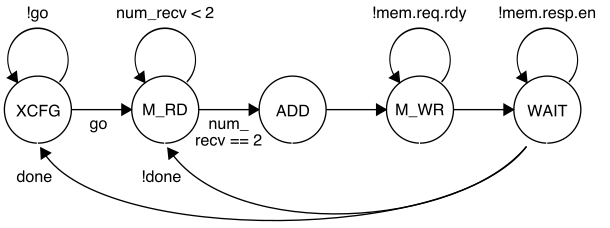

ECE 6745 Tutorial 9: TinyRV2 Accelerator RTL Design
==========================================================================

The infrastructure for the ECE 6745 lab assignments and projects has
support for implementing medium-grain accelerators. Fine-grain
accelerators are tightly integrated within the processor pipeline (e.g.,
a specialized functional unit for bit-reversed addressing useful in
implementing an FFT), while coarse-grain accelerators are loosely
integrated with a processor through the memory hierarchy (e.g., a
graphics rendering accelerator sharing the last-level cache with a
general-purpose processor). Medium-grain accelerators are often
integrated as co-processors: the processor can directly send/receive
messages to/from the accelerator with special instructions, but the
co-processor is relatively decoupled from the main processor pipeline and
can also independently interact with memory.

This tutorial will use the vector-vector-add (vvadd) microbenchmark as an
example. We will explore the area and timing of a baseline TinyRV2
pipelined processor and the energy and performance when this processor is
used to execute a pure-software version of the vvadd microbenchmark. We
will then implement a vvadd accelerator, integrate it with the TinyRV2
pipelined processor, and determine the potential benefit of hardware
acceleration for this simple microbenchmark. This tutorial assumes you
have already completed the tutorials on Linux, Git, Verilog, ASIC
front-end flow, ASIC back-end flow, and ASIC automated ASIC flow.

The first step is to access `ecelinux`. Use VS Code to log into the same
specific `ecelinux` server. Once you are at the `ecelinux` prompt, source
the setup script, source the GUI setup script, clone this repository from
GitHub, and define an environment variable to keep track of the top
directory for the project.

```bash
% source setup-ece6745.sh
% mkdir -p $HOME/ece6745
% cd $HOME/ece6745
% git clone git@github.com:cornell-ece6745/ece6745-tut09-xcel-rtl tut09
% cd tut09
% export TOPDIR=$PWD
```

1. Baseline TinyRV2 Processor FL and RTL Models
--------------------------------------------------------------------------

The following figure illustrates the overall system we will be using with
our TinyRV2 processors. The processor includes eight latency insensitive
val/rdy interfaces. The mngr2proc/proc2mngr interfaces are used for the
test harness to send data to the processor and for the processor to send
data back to the test harness. The imem master/minion interface is used
for instruction fetch, and the dmem master/minion interface is used for
implementing load/store instructions. The system includes both
instruction and data caches. The xcel master/minion interface is used for
the processor to send messages to the accelerator. The
mngr2proc/proc2mngr and memreq/memresp interfaces were all introduced in
ECE 4750. For now we will largely ignore the accelerator, and we will
defer discussion of the xcel master/minion interfaces to later in this
tutorial. **The cache is not ported to work with the ASIC flow so it is
not currently included!**


We provide two implementations of the TinyRV2 processor. The FL model in
`sim/proc/ProcFL.py` is essentially an instruction-set-architecture (ISA)
simulator; it simulates only the instruction semantics and makes no
attempt to model any timing behavior. As a reminder, the TinyRV2
instruction set is defined here:

 - <http://www.csl.cornell.edu/courses/ece6745/handouts/ece6745-tinyrv-isa.txt>

The RTL model in `sim/proc/ProcPRTL.py` is similar to the alternative
design for lab 2 in ECE 4750. It is a five-stage pipelined processor that
implements the TinyRV2 instruction set and includes full
bypassing/forwarding to resolve data hazards. There are two important
differences from the alternative design for lab 2 of ECE 4750. First, the
new processor design uses a single-cycle integer multiplier. We can push
the design through the flow and verify that the single-cycle integer
multiplier does not adversely impact the overall processor cycle time.
Second, the new processor design includes the ability to handle new CSRs
for interacting with medium-grain accelerators. The datapath diagram for
the processor is shown below.


We should run all of the unit tests on both the FL and RTL processor
models to verify that we are starting with a working processor.

```bash
% mkdir -p $TOPDIR/sim/build
% cd $TOPDIR/sim/build
% pytest ../proc
```

See the handout for lab 2 from ECE 4750 for more information about how we
use `pytest` and the mngr2proc/proc2mngr interfaces to test the TinyRV2
processor.

2. Testing and Evaluating TinyRV2 Microbenchmarks
--------------------------------------------------------------------------

We will write our microbenchmarks in C. Take a closer look at the vvadd
microbenchmark which is located in `app/ubmark/ubmark-vvadd.c`:

```c
__attribute__ ((noinline))
void vvadd_scalar( int *dest, int *src0, int *src1, int size )
{
  for ( int i = 0; i < size; i++ )
    dest[i] = src0[i] + src1[i];
}
```

We will a use microbenchmark test to verify the functionality of our
microbenchmark and a microbenchmark eval to evaluate the performance of
our microbenchmark. We will run both the microbenchmark test and eval on
both FL and RTL TinyRV2 processor models.

### 2.1. TinyRV2 VVADD Test

Let's go ahead and take a look at the microbenchmark test provided for
the vvadd microbenchmark.

```bash
% cd $TOPDIR/app/ubmark
% less ubmark-vvadd-test.c
```

Here is a snippet from the microbenchmark test.

```c
#include "ece6745.h"
#include "ubmark-vvadd.h"
#include "ubmark-vvadd.dat"

void test_case_1_pos()
{
  ECE6745_CHECK( L"test_case_1_pos" );

  int src0[] = {  1,  2,  3,  4 };
  int src1[] = {  5,  6,  7,  8 };
  int dest[] = {  0,  0,  0,  0 };
  int ref[]  = {  6,  8, 10, 12 };

  ubmark_vvadd( dest, src0, src1, 4 );

  for ( int i = 0; i < 4; i++ )
    ECE6745_CHECK_INT_EQ( dest[i], ref[i] );
}

...

int main( int argc, char** argv )
{
  __n = ( argc == 1 ) ? 0 : ece6745_atoi( argv[1] );

  if ( (__n <= 0) || (__n == 1) ) test_case_1_pos();
  ...

  ece6745_wprintf( L"\n\n" );
  return ece6745_check_status;
}
```

The test harness includes several test case functions and then we call
these test case functions in `main`. We wave a build system that can
compile C code natively for x86 and can also cross-compile these
microbenchmarks for TinyRV2 so they can be executed on our simulators.
When developing and testing C code, we should always try to compile the
code natively to ensure the code is functionally correct before we
attempt to cross-compile the code for TinyRV2. Debugging code natively is
much easier compared to debugging code on our simulators. Here is how we
compile and execute the tests for the vvadd microbenchmark natively:

```bash
% cd $TOPDIR/app
% mkdir build-native
% cd build-native
% ../configure
% make ubmark-vvadd-test
% ./ubmark-vvadd-test
```

You can run a single test case like this:

```bash
% cd $TOPDIR/app/build-native
% ./ubmark-vvadd-test 1
```

Once we are confident the microbenchmark test passes on natively, we can
cross-compile the microbenchmark test and run it on both FL and RTL
TinyRV2 processor models. Let's start by cross-compiling the
microbenchmark test.

```bash
% mkdir -p $TOPDIR/app/build
% cd $TOPDIR/app/build
% ../configure --host=riscv32-unknown-elf
% make ubmark-vvadd-test
```

This will create a `ubmark-vvadd-test` binary which contains TinyRV2
instructions and data. You can disassemble a TinyRV2 binary (i.e., turn a
compiled binary back into an assembly text representation) with the
`riscv32-objdump` command like this:

```bash
% cd $TOPDIR/app/build
% riscv32-objdump ubmark-vvadd-test | less -p "<ubmark_vvadd>:"
00000fac <ubmark_vvadd>:
    fac: bge    x0,  x13, fd8
    fb0: slli   x13, x13, 0x2
    fb4: add    x13, x11, x13
    fb8: lw     x15, 0(x11)   # <-.
    fbc: lw     x14, 0(x12)   #   |
    fc0: addi   x11, x11, 4   #   |
    fc4: addi   x12, x12, 4   #   |
    fc8: add    x15, x15, x14 #   |
    fcc: sw     x15, 0(x10)   #   |
    fd0: addi   x10, x10, 4   #   |
    fd4: bne    x11, x13, fb8 # --'
    fd8: jalr   x0,  x1,  0
```

You can also redirect the output from `riscv32-objdump` to a text file
for viewing with VS Code. The disassembly shows the address and assembly
text for each instruction in the binary.

The assembly code for the `ubmark_vvadd` function is similar to what we
saw in ECE 4750 although with some additional optimizations. I have added
some comments to show the backwards branch for the vvadd loop. The loop
has eight instructions. Four instructions do useful work (i.e., two LW
instructions, the actual ADDU instruction, one SW instruction) and three
ADDI instructions generate the array addresses by bumping the array
pointers. Notice that there is no explicit loop counter. The compiler has
instead calculated the address of one past the last element in the first
source array, and placed this value in `x13`. Each iteration, the BNE
instruction compares the current pointer to see if we have reached the
end of the array.

We have provided you with a simulator that composes a processor, cache,
memory, and accelerator and is capable of executing TinyRV2 binaries. The
simulator enables flexibly choosing the processor implementation (FL vs.
RTL), the cache implementation (no cache vs. RTL), and the type and
implementation of the accelerator. By default, the simulator uses the
processor FL model, no cache model, and a null accelerator which we will
discuss later. So let's execute the vvadd TinyRV2 binary on the
instruction-set simulator:

```bash
% cd $TOPDIR/app/build
% ../../sim/pmx/pmx-sim ./ubmark-vvadd-test
```

The simulator should display the same test output that we saw when
executing the microbenchmark test natively. You can run a single test
case like this:

```bash
% cd $TOPDIR/app/build
% ../../sim/pmx/pmx-sim ./ubmark-vvadd-test 1
```

The `--trace` command line option will display each instruction as it is
executed on the ISA simulator.

```bash
% cd $TOPDIR/app/build
% ../../sim/pmx/pmx-sim --trace \
    ./ubmark-vvadd-test 1 > ubmark-vvadd-test-fl.trace
```

When dumping out large line traces, it is usually much faster to save
them to a file and then open the file in VS Code. Here is what the
beginning of the line trace looks like.

```
cycle PC       instruction                                          FL memory
----------------------------------------------------------------------------------
  1r  #                                |              ()                 |     |
  2r  #                                |              ()                 |     |
  3:  #                                |              ()            rd>  |     |
  4:  #                                |              ()              >rd|     |
  5:  00000200 auipc  x03, 0x00003     |              ()                 |     |
  6:  #                                |              ()            rd>  |     |
  7:  #                                |              ()              >rd|     |
  8:  00000204 addi   x03, x03, 0x9f0  |              ()                 |     |
  9:  #                                |              ()            rd>  |     |
 10:  #                                |              ()              >rd|     |
 11:  00000208 addi   x01, x00, 0x000  |              ()                 |     |
 12:  #                                |              ()            rd>  |     |
 13:  #                                |              ()              >rd|     |
 14:  0000020c addi   x02, x00, 0x000  |              ()                 |     |
 15:  #                                |              ()            rd>  |     |
 16:  #                                |              ()              >rd|     |
 17:  00000210 addi   x04, x00, 0x000  |              ()                 |     |
 18:  #                                |              ()            rd>  |     |
 19:  #                                |              ()              >rd|     |
```

You can see the beginning of the program is initializing the registers to
zero. Since this is an ISA simulator, instructions can functionally
execute in a single cycle, although technically they take multiple
"cycles" to interact with the memory system. These cycles are not really
modeling any kind of realistic timing, but can instead be thought of as
the "steps" required for functional simulation.

Now that we have verified the microbenchmark test works correctly on the
ISA simulator, we can run the microbenchmark test on the baseline TinyRV2
pipelined processor RTL model:

```bash
% cd $TOPDIR/app/build
% ../../sim/pmx/pmx-sim --proc-impl rtl ./ubmark-vvadd-test
```

Again the simulator should display the same test output that we saw when
executing the microbenchmark test natively and on the FL simulator. You
can run a single test case like this:

```bash
% cd $TOPDIR/app/build
% ../../sim/pmx/pmx-sim --proc-impl rtl ./ubmark-vvadd-test 1
```

Let's use the `--trace` command line option to dump out the trace.

```bash
% cd $TOPDIR/app/build
% ../../sim/pmx/pmx-sim --proc-impl rtl --trace \
    ./ubmark-vvadd-test 1 > ubmark-vvadd-test-rtl.trace
```

Here is what the first few cycles of the simulation look like.

```
cycle F        D                       X    M    W     imem  dmem
-------------------------------------------------------------------
  1r          |                       |    |    |    |      |     |
  2r          |                       |    |    |    |      |     |
  3:          |                       |    |    |    | rd>  |     |
  4:  00000200|                       |    |    |    | rd>rd|     |
  5:  00000204|auipc  x03, 0x00003    |    |    |    | rd>rd|     |
  6:  00000208|addi   x03, x03, 0x9f0 |auiP|    |    | rd>rd|     |
  7:  0000020c|addi   x01, x00, 0x000 |addi|auiP|    | rd>rd|     |
  8:  00000210|addi   x02, x00, 0x000 |addi|addi|auiP| rd>rd|     |
  9:  00000214|addi   x04, x00, 0x000 |addi|addi|addi| rd>rd|     |
 10:  00000218|addi   x05, x00, 0x000 |addi|addi|addi| rd>rd|     |
 11:  0000021c|addi   x06, x00, 0x000 |addi|addi|addi| rd>rd|     |
```

We can see the five stages of the processor pipeline. The PC is displayed
in the F stage, the full instruction is displayed in the D stage, and a
shorter version of the instruction is displayed in the X, M, and W
stages. We are using a single-cycle magic memory, so we can see
instruction memory requests being sent and the responses being returned
the next cycle. Again you can see the beginning of the program is
initializing the registers to zero.

### 2.2. TinyRV2 VVADD Eval

Once we are sure the microbenchmark test is working natively, on the FL
simulator, and the RTL simulator, we can then turn our focus to the
microbenchmark eval.

```bash
% cd $TOPDIR/app/ubmark
% less ubmark-vvadd-eval.c
```

Here is the microbenchmark eval.

```c
#include "ece6745.h"
#include "ubmark-vvadd.h"
#include "ubmark-vvadd.dat"

int main( void )
{
  // Allocate destination array for results

  int* dest = ece6745_malloc( eval_size * (int)sizeof(int) );

  // Run the evaluation

  ece6745_stats_on();
  ubmark_vvadd( dest, eval_src0, eval_src1, eval_size );
  ece6745_stats_off();

  // Verify the results

  for ( int i = 0; i < eval_size; i++ ) {
    if ( dest[i] != eval_ref[i] ) {
      ece6745_wprintf( L"\n FAILED: dest[%d] != eval_ref[%d] (%d != %d)\n\n",
                       i, i, dest[i], eval_ref[i] );
      ece6745_exit(1);
    }
  }

  // Free destination array

  ece6745_free(dest);

  // Check for no memory leaks

  if ( ece6745_get_heap_usage() != 0 ) {
    ece6745_wprintf( L"\n FAILED: memory leak of %d bytes!\n\n",
                     ece6745_get_heap_usage() );
    ece6745_exit(1);
  }

  // Otherwise we passed

  ece6745_wprintf( L"\n **PASSED** \n\n" );

  return 0;
}
```

The `eval_src0`, `eval_src1`, and `eval_ref` arrays are all defined in
the `app/ubmark/ubmark-vvadd.dat` file. The microbenchmark first
allocates the destination array on the heap, turns stats on, does the
actual vvadd computation, turns stats off, verifies that the results are
as expected, and makes sure there are no memory leaks. We need the
`ece6745_stats_on()` and `ece6745_stats_off()` functions to make sure we
can keep track of various statistics (e.g., the number of cycles) only
during the important part of the microbenchmark. We do not want to count
time spent in initialization or verification when comparing the
performance of our various microbenchmarks. The `ece6745_stats_on`
function is defined in `app/ece6745/ece6745-misc.h` as follows:

```c
#ifdef _RISCV

inline
void ece6745_stats_on()
{
  int status = 1;
  __asm__ ( "csrw 0x7c1, %0" :: "r"(status) );
}

#else

inline
void ece6745_stats_on()
{ }

#endif
```

Notice that if `_RISCV` is not defined (i.e., we are compiling the
microbenchmark eval natively on x86) this function is empty. If `_RISCV`
is defined (i.e., we are cross-compilng the microbenchmark eval for
TinyRV2) then this function uses GCC inline assembly to insert a CSRW
instruction into the program. You can find out more about inline assembly
syntax here:

 - <https://gcc.gnu.org/onlinedocs/gcc/Extended-Asm.html>

At a high level, `%0` acts as a place holder for whatever register
specifier the compiler ends up allocating for the `status` variable. The
TinyRV2 instruction set defines CSR number 0x7c1 as the `stats_en`
control/status register, which is why we use `0x7c1` in the inline
assembly. Refer to the TinyRV2 instruction set for a list of the CSRs.

 - <http://www.csl.cornell.edu/courses/ece6745/handouts/ece6745-tinyrv-isa.txt>

The idea is that the microarchitecture and/or simulator can monitor for
writes to the `stats_en` register to determine when to start and stop
keeping statistics. For more on writing microbenchmarks, please review
the handout for lab 5 from ECE 4750.

Here is how we compile and execute the evaluation for the vvadd
microbenchmark natively:

```bash
% cd $TOPDIR/app/build-native
% make ubmark-vvadd-eval
% ./ubmark-vvadd-eval
```

The microbenchmark eval should display `passed`. Once you are sure your
microbenchmark eval is working correctly natively, you can cross-compile
the microbenchmark eval for TinyRV2 and look at the main function.

```bash
% cd $TOPDIR/app/build
% make ubmark-vvadd-eval
% riscv32-objdump ./ubmark-vvadd-eval | less -p "<main>:"
```

If you look in the disassembly for the main function you should be able
to see the two CSRW instructions used to turn stats on and off.

```
 6f8:   addi    x15,x0,1              # \
 6fc:   csrw    0x7c1,x15             # / turn stats on
 700:   lui     x12,0x1               # \
 704:   lw      x13,-2048(x3)         # | setup arguments
 708:   addi    x9,x12,-1072          # |
 70c:   addi    x11,x9,400            # |
 710:   addi    x12,x12,-1072         # /
 714:   jal     x1,2fc <ubmark_vvadd> # call the ubmark_vvadd function
 718:   addi    x15,x0,0              # \
 71c:   csrw    0x7c1,x15             # / turn stats off
```

Now let's run the microbenchmark eval on the FL simulator.

```bash
% cd $TOPDIR/app/build
% ../../sim/pmx/pmx-sim ./ubmark-vvadd-eval
```

The microbenchmark eval should display `passed`. Once you are sure your
microbenchmark eval is working correctly natively and on the FL simulator
you are finally ready to run it on the actual RTL simulator to do a real
performance evaluation.

```bash
% cd $TOPDIR/app/build
% ../../sim/pmx/pmx-sim --proc-impl rtl --stats ./ubmark-vvadd-eval
 **PASSED**

 num_cycles        = 1013
 num_inst          = 812
 CPI               = 1.25
```

Now let's look in more detail at the trace.

```
% cd $TOPDIR/app/build
% ../../sim/pmx/pmx-sim --trace ./ubmark-vvadd-eval > ubmark-vvadd-eval-rtl.trace
```

Open up the trace in VS code and search for 0fbc which is the address of
the first instruction in the loop.

```
cycle F        D                       X    M    W     imem  dmem
-------------------------------------------------------------------
841:  00000fbc|lw     x15, 0x000(x11) |add |slli|bge | rd>rd|     |
842:  00000fc0|lw     x14, 0x000(x12) |lw  |add |slli| rd>rd|rd>  |
843:  00000fc4|addi   x11, x11, 0x004 |lw  |lw  |add | rd>rd|rd>rd|
844:  00000fc8|addi   x12, x12, 0x004 |addi|lw  |lw  | rd>rd|  >rd|
845:  00000fcc|add    x15, x15, x14   |addi|addi|lw  | rd>rd|     |
846:  00000fd0|sw     x15, 0x000(x10) |add |addi|addi| rd>rd|     |
847:  00000fd4|addi   x10, x10, 0x004 |sw  |add |addi| rd>rd|wr>  |
848:  00000fd8|bne    x11, x13, 0x1fe4|addi|sw  |add | rd>rd|  >wr|
849:  /       |/                      |bne |addi|sw  | rd>rd|     |
850:  00000fb8|                       |    |bne |addi| rd>rd|     |
851:  00000fbc|lw     x15, 0x000(x11) |    |    |bne | rd>rd|     |
852:  00000fc0|lw     x14, 0x000(x12) |lw  |    |    | rd>rd|rd>  |
853:  00000fc4|addi   x11, x11, 0x004 |lw  |lw  |    | rd>rd|rd>rd|
854:  00000fc8|addi   x12, x12, 0x004 |addi|lw  |lw  | rd>rd|  >rd|
```

We can see the eight instructions in the loop going through the five
stages of the pipeline. We can see the memory requests for the two loads
and store going to the data memory and the responses coming back on the
next cycle. We can also see the branch misprediction squashing two
instructions. The `eval_size` is 100 so there are 100 iterations of the
loop and 800 instructions, which should take a total of 1000 cycles
resulting in a CPI of 1.25.

When we used `--stats` the instruction count and number of cycles was
slightly higher due to the extra instructions required to setup the
arguments before calling `ubmark_vvadd` and the extra instructions within
`ubmark_vvadd` before we start the loop.

3. Testing and Evaluating Accelerators in Isolation
--------------------------------------------------------------------------

We will take an incremental approach when designing, implementing,
testing, and evaluating accelerators. We can use test sources, sinks, and
memories to create a test harness that will enable us to explore the
accelerator cycle-level performance and the ASIC area, energy, and timing
in isolation. Only after we are sure that we have a reasonable
design-point should we consider integrating the accelerator with the
processor.

All accelerators have an xcel minion interface along with a standard mem
master interface. The messages sent over the xcel minion interface allows
the test harness or processor to read and write _accelerator registers_.
These accelerator registers can be real registers that hold configuration
information and/or results, or these accelerator registers can just be
used to trigger certain actions. The messages sent over the xcel.req
interface from the test harness or processor to the accelerator have the
following format:

```
   1b     5b      32b
 +------+-------+-----------+
 | type | raddr | data      |
 +------+-------+-----------+
```

The 1-bit `type` field indicates if this messages if for reading (0) or
writing (1) an accelerator register, the 5-bit `raddr` field specifies
which accelerator register to read or write, and the 32-bit `data` field
is the data to be written. For every accelerator request, the accelerator
must send back a corresponding accelerator response over the xcel.resp
interface. These response messages have the following format:

```
   1b     32b
 +------+-----------+
 | type | data      |
 +------+-----------+
```

The 1-bit `type` field gain indicates if this response is from if for
reading (0) or writing (1) an accelerator register, and the 32-bit `data`
field is the data read from the corresponding accelerator register. Every
accelerator is free to design its own _accelerator protocol_ by defining
the meaning of reading/writing the 32 accelerator registers.

We have implemented a null accelerator which we can use when we don't
want to integrate a "real" accelerator, but this null accelerator is also
useful in illustrating the basic accelerator interface. The null
accelerator has a single accelerator register (xr0) which can be read and
written. Take a closer look at this null accelerator in
`sim/proc/NullXcel.v`.

```verilog
  always_comb begin

    // Mux to force xcelresp data to zero on a write
    // Enable xr0 only upon write requests and both val/rdy on resp side

    if ( xcelreq_deq_msg.type_ == `VC_XCEL_REQ_MSG_TYPE_WRITE ) begin
      xr0_en = xcel_respstream_val && xcel_respstream_rdy;
      xcel_respstream_msg.data = '0;
    end
    else begin
      xr0_en = 0;
      xcel_respstream_msg.data = xr0;
    end

  end
```

The null accelerator simply waits for a xcel.req message to arrive. If
that message is a read, then it reads the `xr0` register into the
xcelresp message. If that message is a write, then it sets the enable of
the `xr0` register so that the new value is flopped in at the end of the
cycle. Here is a unit test which writes a value to the null accelerator's
xr0 register and then reads it back:

```bash
% cd $TOPDIR/sim/build
% pytest ../proc/test/NullXcel_test.py -k basic -s

  1r                >               |.           > .
  2r                >               |.           > .
  3:                >               |.           > .
  4:                >               |.           > .
  5:                >               |.           > .
  6:                >               |.           > .
  7: wr:00:0000000a > wr:00:0000000a|            >
  8: rd:00:         > rd:00:        |wr:         > wr:
  9:                >               |rd:0000000a > rd:0000000a
 10:                >               |            >
```

From the line trace, you can see the write request message (with write
data 0x0a) going into the accelerator, and then the write response being
returned on the next cycle. You can also see the read request message
going into the accelerator, and then the read response being returned
(with read data 0x0a) again on the next cycle.

The vvadd accelerator is obviously more sophisticated. Accelerator
protocols are usually defined as a comment at the top of the FL model, so
take a closer look at the vvadd accelerator FL model in
`sim/tut9_xcel/VvaddXcelFL.py`. The vvadd accelerator protocol defines
the accelerator registers as follows:

 - xr0 : go/done
 - xr1 : base address of the array src0
 - xr2 : base address of the array src1
 - xr3 : base address of the array dest
 - xr4 : size of the array

The actual protocol involves the following steps:

 1. Write the base address of src0 to xr1
 2. Write the base address of src1 to xr2
 3. Write the base address of dest to xr3
 4. Write the number of elements in the array to xr4
 5. Tell accelerator to go by writing xr0
 6. Wait for accelerator to finish by reading xr0, result will be 1

A close look at the vvadd accelerator FL model shows that most of the
work is really in managing this accelerator protocol. The accelerator
waits for accelerator requests, updates its internal state registers, and
when it receives a write to xr0 it starts doing the actual vvadd
computation. The FL model makes use of method-based interfaces to
simplify interacting with the memory system. Let's run the unit tests on
the FL model first:

```bash
% cd $TOPDIR/sim/build
% pytest ../tut9_xcel/test/VvaddXcelFL_test.py -v
```

The vvadd accelerator CL model is actually very close to the RTL
implementation largely due to the need to carefully interact with the
latency insensitive memory interface. CL modeling may or may not be
useful in this context. The vvadd accelerator RTL model is in
`sim/tut9_xcel/VvaddXcelPRTL.py` and (roughly) implements the following
FSM:



While the accelerator is in the XCFG state, it will update its internal
registers when it receives accelerator requests. When the accelerator
receives a write to xr0 it moves into the M_RD state. While in the M_RD
state, the accelerator will send out two memory read requests to read the
current element from each source array. In the ADD state, the accelerator
will do the actual addition, and in the M_WR state, the accelerator will
send out the memory write request to write the result to the destination
array. The accelerator will wait in the final WAIT state until it
receives the memory write response, and then will either move back into
the M_RD state if there is another element to be processed, or move into
the XCFG state if we have processed all elements in the array.

The accelerator is not implemented with a control/datapath split because
the accelerator is almost entirely control logic; it was just simpler to
implement the accelerator as a single model. When a model is almost all
control logic or almost all datapath logic, then a control/datapath split
may be more trouble than its worth.

Let's run the unit tests for all of the vvadd accelerator models:

```bash
% cd $TOPDIR/sim/build
% pytest ../tut9_xcel
% pytest ../tut9_xcel --test-verilog
```

We have also included a simulator for just the vvadd accelerator in
isolation which can be used to evaluate its performance.

```bash
% cd $TOPDIR/sim/build
% ../tut9_xcel/vvadd-xcel-sim --impl rtl --input multiple --stats
  num_cycles = 1058
```

We could use the simulator to help evaluate the cycle-level performance
of the accelerator on various different datasets as we try out various
optimizations.

4. Testing and Evaluating TinyRV2 Microbenchmarks with Accelerators
--------------------------------------------------------------------------

Now that we have unit tested and evaluated both the baseline TinyRV2
pipelined processor and the vvadd accelerator in isolation, we are
finally ready to compose them. We will start by looking at a basic null
accelerator to understand how we will integrate processors and
accelerators before looking at the vvadd accelerator in the next section.

### 4.1. Integrating the TinyRV2 Processor and a Null Accelerator

The key way the processor interacts with an accelerator is by sending
messages that read and write 32 special accelerator registers using the
standard CSRW and CSRR instructions. These 32 special CSRs are as
follows:

```
  0x7e0 : accelerator register  0 (xr0)
  0x7e1 : accelerator register  1 (xr1)
  0x7e2 : accelerator register  2 (xr2)
  ...
  0x7ff : accelerator register 31 (xr31)
```

When the processor uses a CSRW instruction to write an accelerator
register, it first reads the general-purpose register file to get the
source value, creates a new accelerator request message, then sends this
message to the accelerator through the xcel.req interface in the X stage.
The processor waits for the response message to be returned through the
xcel.resp interface in the M stage. The processor uses a CSRR instruction
to read an accelerator register in a similar way, except that when the
response message is returned in the M stage, the data from the
accelerator is sent down the pipeline and written into the
general-purpose register file in the W stage.

Here is a simple assembly sequence which will write the value `1` to the
null accelerator's only accelerator register, read that value back from
the accelerator register, and write the value to general-purpose register
`x2`.

```
  addi x1, x0, 1
  csrw 0x7e0, x1
  csrr x2, 0x7e0
```

You can run a simple test of using the CSRW/CSRR instructions to
write/read an accelerator register like this:

```bash
% cd $TOPDIR/sim/build
% pytest ../proc/test/ProcFL_xcel_test.py
% pytest ../proc/test/Proc_xcel_test.py
% pytest ../proc/test/Proc_xcel_test.py -k [bypass -s

     src        F-stage   D-stage                 X    M    W    xcelreq         xcelresp    sink
 ------------------------------------------------------------------------------------------------------
  1r .        >          |                       |    |    |    |              ().           >
  2r .        >          |                       |    |    |    |              ().           >
  3: .        >          |                       |    |    |    |              ().           >
  4: #        >  00000200|                       |    |    |    |              ().           >
  5: deadbeef >  00000204|csrr   x02, mngr2proc  |    |    |    |              ().           >
  6: #        >  00000208|nop                    |csrr|    |    |              ().           >
  7: #        >  0000020c|nop                    |nop |csrr|    |              ().           >
  8: #        >  00000210|nop                    |nop |nop |csrr|              ().           >
  9: #        >  00000214|csrw   0x7e0, x02      |nop |nop |nop |              ().           >
 10: #        >  00000218|csrr   x03,     0x7e0  |csrw|nop |nop |wr:00:deadbeef().           >
 11: #        >  0000021c|nop                    |csrr|csrw|nop |rd:00:        ()wr:         >
 12: #        >  00000220|nop                    |nop |csrr|csrw|              ()rd:deadbeef >
 13: #        >  00000224|nop                    |nop |nop |csrr|              ().           >
 14: #        >  00000228|csrw   proc2mngr, x03  |nop |nop |nop |              ().           >
 15: deadbe00 >  0000022c|csrr   x02, mngr2proc  |csrw|nop |nop |              ().           >
 16: #        >  00000230|nop                    |csrr|csrw|nop |              ().           >
 17: #        >  00000234|nop                    |nop |csrr|csrw|              ().           > deadbeef
 18: #        >  00000238|csrw   0x7e0, x02      |nop |nop |csrr|              ().           >
 19: #        >  0000023c|csrr   x03,     0x7e0  |csrw|nop |nop |wr:00:deadbe00().           >
 20: #        >  00000240|nop                    |csrr|csrw|nop |rd:00:        ()wr:         >
 21: #        >  00000244|nop                    |nop |csrr|csrw|              ()rd:deadbe00 >
 22: #        >  00000248|csrw   proc2mngr, x03  |nop |nop |csrr|              ().           >
 23: 00adbe00 >  0000024c|csrr   x02, mngr2proc  |csrw|nop |nop |              ().           >
 24: #        >  00000250|nop                    |csrr|csrw|nop |              ().           >
 25: #        >  00000254|csrw   0x7e0, x02      |nop |csrr|csrw|              ().           > deadbe00
 26: #        >  00000258|csrr   x03,     0x7e0  |csrw|nop |csrr|wr:00:00adbe00().           >
 27: #        >  0000025c|nop                    |csrr|csrw|nop |rd:00:        ()wr:         >
 28: #        >  00000260|csrw   proc2mngr, x03  |nop |csrr|csrw|              ()rd:00adbe00 >
 29: dea00eef >  00000264|csrr   x02, mngr2proc  |csrw|nop |csrr|              ().           >
 30: .        >  00000268|csrw   0x7e0, x02      |csrr|csrw|nop |              ().           >
 31: .        >  0000026c|csrr   x03,     0x7e0  |csrw|csrr|csrw|wr:00:dea00eef().           > 00adbe00
 32: .        >  #       |#                      |csrr|csrw|csrr|rd:00:        ()wr:         >
 33: .        >  00000270|csrw   proc2mngr, x03  |    |csrr|csrw|              ()rd:dea00eef >
 34: .        >  #       |#                      |csrw|    |csrr|              ().           >
 35: .        >  #       |#                      |    |csrw|    |              ().           >
 36: .        >  #       |#                      |    |    |csrw|              ().           > dea00eef
 37: .        >  #       |#                      |    |    |    |              ().           >
```

I have cleaned up the line trace a bit to annotate the columns and make
it more compact. You can see the processor executing CSRW/CSRR
instructions to 0x7e0 which is accelerator register 0. This results in
the processor sending accelerator requests to the null accelerator, and
then the accelerator sending the corresponding accelerator responses back
to the processor.

Also notice the need for the processor to add new RAW dependency stall
logic. CSRR instructions which read from accelerator registers send out
the xcel.req in the X stage and receive the xcelresp in the M stage. This
means we cannot bypass data from a CSRR instruction if it is in the X
stage since the data has not returned from the accelerator yet. In cycle
32, the CSRW instruction in the decode stage needs to stall to wait for
the CSRR instruction in the X stage to move into the M stage.


To use an accelerator from a C microbenchmark, we can use the same GCC
inline assembly extensions we used to write the `stats_en` CSR earlier in
the tutorial. Take a closer look at the
`app/ubmark/ubmark-null-xcel-test.c` example:

```c
 __attribute__ ((noinline))
 int ubmark_null_xcel( int in )
 {
   int result;
   __asm__ (
     "csrw 0x7E0,     %[in];\n"
     "csrr %[result], 0x7E0;\n"

     // Outputs from the inline assembly block

     : [result] "=r"(result)

     // Inputs to the inline assembly block

     : [in] "r"(in)

   );
   return result;
 }
```

We are inserting a CSRW instruction to copy the value passed to this
function through the `in` argument, and then we are using an CSRR
instruction to retrieve the same value from the null accelerator. Notice
that unlike the inline assembly we used when setting the `stats_en` CSR,
here we also need to handle outputs from the assembly block. Again, you
can find out more about inline assembly syntax here:

 - <https://gcc.gnu.org/onlinedocs/gcc/Extended-Asm.html>

Let's cross-compile this microbenchmark. Note that you cannot natively
compile a microbenchmark that makes use of an accelerator, since x86 does
not have any accelerators!

```bash
% cd $TOPDIR/app/build
% make ubmark-null-xcel-test
% riscv32-objdump ubmark-null-xcel-test | less -p"<ubmark_null_xcel>:"
000002fc <ubmark_null_xcel>:
    2fc:  csrw 0x7e0,x10
    300:  csrr x10,0x7e0
    304:  jalr x0,x1,0
```

Always a good idea to use `riscv32-objdump` so you can verify your C code
is compiling as expected. Here we can see that the `null_xcel` function
compiles into a CSRW, CSRR, and JALR instruction as expected. We should
now run this microbenchmark on our ISA simulator to verify it works, and
then we can run it on our RTL simulator.

```bash
% cd $TOPDIR/sim/build
% ../pmx/pmx-sim ../../app/build/ubmark-null-xcel
% ../pmx/pmx-sim --proc-impl rtl --cache-impl rtl --xcel-impl null-rtl \
     --trace ../../app/build/ubmark-null-xcel
```

### 4.2. TinyRV2 VVADD Xcel Test

Let's turn out attention to our vvadd accelerator. Take a closer look at
the accelerated version of the vvadd microbenchmark in
`app/ubmark/ubmark-vvadd-xcel.c`:

```c
 __attribute__ ((noinline))
 void vvadd_xcel( int *dest, int *src0, int *src1, int size )
 {
   asm volatile (
     "csrw 0x7E1, %[src0];\n"
     "csrw 0x7E2, %[src1];\n"
     "csrw 0x7E3, %[dest];\n"
     "csrw 0x7E4, %[size];\n"
     "csrw 0x7E0, x0     ;\n"
     "csrr x0,    0x7E0  ;\n"

     // Outputs from the inline assembly block

     :

     // Inputs to the inline assembly block

     : [src0] "r"(src0),
       [src1] "r"(src1),
       [dest] "r"(dest),
       [size] "r"(size)

     // Tell the compiler this accelerator read/writes memory

     : "memory"
   );
 }
```

Notice that our use of the CSRW/CSRR instructions corresponds exactly to
the accelerator protocol described above. We first write the source base
pointers, the destination base pointer, and the size before starting the
accelerator by writing to `xr0` and then waiting for the accelerator to
finish by reading `xr0`. We need a final `"memory"` argument in our
inline assembly block to tell the compiler that this accelerator reads
and writes memory. Let's cross-compile the test for the vvadd
microbenchmark:

```bash
% cd $TOPDIR/app/build
% make ubmark-vvadd-xcel-test
% riscv32-objdump ubmark-vvadd-xcel-test | less -p"<ubmark_vvadd_xcel>:"
00000fac <ubmark_vvadd_xcel>:
    fac:  csrw 0x7e1, x11
    fb0:  csrw 0x7e2, x12
    fb4:  csrw 0x7e3, x10
    fb8:  csrw 0x7e4, x13
    fbc:  csrw 0x7e0, x0
    fc0:  csrr x0, 0x7e0
    fc4:  jalr x0, x1, 0
```

Everything looks as expected, so we can now test our accelerated vvadd
microbenchmark on the ISA simulator.

```bash
% cd $TOPDIR/app/build
% ../../sim/pmx/pmx-sim --xcel-impl vvadd-fl ./ubmark-vvadd-xcel-test
```

Notice that we needed to specify the accelerator implementation as a
command line option. If we forgot to include this option, then the
simulator would use the null accelerator and clearly the accelerated
vvadd microbenchmark does not work with the null accelerator!

Finally, we can run the test on the RTL implementation of the
processor and accelerator.

```bash
% cd $TOPDIR/app/build
% ../../sim/pmx/pmx-sim --proc-impl rtl --xcel-impl vvadd-rtl \
    ./ubmark-vvadd-xcel-test
```

All of the tests should pass.

### 4.3. TinyRV2 VVADD Xcel Eval

We are now ready to run the microbenchmark eval. We first make sure it
works on the FL simulator.

```bash
% cd $TOPDIR/app/build
% ../../sim/pmx/pmx-sim --xcel-impl vvadd-fl ./ubmark-vvadd-xcel-eval
```

Finally, we can run the accelerated vvadd microbenchmark on the RTL
implementation of the processor augmented with the RTL implementation of
the vvadd accelerator:

```bash
% cd $TOPDIR/app/build
% ../../sim/pmx/pmx-sim --proc-impl rtl --xcel-impl vvadd-rtl \
     --stats ./ubmark-vvadd-xcel-eval
 **PASSED**

 num_cycles        = 818
 num_inst          = 15
 CPI               = 54.53
```

The CPI is so large because there are only a few CSR instructions. All of
the work is done by the vvadd accelerator. Recall that the pure-software
vvadd microbenchmark required 1013 cycles. So our accelerator results in
a cycle-level speedup of 1.23x. We might ask, where did this speedup come
from? Why isn't the speedup larger? Let's look at the line trace.

```bash
% cd $TOPDIR/app/build
% ../../sim/pmx/pmx-sim --proc-impl rtl --xcel-impl vvadd-rtl \
     --trace ./ubmark-vvadd-xcel-eval > ubmark-vvadd-xcel-eval-rtl.trace
```

Here is what the line trace looks like for the initial configuration of
the accelerator and the first two iterations of the vvadd loop:

```
cyc   F-stage  D-stage                 X    M    W    xcelreq        ST xcelresp    imem  dmem  xmem
-----------------------------------------------------------------------------------------------------
186:  000006ec|csrw   stats_en , x15  |addi|addi|    |              (X ).           rd>rd|     |
187:  000006f0|lui    x12, 0x00001    |csrw|addi|addi|              (X ).           rd>rd|     |
188:  000006f4|lw     x13, 0x800(x03) |lui |csrw|addi|              (X ).           rd>rd|     |
189:  000006f8|addi   x09, x12, 0xbc0 |lw  |lui |csrw|              (X ).           rd>rd|rd>  |
190: *000006fc|addi   x11, x09, 0x190 |addi|lw  |lui |              (X ).           rd>rd|  >rd|
191: *00000700|addi   x12, x12, 0xbc0 |addi|addi|lw  |              (X ).           rd>rd|     |
192: */       |jal    x01, 0x1ffbfc   |addi|addi|addi|              (X ).           rd>rd|     |
193: *000002fc|                       |jal |addi|addi|              (X ).           rd>rd|     |
194: *00000300|csrw   0x7e1, x11      |    |jal |addi|              (X ).           rd>rd|     |
195: *00000304|csrw   0x7e2, x12      |csrw|    |jal |wr:01:00000d50(X ).           rd>rd|     |
196: *00000308|csrw   0x7e3, x10      |csrw|csrw|    |wr:02:00000bc0(X )wr:         rd>rd|     |
197: *0000030c|csrw   0x7e4, x13      |csrw|csrw|csrw|wr:03:000010c4(X )wr:         rd>rd|     |
198: *00000310|csrw   0x7e0, x00      |csrw|csrw|csrw|wr:04:00000064(X )wr:         rd>rd|     |
199: *00000314|csrr   x00,     0x7e0  |csrw|csrw|csrw|wr:00:00000000(X )wr:         rd>rd|     |
200: *00000318|jalr   x00, x01, 0x000 |csrr|csrw|csrw|rd:00:        (X )wr:         rd>rd|     |
201: *#       |#                      |#   |#   |csrw|.             (RD).                |     |rd>
202: *#       |#                      |#   |#   |    |.             (RD).                |     |rd>rd
203: *#       |#                      |#   |#   |    |.             (RD).                |     |  >rd
204: *#       |#                      |#   |#   |    |.             (RD).                |     |
205: *#       |#                      |#   |#   |    |.             (+ ).                |     |
206: *#       |#                      |#   |#   |    |.             (WR).                |     |wr>
207: *#       |#                      |#   |#   |    |.             (W ).                |     |  >wr
208: *#       |#                      |#   |#   |    |.             (W ).                |     |
209: *#       |#                      |#   |#   |    |.             (RD).                |     |rd>
210: *#       |#                      |#   |#   |    |.             (RD).                |     |rd>rd
211: *#       |#                      |#   |#   |    |.             (RD).                |     |  >rd
212: *#       |#                      |#   |#   |    |.             (RD).                |     |
213: *#       |#                      |#   |#   |    |.             (+ ).                |     |
214: *#       |#                      |#   |#   |    |.             (WR).                |     |wr>
215: *#       |#                      |#   |#   |    |.             (W ).                |     |  >wr
216: *#       |#                      |#   |#   |    |.             (W ).                |     |
217: *#       |#                      |#   |#   |    |.             (RD).                |     |rd>
218: *#       |#                      |#   |#   |    |.             (RD).                |     |rd>rd
219: *#       |#                      |#   |#   |    |.             (RD).                |     |  >rd
220: *#       |#                      |#   |#   |    |.             (RD).                |     |
```

I have cleaned up the line trace a bit to annotate the columns and make
it more compact. The ST column is the current state of the vvadd
accelerator FSM. You can see the processor executing the CSRW
instructions to configure the accelerator, and these instructions then
turn into messages over the xcel.req interface. The accelerator is in the
XCFG state receiving these messages until it receives the write to `xr0`
which causes the accelerator to move into the RD stage. The accelerator
sends memory read requests into the memory system, then does the vvadd,
then writes the result back to the memory system. We know that every
iteration should look like the first iteration (8 cycles). Since there
are 100 iterations, this means the total number of cycles should be about
800 cycles, but our simulator reported 818 cycles. Again, the discrepancy
is due to the extra cycles required to call and return from the
`ubmark_vvadd_xcel` function. So the accelerator is a little faster than
the processor since it requires fewer cycles per iteration.

There is certainly room for improvement. We can probably remove some of
the bubbles and improve the accelerator performance by a couple more
cycles. The accelerator could also potentially use wide accesses to the
data cache to retrieve four words at a time and then process all four
words in parallel. The accelerator could also potentially achieve better
performance by issuing multiple memory requests to a non-blocking cache.
Eventually we should be able to optimize such an accelerator so that it
is memory bandwidth limited (i.e., we are doing a memory request every
cycle).

