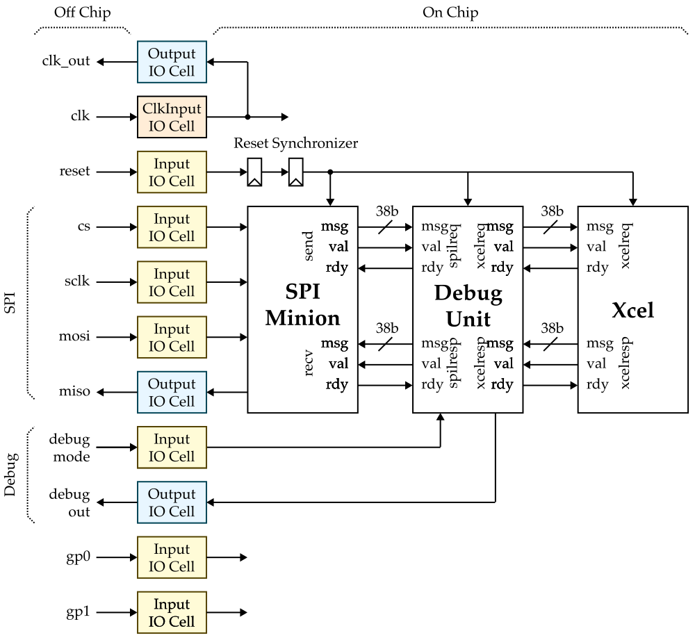
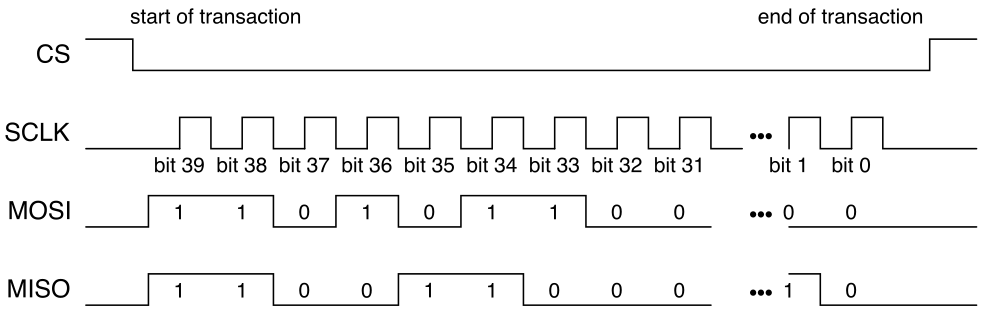
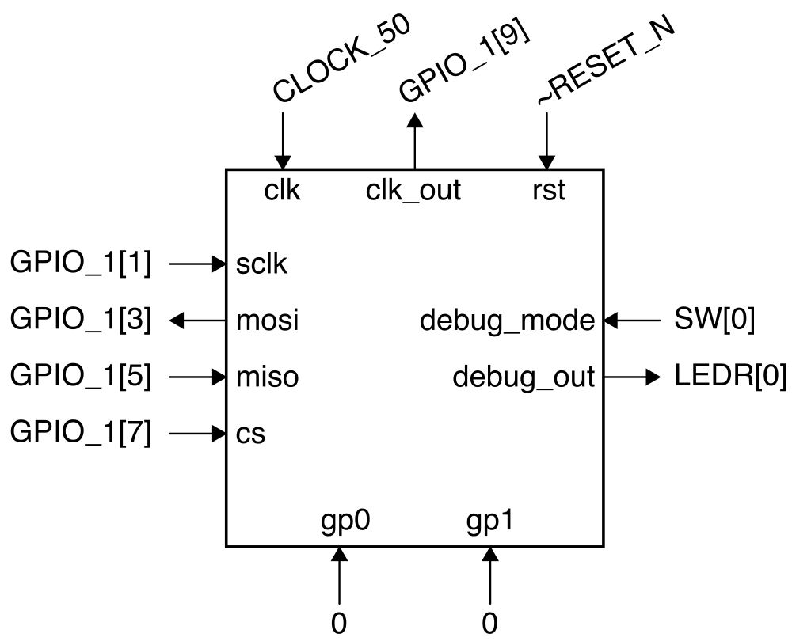
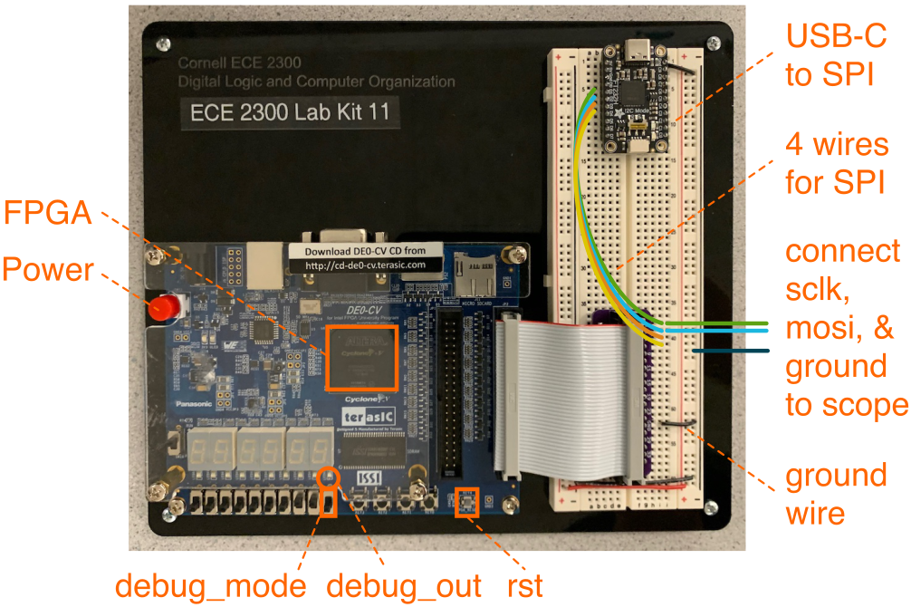

Lab 1: FPGA Emulation
==========================================================================

In this lab, you will be using FPGA emulation to verify your accelerator
tape-out. FPGA emulation is the process of mapping the RTL for a chip to
an FPGA, and then testing the FPGA in the same way as we will eventually
test the actual tape-out. We will start by reviewing what we put on the
tapeout including details about the SPI protocol we will be using to
thest the chip before:

 - revising our pre-silicon verification
 - creating an FPGA emulator for your accelerator tape-out
 - SPI testing using your FPGA emulator
 - Accelerator testing using your FPGA emulator

To get started find a free workstation and log in with your NetID and
NetID password.

1. Background on SPI Protocol
--------------------------------------------------------------------------

Let's start by reminding ourselves the block diagram for the top of our
accelerator tape-out:



Recall that we interact with your accelerator by sending accelerator
request messages and receiving accelerator response messages. An
accelerator request message includes a 1-bit type field (type = 0 for
reads and type = 1 for writes), 5-bit register address field, and 32-bit
write data field for a total of 38 bits:

```
   37   36   32 31  ....  0
+------+-------+-----------+
| type | raddr | wdata     |
+------+-------+-----------+
```

An accelerator response message includes a 1-bit type field and 32-bit
read data field for a total of 33 bits:

```
   32   31  ....  0
+------+-----------+
| type | rdata     |
+------+-----------+
```

### 1.1. SPI Basics

The SPI minion interfaces with a SPI master controlled by the host
workstation. SPI is a very basic four-wire serial protocol with the
following timing diagram:



Each SPI transaction involves exchanging an SPI request and an SPI
response between the SPI master and the SPI minion using the following
steps assuming we want to exchange 40-bits of data.

 - Step 1: SPI master sets CS low (this is how the SPI minion knows the
    start of an SPI transaction)
 - Step 2: SPI master toggles SCLK 40 times, once for each bit of data
 - Step 3: SPI master writes MOSI with each bit of the SPI request on the
    falling edge of SCLK while the SPI minion writes MISO with each bit
    of the SPI response on the falling edge of SCLK
 - Step 4: SPI minion reads MOSI on the rising edge of SCLK while the SPI
    master reads MISO on the rising edge of SCLK
 - Step 5: SPI master sets CS high (this is how the SPI minion knows the
    end of an SPI transaction)

When an SPI transaction is done, the master has sent the minion 40-bits
of data at the same time as the minion has sent the master 40-bits of
data.

### 1.2. SPI for Xcel Tape-Out

For our accelerator tape-out, we will be using SPI to send and receive
accelerator messages. The SPI request format for this course always
includes a 1-bit valid field, a 1-bit constant field which is always one,
and then potentially a 38-bit accelerator request message. The `val` bit
specifies whether this SPI request contains a valid accelerator request
message.

```
   39     38     37   36   32 31  ....  0
+------+------+------+-------+-----------+
| val  | 1    | type | raddr | wdata     |
+------+------+------+-------+-----------+
```

The SPI response format for this course includes a 1-bit valid field, a
1-bit constant field which is always one, a 5-bit field which is always
zero, and then potentially a 33-bit accelerator response message.

```
   39     38   37   33   32   31  ....  0
+------+------+-------+------+-----------+
| val  | 1    | 00000 | type | rdata     |
+------+------+-------+------+-----------+
```

The SPI protocol involves the master sending an accelerator request and
then waiting until the minion sends back the corresponding accelerator
response:

 - The host uses an SPI request with the valid bit set to one to send an
   accelerator request to the accelerator tapeout

 - The host then uses an SPI request with the valid bit set to zero to
   repeatedly poll until eventually the SPI response is valid meaning the
   accelerator is sending back the corresponding accelerator response

So writing xr0 with the value 0xdeadbeef would look like this:

```
 ------- SPI request -------    ------ SPI response -------
 val 1 type raddr wdata         val 1 00000 type rdata
 ----------------------------------------------------------
 1   1 1    0     0xdeadbeef -> 0   1 00000 0    0x00000000 # send xcel req
 0   1 0    0     0x00000000 -> 0   1 00000 0    0x00000000 # ... waiting ...
 0   1 0    0     0x00000000 -> 0   1 00000 0    0x00000000 # ... waiting ...
 0   1 0    0     0x00000000 -> 1   1 00000 1    0x00000000 # recv xcel resp
```

### 1.3. Debug Unit

Every accelerator tape-out also has a debug unit which sits between the
SPI minion and the accelerator. An external input pin on the chipcan turn
on/off debug mode. When in debug mode, the host workstation can only read
and write xr0 which maps to a debug register in the debug unit. Reading
and writing any other accelerator register while in debug mode is
undefined. The least significant bit of the debug register is connected
to the debug out pin on the chip.

2. Pre-Silicon Verification
--------------------------------------------------------------------------

Let's now reproduce our pre-silicon verification. Log into `ecelinux`
using VS Code and clone a fresh copy of your tapeout repository. Then be
sure to checkout the `tapeout-v2-branch` which is the exact version of
the repository you taped out last spring.

```bash
% source setup-ece6745.sh
% cd ${HOME}/ece6745
% mv project2-groupXX project2-groupXX-backup
% git clone git@github.com:cornell-ece6745/project2-groupXX
% cd project2-groupXX
% git checkout tapeout-v2-branch
% mkdir -p sim/build
% cd build
```

Take a look at your chip top and convince yourself it matches the block
diagram shown above.

```bash
% cd ${HOME}/ece6745/project2-groupXX/sim/build
% code ../proj2/Proj2XcelChip.v
```

### 2.1. Xcel Verification

Then run all of the tests for your accelerator in isolation as well
as all of the chip tests.

```bash
% cd ${HOME}/ece6745/project2-groupXX/sim/build
% pytest ../proj2 --verbose
```

### 2.2. Xcel Chip Verification

We want to run these exact same chip tests on the FPGA emulator and
eventually the actual chip. We will do this by dumping all of the
accelerator request messages and the (correct) accelerator response
messages to an _xmsgs_ file. Then we can replay the accelerator request
messages from the xmsgs file on the FPGA emulator or chip and check that
the accelerator response messages returned from the FPGA emulator or chip
exactly match the expected accelerator response messages.

You can generate the xmsgs files with the `--dump-xmsgs` command line
option to pytest like this:

```bash
% cd ${HOME}/ece6745/project2-groupXX/sim/build
% pytest ../proj2/test/Proj2XcelChip_test.py --verbose --dump-xmsgs
```

Look inside one of the xmsg files:

```bash
% cd ${HOME}/ece6745/project2-groupXX/sim/build
% ls *.xmsgs
% cat *.xmsgs
```

Each xmsg file looks like this:

```
01 00 0000000f 00000000
01 01 00000005 00000000
00 02 00000000 00000005
01 00 00000006 00000000
```

The first field is the type, the second field is the accelerator register
address, the third field is the write data, and the final field is the
read data. Remind yourself what some of your tests do and make sure the
xmsgs files match your expectations.

We now need to commit the xmsg files to your repo.

```bash
% cd ${HOME}/ece6745/project2-groupXX/sim/build
% mv *.xmsgs ../../xmsgs
% git add ../../xmsgs
% git commit -m "added xmsgs"
% git push
```

### 2.3. Clone Repo

We now need to get the files for your design and your xmsg files from
`ecelinux` onto the workstation. This requires multiple steps.

 - Step 1. Click _Microsoft Edge_ on the desktop to open a web-browser on
   the workstation to log into GitHub and then find your repository

 - Step 2. Start PowerShell by clicking the _Start_ menu then searching
   for _Windows PowerShell_

 - Step 3. Use the following command to change to your home directory on
   the workstation in the lab (where `netid` is your Cornell NetID)

```
% cd C:\Users\netid
```

 - Step 4. Clone your repo onto the workstation by using this command in
   PowerShell (where `netid` is your Cornell NetID, **notice we are using
   https!**):

```
% git clone https://github.com/cornell-ece6745/project2-groupXX
```

 - Step 5. In the _Connect to GitHub_ pop-up, click _Sign in with your
   browser_

 - Step 6. You may be asked for your GitHub username again and you may be
   asked to authorize the Git Credential Manager; click _authorize
   git-ecosystem_

 - Step 7. Change into your repo, checkout the tapeout branch, and using
   `tree` on the workstation:

```
% cd project2-groupXX
% git checkout tapeout-v2-branch
% tree
```

3. FPGA Emulation
--------------------------------------------------------------------------

We will now integrate your accelerator tape-out into the FPGA, synthesize
the design, and configure the FPGA so we can use FPGA emulation to verify
your design.

Use the USB-C cable to connect the SPI adapter on the breadboard to the
top-left USB port of the workstation. **You must use the top-left USB
port of the workstation; any other port will not work!** Then use the
USB-B cable to connect the FPGA board to the workstation.

### 3.1. Setup Quartus Project

Click _Quartus (Quartus Prime 18.1)_ on the desktop to start Quartus.
Then, click _Run the Quartus Prime software_. You might need to try
starting Quartus twice. Setup a new Quartus project using the _New
Project Wizard_:

 - Directory, Name, Top-Level Entity
    + **You must enter the working directory as follows with your NetID!**
    + Working directory: `C:\Users\netid\fpga-emulation`
    + Name of this project: `fpga-emulation`
    + Name of top-level design entity: `fpga-emulation`
    + Click _Next_
 - Directory does not exist. Do you want to create it?
    + Click yes
 - Project Type
    + Choose _Empty Project_
    + Click _Next_
 - Add Files
    + Click _User Libraries..._
    + Click triple dots to the right of _Project library name_
    + Click on _This PC_, then navigate to your cloned repo by choosing
       _Windows (C:) >  Users > netid > project2-groupXX > sim_ where _XX_ is your
       group number
    + Click _Select Folder_
    + Click _Add_
    + Click _OK_
    + Click triple dots to right of _File name_
    + Click on _This PC_, then navigate to your cloned repo by choosing
       _Windows (C:) >  Users > netid > project2-groupXX > sim > proj2_
       where _XX_ is your Cornell NetID
    + Click on just `Proj2XcelChip.v`  (do not include any other files!)
    + Click _Open_
    + Click _Next_
 - Family, Device, and Board Settings
    + Click _Board_ tab
    + Family: _Cyclone V_
    + Select _DE0-CV Development Board_
    + Make sure _Create top-level design file_ is checked
    + Click _Next_
 - EDA Tool Settings
    + Click _Next_
 - Summary
    + Click _Finish_

You must use the following steps to ensure Quartus knows your design
includes SystemVerilog:

 - Choose _Assignments > Settings_ from the menu
 - Select the category _Compiler Settings > Verilog HDL Input_
 - Under _Verilog version_ click _SystemVerilog_
 - Click _OK_

### 3.2. Integrate

We want to implement the FPGA emulator with the following specification:

 - 50MHz clock on the FPGA is connected to chip clock pin
 - Reset button (**ACTIVE LOW!**) is connected to chip reset pin
 - Switch `SW[0]` is connected to chip debug mode pin
 - `LEDR[0]` is connected to chip debug out pin
 - Constants 0 are connected to chip gp0/gp1 pins
 - The general-purpose pins will be used to connect clock out and SPI
    + Clock out connects to `GPIO_1[9]`
    + SCLK connects to GPIO_1[1] which connects to D0 on USB-to-SPI adapter
    + MOSI connects to GPIO_1[3] which connects to D1 on USB-to-SPI adapter
    + MISO connects to GPIO_1[5] which connects to D2 on USB-to-SPI adapter
    + CS connects to GPIO_1[7] which connects to D3 on USB-to-SPI adapter

Here is a block diagam and annotated FPGA board and breadboard diagram
illustrating our FPGA emulator.

{ width="75%" }



Here is a template you can use for your design:

```verilog
proj2_Proj2XcelChip chip
(
  .clk        (),
  .reset      (), // remember reset is active low!

  .sclk       (),
  .mosi       (),
  .miso       (),
  .cs         (),

  .debug_mode (),
  .debug_out  (),

  .clk_out    (),

  .gp0        (),
  .gp1        ()
);
```

Use the following steps when you are ready to integrate the chip.

 - Double-click on DE0_CV_golden_top
 - Instantiate the template shown above
 - Fill in the connections to the top-level ports
 - Choose File > Save from the menu

You will also need to add the following to the very top of your
`Proj2XcelChip.v` file:

```verilog
// Quartus does not define SYNTHESIS, so we need to do so here just to
// make sure we remove any non-synthesizable code.

`define SYNTHESIS
```

Then make sure to hook up the SPI interface on the breadboard as mentioned above.

 - SCLK connects to `GPIO_1[1]` which connects to D0 on USB-to-SPI adapter
 - MOSI connects to `GPIO_1[3]` which connects to D1 on USB-to-SPI adapter
 - MISO connects to `GPIO_1[5]` which connects to D2 on USB-to-SPI adapter
 - CS connects to   `GPIO_1[7]` which connects to D3 on USB-to-SPI adapter

Connect the two oscilloscope primary probe points to the SCLK and MOSI
pins of the SPI interface. Be sure also to connect the ground probe
points to ground.

### 3.3. Synthesize

In addition to the above, we need to give Quartus information about our
timing constraints, so that it can properly analyze the timing of our
design and analyze the critical path. This is analogous to the timing
constraints we had to give to Synopsys DesignCompiler and Cadence Innovus
for the tape-out.

 - Choose _File > New_ from the menu
 - Select _Synopsys Design Constraints File_
 - Add the following constraints:

```
set_max_delay -from [all_inputs] -to [all_outputs] 20
set_min_delay -from [all_inputs] -to [all_outputs] 0

create_clock -name clk -period 20 [get_ports {CLOCK_50}]

set_input_delay  -add_delay -clock clk -max 0 [all_inputs]
set_input_delay  -add_delay -clock clk -min 0 [all_inputs]

set_output_delay -add_delay -clock clk -max 0 [all_outputs]
set_output_delay -add_delay -clock clk -min 0 [all_outputs]
```

  - Choose _File > Save As_ from the menu
  - Save as `timing.sdc` within your `fpga-emulation` directory

Now choose _Processing > Start Compilation_ to start synthesis and
place-and-route for your design.

Now let's see how many gates our design is using.

 - Choose _Processing -> Compilation Report_ from the menu
 - Under _Table of Contents_ choose _Fitter > Resource Section > Resource
   Usage Summary_
 - Look through the report to determine what percentage of the total FPGA
   resources are being used (use the "Logic Utilization" row at the top
   of the area report)

Let's also look at the area on the FPGA used by the processor FPGA
prototype using the chip planner.

 - Chip Planner
    + Choose _Tools > Chip Planner_ from the menu
    + Identify where the logic used to implement your design is located
       in the FPGA
    + Choose _File > Close_ from the menu to close the chip planner

The final step is to analyze the timing (i.e., the critical path delay)
of your FPGA emulator just like what we did for the tape-out in the
spring. We will analyze timing for the _Slow 1100mV 85C Model_ which is
the default choice in the Timing Analyzer.

 - Choose _Tools > Timing Analyzer_ from the menu
 - Double-click _Update Timing Netlist_
 - Choose _Reports > Custom Reports > Report Timing_ from the menu
 - Report Timing
    + Clocks - From clock: _clk_
    + Clocks - To clock: _clk_
    + Targets - From: _[get_registers *]_
    + Targets - To: _[get_registers *]_
    + Report number of paths: _1_
    + Click _Report Timing_
 - Identify the propagation delay of the displayed path
 - Look at the actual critical path (i.e., _Data Arrival Path_) which
    shows the longest path from one of the inputs through your
    design to one of the outputs
 - Choose _File > Close_ from the menu to close the timing analyzer

### 3.4. Configure

Now we are finally ready to configure the FPGA for TinyRV1 single-cycle
processor prototype.

 - Choose _Tools > Programmer_ from the menu
 - Click _Hardware Setup_
 - Currently selected hardware: _USB-Blaster [USB-0]_
 - Click _Close_
 - Click _Start_

4. SPI Testing
--------------------------------------------------------------------------

We will start by just testing the SPI interface using debug mode, so go
ahead and flip the debug mode switch.

### 4.1. Using REPL

Start PowerShell by clicking the _Start_ menu then searching for _Windows
PowerShell_. Then start Python and use the following commands to exchange
SPI transactions with the FPGA.

```bash
% python
>>> from pyftdi.spi import *
>>> spi_controller = SpiController()
>>> spi_controller.configure('ftdi://ftdi:232h/1')
>>> spi = spi_controller.get_port(cs=0, freq=1000, mode=0)
>>> spi.exchange(0xe0_0000_0001.to_bytes(5),5,duplex=True).hex()
>>> spi.exchange(0x80_0000_0000.to_bytes(5),5,duplex=True).hex()
>>> spi.exchange(0xe0_0000_0000.to_bytes(5),5,duplex=True).hex()
>>> spi.exchange(0x80_0000_0000.to_bytes(5),5,duplex=True).hex()
```

Why are we using 0xe0_0000_0001? Recall that the top three bits in an SPI
request correspond to the valid bit, the constant 1 bit, and the type
field. So the first transaction writes acceleator register xr0 with the
value 1.

Why are we using 0x80_0000_0000? Again that the top three bits in an SPI
request correspond to the valid bit, the constant 1 bit, and the type
field. So the second transaction is an invalid request; we are basically
waiting for the accelerator response message.

So the above sequence writes xr0 with the value 1, then writes xr0 with
the value 0. This should toggle the debug out pin (i.e., the LED).

Let's also look at the SPI transactions on the oscilloscope.

 - Turn on the oscilloscope
 - Press _Default Setup_
 - Press _2_ to turn on Channel 2

Now use the Python REPL to exchange SPI transactions. You should see the
oscilloscope flicker. Using the following steps to capture a waveform of
the SPI packets on the oscilloscope.

 - Rotate the _Horizontal Scale_ knob counter clockwise to 20ms
 - Continue to exchange SPI transactions (i.e., press up arrow key in
     PowerShell and then enter), see SPI packets flicker
 - Rotate the _Vertical Position_ knob of channel 2 counter-clock wise
 - Continue to exchange SPI transactions ... position channel 2 below
    channel 1 using _Vertical Position_ knob
 - Rotate the _Horizontal Position_ counter clockwise to move the signal
    to the left
 - Continue exchange SPI transactions and adjust the vertical/horizontal
     position
 - Rotate the _Trigger Level_ kbob clockwise until the trigger is about
     1V higher than baseline voltage level
 - Press _Single_
 - Exchange an SPI transactions again to get a captured waveform

### 4.2. Using xmsgs

e have provided you with a Python program to make it easier to send
accelerator requests to the FPGA emulator and eventually your chip. In
PowerShell on the workstation, change into the `xmsgs` subdirectory and
then run the `ece6745-check-xmsgs` script.

```bash
% cd C:\Users\netid\project2-groupXX\xmsgs
% python ece6745-check-xmsgs --help
```

You can use the `--debug-mode` command line option to write/read data
to/from the debug unit like this:

```bash
% cd C:\Users\netid\project2-groupXX\xmsgs
% python ece6745-check-xmsgs --verbose --debug-mode 1
% python ece6745-check-xmsgs --verbose --debug-mode 0
% python ece6745-check-xmsgs --verbose --debug-mode 1
% python ece6745-check-xmsgs --verbose --debug-mode 0
% python ece6745-check-xmsgs --verbose --debug-mode 0xdeadbeef
```

5. Accelerator Testing
--------------------------------------------------------------------------

Now that we know the SPI is working, we can test the actual accelerator
using the xmsgs files we generated earlier. Start by picking the simplest
xmsg file you have. Let's assume it is called `simple.xmsgs`. Then use
the `ece6745-check-msgs` script to replay the accelerator requests and
check the accelerator responses.

```bash
% cd C:\Users\netid\project2-groupXX\xmsgs
% python ece6745-check-xmsgs --verbose simple.xmsgs
```

Try a few more and then try all of them at once.

```bash
% cd C:\Users\netid\project2-groupXX\xmsgs
% python ece6745-check-xmsgs *.xmsgs
```

You have now successfully completed pre-silicon verification and FPGA
emulation of your accelerator tape-out! We will be using a similar
approach to test your chip.

